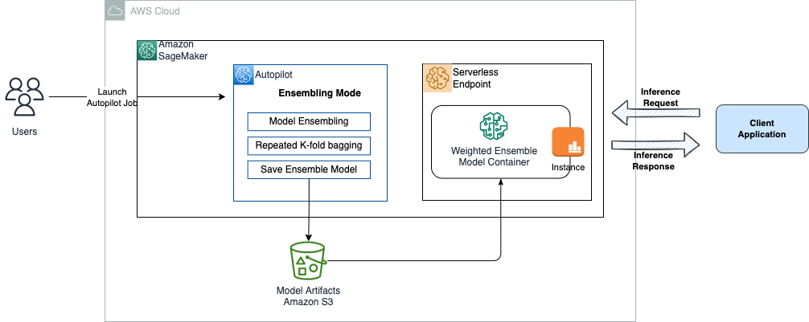
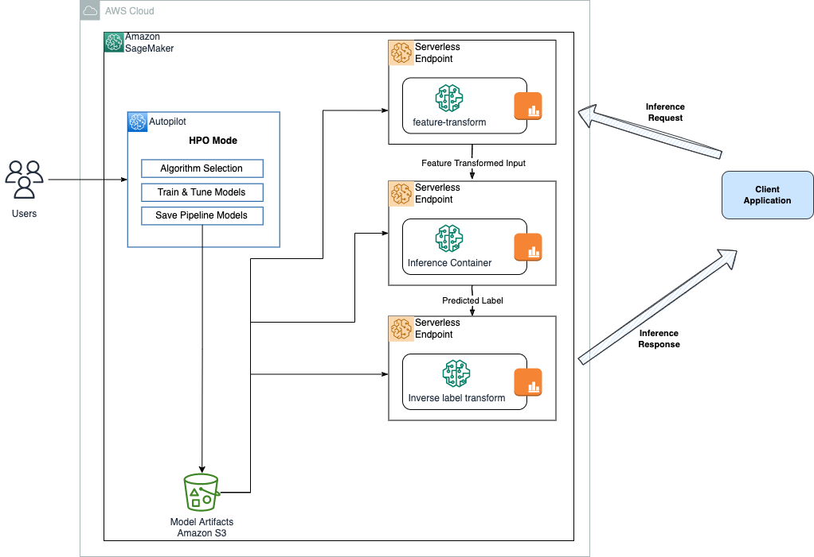

# Introduction

Amazon SageMaker Autopilot currently allow deploying generated models to real-time inference endpoints by default. In this repository, we'll show how to deploy Autopilot models trained with `ENSEMBLING` and `HYPERPARAMETER OPTIMIZATION` (HPO) modes to serverless endpoints.

The notebook in this folder is the solution as described in this [blog post](https://aws.amazon.com/blogs/machine-learning/deploy-amazon-sagemaker-autopilot-models-to-serverless-inference-endpoints/).

## Dataset

In this example, we use the [UCI Bank Marketing](https://archive.ics.uci.edu/ml/datasets/Bank+Marketing) dataset to predict if a client will subscribe to a term deposit offered by the bank. This is a binary classification problem type.

## Solution Overview

In the first part of the notebook we'll launch two Autopilot jobs one with training mode set to `ENSEMBLING` and the other with `HYPERPARAMETER OPTIMIZATION` (HPO).

### Autopilot ensembling model to serverless endpoint

Autopilot generates a single model in `ENSEMBLING` training mode. We deploy this single model to a serverless endpoint. Then we also send an inference request with test data to the serverless endpoint.

### Autopilot HPO models to serverless endpoints

In the second part of the notebook we'll extract the three inference containers generated by Autopilot in `HPO` training mode and deploy these models to three separate serverless endpoints and send inference requests in sequence.

----

## Additional References

- If you’re new to Autopilot, we encourage you to refer to [Get started with Amazon SageMaker Autopilot](https://docs.aws.amazon.com/sagemaker/latest/dg/autopilot-automate-model-development-get-started.html).
- To determine the optimal configuration for your serverless endpoint from a cost and performance perspective, we encourage you to explore our Serverless Inference Benchmarking Toolkit. For more information, refer to [Introducing the Amazon SageMaker Serverless Inference Benchmarking Toolkit](https://aws.amazon.com/blogs/machine-learning/introducing-the-amazon-sagemaker-serverless-inference-benchmarking-toolkit/).
- To learn more about Autopilot training modes, refer to [Amazon SageMaker Autopilot is up to eight times faster with new ensemble training mode powered by AutoGluon](https://aws.amazon.com/blogs/machine-learning/amazon-sagemaker-autopilot-is-up-to-eight-times-faster-with-new-ensemble-training-mode-powered-by-autogluon/).
- Refer to [Inference container definitions for regression and classification problem types](https://docs.aws.amazon.com/sagemaker/latest/dg/autopilot-automate-model-development-container-output.html#autopilot-problem-type-container-output).
- Refer to [Configure inference output in generated containers](https://docs.aws.amazon.com/sagemaker/latest/dg/autopilot-automate-model-development-container-output.html#autopilot-problem-type-container-output)
- For an overview on how to deploy an XGBoost model to a serverless inference endpoint, we encourage you to refer to this [example notebook](https://github.com/aws/amazon-sagemaker-examples/blob/main/serverless-inference/Serverless-Inference-Walkthrough.ipynb).

## Security

See [CONTRIBUTING](CONTRIBUTING.md#security-issue-notifications) for more information.

## License

This project is licensed under the MIT License.
