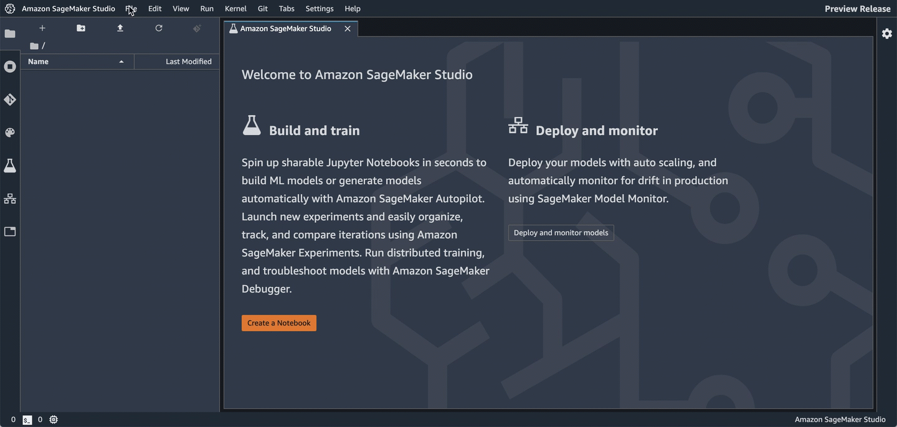
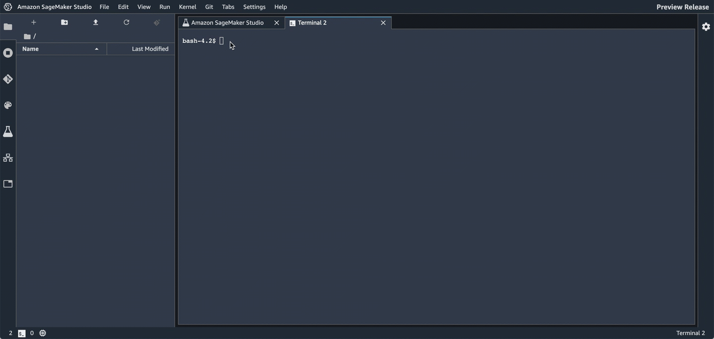
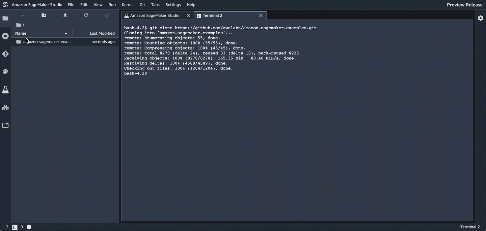

# Getting Started with Amazon SageMaker Studio

This folder contains a [Jupyter notebook that will demonstrate the main features of Amazon SageMaker Studio](xgboost_customer_churn_studio.ipynb). It is designed to be run from within Studio. It is an example of creating a model to predict customer churn using the XGBoost algorithm.

## Features

* [Amazon SageMaker Experiments](https://docs.aws.amazon.com/sagemaker/latest/dg/experiments.html)
  * Manage multiple trials
  * Hyperparameter experimentation & charting
* [Amazon SageMaker Debugger](https://docs.aws.amazon.com/sagemaker/latest/dg/train-debugger.html)
  * Debug your model 
* [Model hosting](https://docs.aws.amazon.com/sagemaker/latest/dg/how-it-works-hosting.html)
  * Set up a persistent endpoint to get predictions from your model
* [SageMaker Model Monitor](https://docs.aws.amazon.com/sagemaker/latest/dg/model-monitor.html)
  * Monitor the quality of your model
  * Set alerts for when there are deviations in the model's quality

## Prerequisites

You must have already [on-boarded with Amazon SageMaker Studio](https://docs.aws.amazon.com/sagemaker/latest/dg/gs-studio-onboard.html) and be able to login to Studio.

## How to run this notebook

1. Login to [Amazon SageMaker Studio](https://us-east-2.console.aws.amazon.com/sagemaker/home?region=us-east-2#/studio/).

2. Open a terminal within Studio.



3. Clone this repository with the following command.

```bash
git clone https://github.com/awslabs/amazon-sagemaker-examples.git
```



4. Use Studio's file manager to find and open the notebook.



