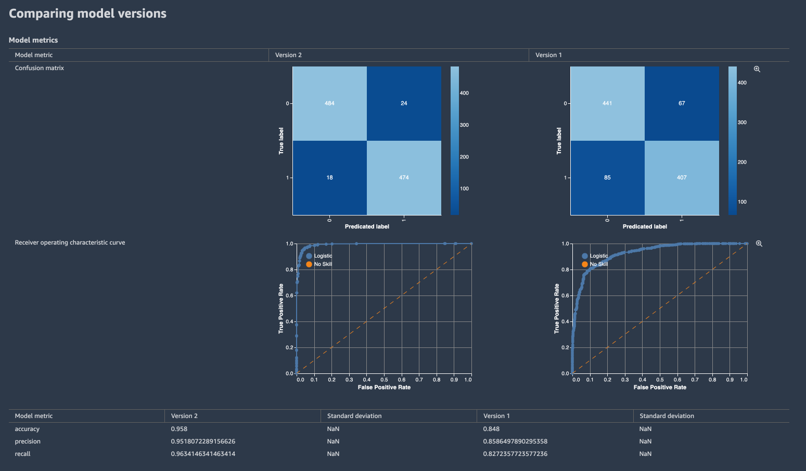
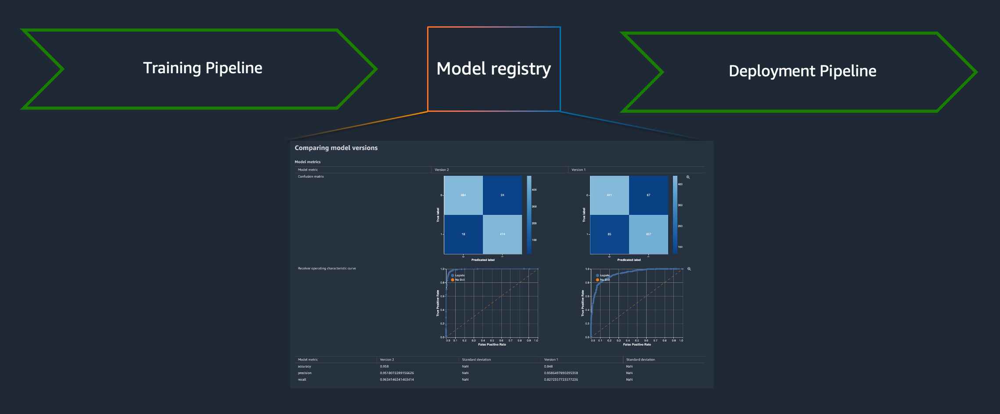
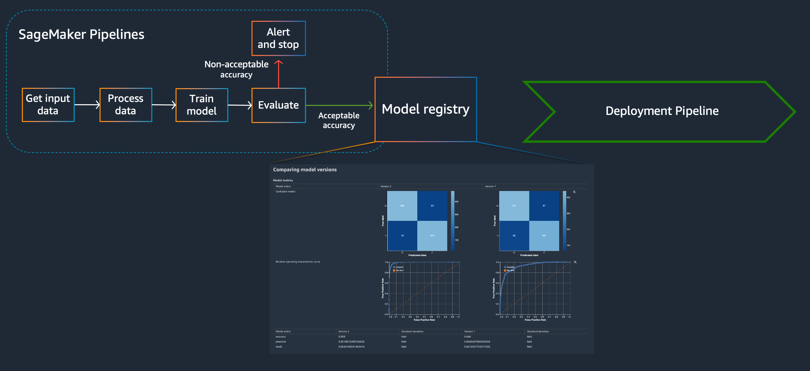

# Comparing model metrics with SageMaker Pipelines and SageMaker Model Registry

### SageMaker Model Registry
SageMaker Model Registry is a central location where customers can manage their machine learning models, compare different model versions and visualize metrics. It's a registry with which data scientists can register machine learning models with relevant metadata and metrics, and from which machine learning engineers or DevOps engineers can deploy machine learning models. In larger MLOps systems, a model registry is usually where the teams in charge of deploying machine learning models, meet the teams in charge of developing and training machine learning models.

### MLOps

MLOps, or Machine Learning Operations, is the concept of applying DevOps practices on the lifecycle of a machine learning model. Among many other things, MLOps usually consists of two workflows that sits on either side of a machine learning model registry; one to train a model and one to deploy a model. A model registry is a central location to manage machine learning models, where ML engineers and data scientists can compare different model versions, visualize metrics, and decide which versions to accept and which to reject. Ideally, approving a new version of a model triggers a pipeline that ultimately deploys the model into production.

From a high-level perspective, it can look like this.

The deployment pipeline is what is most similar to traditional CI/CD methods, propagating an artifact through a pipeline that performs testing and if the tests are successful, deploys them. Any CI/CD tools can be used for the deployment, but to automate the entire machine learning model lifecycle, a pipeline on "the other side" of the model registry is required as well. A pipeline that ultimately produces a new machine learning model and registers it with the model registry. A SageMaker Pipeline.

**This notebook**, demonstrate how SageMaker Pipelines can be used to create a reusable machine learning pipeline that preprocesses, trains, evaluates and registers a machine learning model with the SageMaker Model Registry for visualization and comparison of different model versions.