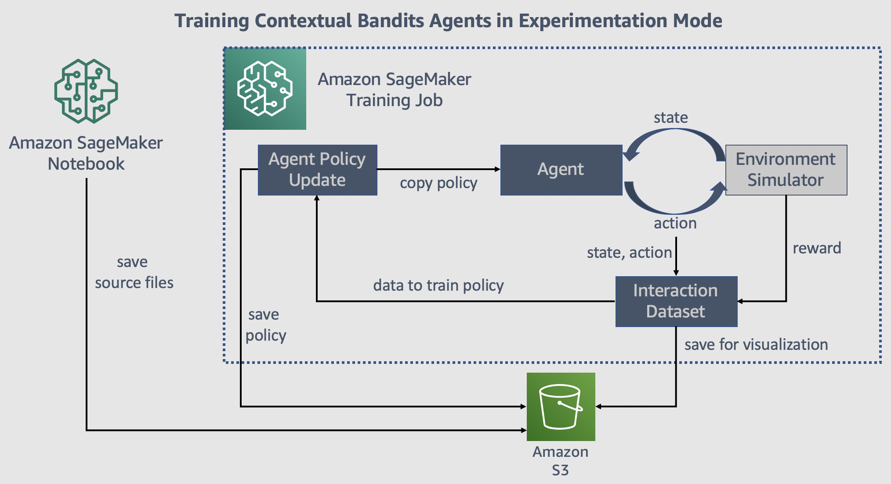

## Contextual Bandits with Parametric Actions -- Experimentation Mode

We demonstrate how you can use varying number of actions with contextual bandits algorithms in SageMaker. `bandits_movielens_testbed.ipynb` builds on 
the [Contextual Bandits example notebook](https://github.com/awslabs/amazon-sagemaker-examples/blob/master/reinforcement_learning/bandits_statlog_vw_customEnv/bandits_statlog_vw_customEnv.ipynb) example notebook which used fixed number of actions. Please refer to that notebook for basics on contextual 
bandits. 

In the contextual bandit setting, an agent recommends an action given a state. `bandits_movielens_testbed.ipynb` introduces three features to bandit algorithms that make them applicable to a broader set of real-world problems. We use the movie recommendation problem as an example.
1. The number of actions available to the agent can change over time. For example, the movies in the catalog changes over time.
2. Each action may have features associated with it. For the movie recommendation problem, each movie can have features such as 
genre, cast, etc.
3. The agent can produce a ranked list of actions/items. When recommending movies, it is natural that multiple movies are recommended at a time step.

The contextual bandit agent will trade-off between exploitation and exploration to quickly learn user preferences and minimize 
poor recommendations. The bandit algorithms are appropriate to use in recommendation problems when there are many cold items (items which have no or little interaction data) in the catalog or if user preferences change over time.

