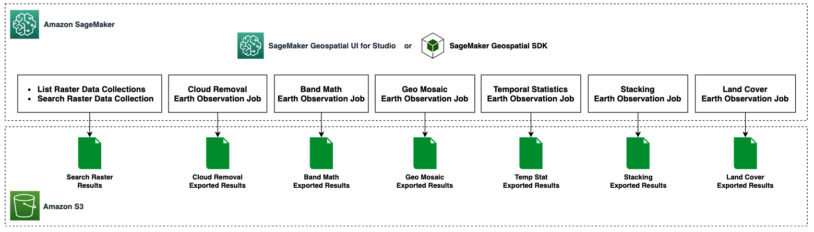
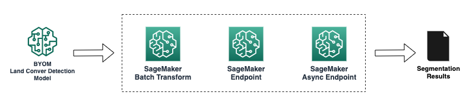
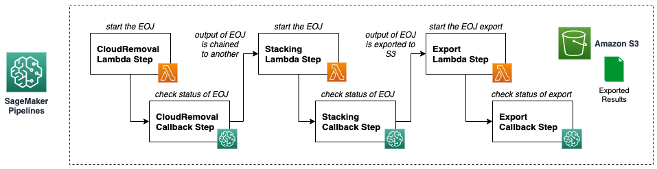

# Digital Farming with Amazon SageMaker Geospatial Capabilities

Digital Farming consists on applying digital solutions for helping farmers optimize crop production in agriculture, through the use of advanced analytics and machine learning. There are multiple applications of Digital Farming, but most of these require working with geospatial data including satellite imagery of the areas where the farmers have their fields located.

In this repository, we will explore how Amazon SageMaker geospatial capabilities can help accelerating, optimizing, and easing the processing of the geospatial data for the Digital Farming use cases.

Notebooks included:
1. [Digital Farming with Amazon SageMaker Geospatial Capabilities - Part I](./digital-farming-sagemaker-geospatial-part-1.ipynb)

In this notebook, we will explore how to setup the SageMaker client for working with the geospatial features, how to list, search, and query the geospatial data, and how to perform some of the most common tasks used in Digital Farming.

2. [Digital Farming with Amazon SageMaker Geospatial Capabilities - Part II](./digital-farming-sagemaker-geospatial-part-2.ipynb)

In this notebook, we will continue exploring other common tasks used in Digital Farming.

We will also explore the way to bring your own models to SageMaker for any custom use case not covered in the built-in tasks shown.

3. [Building Pipelines with Amazon SageMaker Geospatial Capabilities](./pipelines-sagemaker-geospatial.ipynb)

In this notebook, we will explore how to automate the geospatial processing pipelines for the tasks shown before, through the use of Amazon SageMaker Pipelines.

