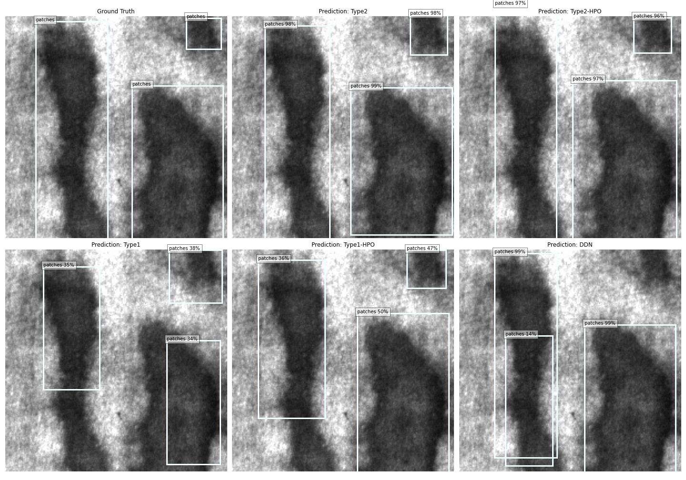

# Visual Inspection Automation with Pre-trained Amazon SageMaker Models

This solution detects product defects with an end-to-end Deep Learning workflow for quality control in manufacturing process. The solution takes input of product images and identifies defect regions with bounding boxes. In particular, this solution uses a pre-trained Sagemaker object detection model and fine-tune on the target dataset.

This solution will demonstrate the immense advantage of fine-tuning a high-quality pre-trained model on the target dataset, both visually and numerically.

### Contents
1. [Overview](#overview)
   1. [What Does the Input Data Look Like?](#input)
   2. [How to Prepare Your Data to Feed into the Model?](#preparedata)
   3. [What are the Outputs?](#output)
   4. [What is the Estimated Cost?](#cost)
   5. [What Algorithms & Models are Used?](#algorithms)
   6. [What Does the Data Flow Look Like?](#dataflow)
2. [Solution Details](#solution)
   1. [Background](#background)
   2. [What is Visual Inspection?](#inspection)
   3. [What are the Problems?](#problems)
   4. [What Does this Solution Offer?](#offer)
3. [Architecture Overview](#architecture)
4. [Cleaning up](#cleaning-up)
5. [Customization](#customization)

## 1. Overview 

### 1.1. What Does the Input Data Look Like? 

Input is an image of a defective / non-defective product. The training data should have relatively balanced classes, with annotations for ground truth defects (locations and defect types) per image. Here are examples of annotations used in the demo, they show some "inclusion" defects on the surface:

The NEU surface defect database (see [references](#references)) is a *balanced* dataset which contains

> Six kinds of typical surface defects of the hot-rolled steel strip are collected, i.e., rolled-in scale (RS), patches (Pa), crazing (Cr), pitted surface (PS), inclusion (In) and scratches (Sc). The database includes 1,800 grayscale images: 300 samples each of six different kinds of typical surface defects

Here is a sample image of the six classes

### 1.2. How to Prepare Your Data to Feed into the Model? 

There are data preparation and preprocessing steps and should be followed in the notebooks. It's critical to prepare your image annotations beforehand.
For finetuning pretrained Sagemaker models, you need to prepare either a single `annotation.json` for all data, or a `RecordIO` file for both all images and all annotations. Check the notebook for details.

### 1.3. What are the Outputs? 

* For each image, the trained model will produce bounding boxes of detected visual defects (if any), the predicted defect type, and prediction confidence score (0~1).
* If you have a labeled test dataset, you could obtain the mean Average Precision (mAP) score for each model and compare among all the models.
   * For example, the mAP scores on a test set of the NEU dataset

     |     |  Type1 | Type1+HPO | Type2 | Type2+HPO|
     | --- |  --- | --- | --- | ---|
     | mAP | 0.067 | 0.226 | 0.371 | 0.375|

### 1.4. What is the Estimated Cost? 

* Running the notebook costs around $130~140 USD, assuming using p3.2xlarge EC2 instance in the notebook, and $3.06 on-demand hourly rate in US East. This notebook provides advanced materials, including finetuning two types of pretrained Sagemaker models **till convergence**, with and without hyperparameter optimization (HPO), and result in four models for inference. You could choose to train either one model, or all four models according to your budget and requirements. The cost and runtime for training each model are:

   | Model | Cost (USD) | Runtime (Hours) | Billable time (Hours)|
   |:----------:|:---------------:|:----:|:-----:|
   |Type 1|    1.5     |       0.5       | 0.5|
   |Type 1 with HPO (20 jobs)|    30.6    |       1*        | 10|
   |Type 2|    4.6     |       1.5       | 1.5|
   |Type 2 with HPO (20 jobs)|     92     |       3*        | 30|
  (*) HPO tasks in this solution consider 20 jobs in total and 10 jobs in parallel. So 1 actual runtime hour amounts to 10 billable cost hours.
* Please make sure you have read the cleaning up part in [Section 4](#cleaning-up) after training to avoid incurred cost from deployed models.

### 1.5. What Algorithms & Models are Used? 

* The pretrained Sagemaker models include SSD models and FasterRCNN model, using either VGG, ResNet, or MobileNet as backbone, pretrained on either ImageNet, COCO, VOC, or FPN dataset.

### 1.6. How Does the Data Flow Look Like? 

## 2. Solution Details 

### 2.1. Background 

According to the [Gartner study on the top 10 strategic tech trends for 2020](https://www.gartner.com/smarterwithgartner/gartner-top-10-strategic-technology-trends-for-2020/),  hyper-automation is the number one trend in 2020 and will continue advancing in future. When it comes to manufacturing, one of the main barriers to hyper-automation is in areas where Human involvements is still struggling to be reduced and intelligent systems have hard times to become on-par with Human visual recognition abilities and become mainstream, despite great advancement of Deep Learning in Computer Vision. This is mainly due to lack of enough annotated data (or when data is sparse) in areas such as _Quality Control_ sections where trained Human eyes still dominates.

### 2.2. What is Visual Inspection? 

The **analysis of products on the production line for the purpose of Quality Control**. According to [Everything you need to know about Visual Inspection with AI](https://nanonets.com/blog/ai-visual-inspection/), visual inspection can also be used for internal and external assessment of the various equipment in a production facility such as storage tanks, pressure vessels, piping, and other equipment which expands to many industries from Electronics, Medical, Food and Raw Materials.

### 2.3. What are the Problems? 

* *Human visual inspection error* is a major factor in this area. According to the report [The Role of Visual Inspection in the 21st Century](https://www.osti.gov/servlets/purl/1476816)

   > Most inspection tasks are much more complex and typically exhibit error rates of 20% to 30% (Drury & Fox, 1975)

which directly translates to *cost*.
* Cost: according to [glassdoor estimate](https://www.glassdoor.co.in/Salaries/us-quality-control-inspector-salary-SRCH_IL.0,2_IN1_KO3,28.htm), a trained quality inspector salary varies between 29K (US) - 64K per year.

### 2.4. What Does this Solution Offer?  

This solution offers a complete solution using high-quality pretrained Sagemaker models to finetune on the target dataset with and without hyperparameter optimization (HPO).

The **most important** information this solution delivers, is that training a deep learning model from scratch on a small dataset can be both time-consuming and less effective, whereas finetuning a high-quality pretrained model, which was trained on large-scale dataset, could be both cost- and runtime-efficient and highly performant. Here are the sample detection results

## 3. Architecture Overview 

The following illustration is the architecture for the end-to-end training and deployment process

1. The input data located in an [Amazon S3](https://aws.amazon.com/s3/) bucket
2. The provided [SageMaker notebook](source/deep_demand_forecast.ipynb) that gets the input data and launches the later stages below
3. **Training Classifier and Detector models** and evaluating its results using Amazon SageMaker. If desired, one can deploy the trained models and create SageMaker endpoints
4. **SageMaker endpoint** created from the previous step is an [HTTPS endpoint](https://docs.aws.amazon.com/sagemaker/latest/dg/how-it-works-hosting.html) and is capable of producing predictions
5.  Monitoring the training and deployed model via [Amazon CloudWatch](https://aws.amazon.com/cloudwatch/)

## 4. Cleaning up 

If you run the notebook end-to-end, the Cleaning up section in the notebook will delete all the checkpoints and models automatically for you. If you choose to only train some of the four models in the notebook, please make sure to run corresponding code in the Cleaning up section to delete all the artifacts.

**Caution:** You need to manually delete any extra resources that you may have created in this notebook. For examples extra Amazon S3 bucketis.

## 5. Customization 

For using your own data, make sure it is labeled and is a *relatively* balanced dataset. Also make sure the image annotations follow the required format.

### Useful Links 

* [Amazon SageMaker Getting Started](https://aws.amazon.com/sagemaker/getting-started/)
* [Amazon SageMaker Developer Guide](https://docs.aws.amazon.com/sagemaker/latest/dg/whatis.html)
* [Amazon SageMaker Python SDK Documentation](https://sagemaker.readthedocs.io/en/stable/)
* [AWS CloudFormation User Guide](https://docs.aws.amazon.com/AWSCloudFormation/latest/UserGuide/Welcome.html)

### References

* K. Song and Y. Yan, “A noise robust method based on completed local binary patterns for hot-rolled steel strip surface defects,” Applied Surface Science, vol. 285, pp. 858-864, Nov. 2013.

* Yu He, Kechen Song, Qinggang Meng, Yunhui Yan, “An End-to-end Steel Surface Defect Detection Approach via Fusing Multiple Hierarchical Features,” IEEE Transactions on Instrumentation and Measuremente, 2020,69(4),1493-1504.

* Hongwen Dong, Kechen Song, Yu He, Jing Xu, Yunhui Yan, Qinggang Meng, “PGA-Net: Pyramid Feature Fusion and Global Context Attention Network for Automated Surface Defect Detection,” IEEE Transactions on Industrial Informatics, 2020.
