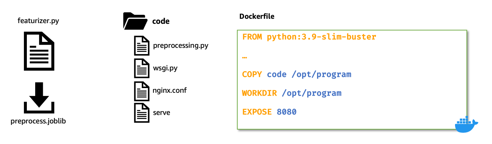

# Build Featurizer model

We demonstrate building a ML application to predict the rings of Abalone.

## Start with [featurizer.ipynb](./featurizer.ipynb)

---

In this notebook, we build the Featurizer model that transforms the input raw csv records using scikit-learn

- [SimpleImputer](https://scikit-learn.org/stable/modules/generated/sklearn.impute.SimpleImputer.html) for handling missing values, 
- [StandardScaler](https://scikit-learn.org/stable/modules/generated/sklearn.preprocessing.StandardScaler.html) for normalizing numerical columns, and
- [OneHotEncoder](https://scikit-learn.org/stable/modules/generated/sklearn.preprocessing.OneHotEncoder.html) for transforming categorical columns. After fitting the transformer, we save the fitted model to disk in [joblib](https://joblib.readthedocs.io/en/latest/persistence.html) format

