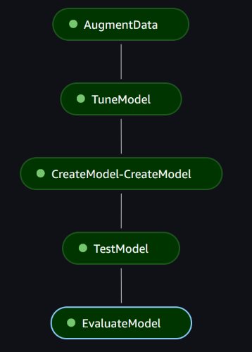

# Computer Vision Pipeline using @step decorator

## Description

We have introduced a low-code experience for data scientists to convert the Machine Learning (ML) development code into repeatable and reusable workflow steps of [Amazon SageMaker Pipelines](https://docs.aws.amazon.com/sagemaker/latest/dg/pipelines-sdk.html) using an [@step decorator](https://docs.aws.amazon.com/sagemaker/latest/dg/pipelines-step-decorator.html). This sample notebook demonstrates how to build a computer vision pipeline using a combination of the @step decorator and other pipeline steps.

Specifically, this notebook builds a pipeline which:
1. Uses the @step decorator to augment a retail image dataset;
2. Uses the Tuning step to train and tune a model using SageMaker's [Object Detection algorithm](https://docs.aws.amazon.com/sagemaker/latest/dg/object-detection.html);
3. Uses the Model step to create a model object for the best-performing model;
4. Uses the Transform step to run the test set through the best-performing model;
5. Uses the @step decorator to evaluate the results.

The screenshot below shows an example of a successful execution of this pipeline.

