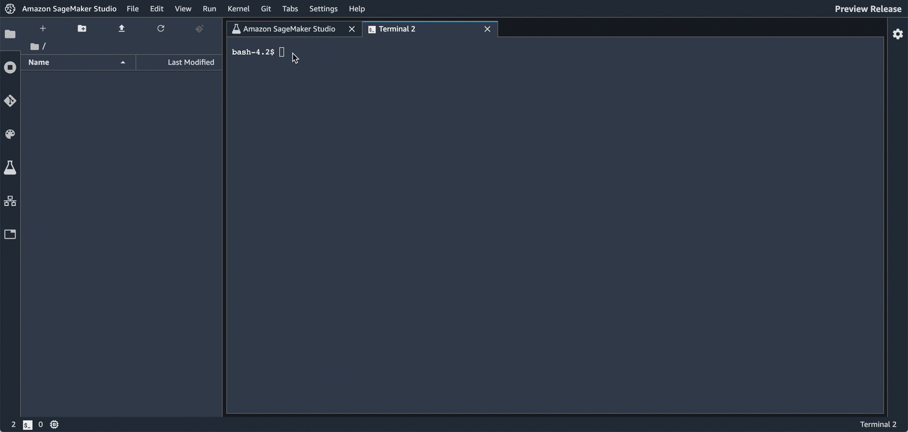
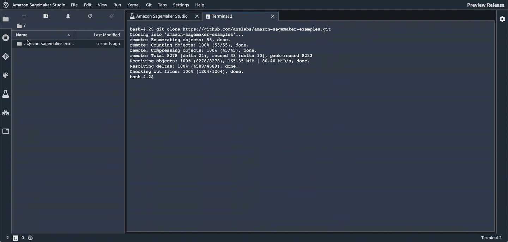

# Getting Started with Amazon SageMaker Studio

This folder contains a Jupyter notebook that will demonstrate the main features of Amazon SageMaker Studio. It is designed to be run from within Studio. It is an example of creating a model to predict customer churn using the XGBoost algorithm.

## Features

* Amazon SageMaker Experiments
  * Manage multiple trials
  * Hyperparameter experimentation
* Amazon SageMaker Debugger
  * Debug your model 
* Model hosting
  * Set up a persistent endpoint to get predictions from your model
* SageMaker Model Monitor
  * Monitor the quality of your model
  * Set alerts for when there are deviations in the model's quality

## Prerequisites

You must have already [on-boarded with Amazon SageMaker Studio](https://docs.aws.amazon.com/sagemaker/latest/dg/gs-studio-onboard.html) and be able to login to Studio.

## How to run this notebook

1. Login to [Amazon SageMaker Studio](https://us-east-2.console.aws.amazon.com/sagemaker/home?region=us-east-2#/studio/).

2. Open a terminal within Studio.


3. Clone this repository with the following command.

```bash
git clone https://github.com/awslabs/amazon-sagemaker-examples.git
```



4. Use Studio's file manager to find and open the notebook.



