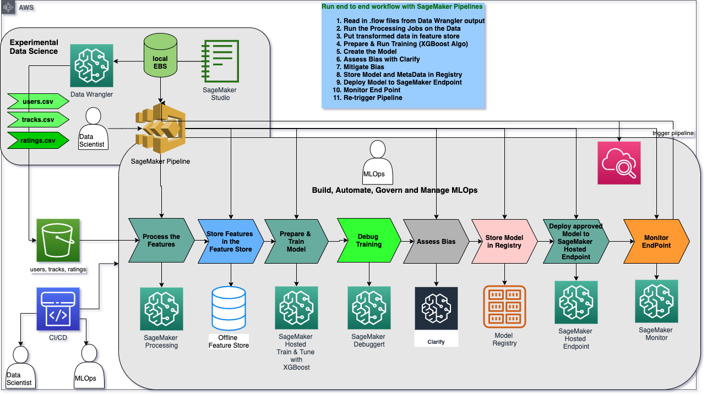

# Music Recommender

## Contents
1. [Background](#Background)
1. [Prereqs](#Prereqs)
1. [Data](#Data)
1. [Approach](#Approach)
1. [Clean Up](#Clean-Up)

---

# Background

Amazon SageMaker helps data scientists and developers to prepare, build, train, and deploy machine learning models quickly by bringing together a broad set of purpose-built capabilities. In this demo, learn about how SageMaker can accelerate machine learning development by way of an example where we build the perfect musical playlist tailored to a user's tastes.

# Prereqs

You will need an AWS account to use this solution. Sign up for an [account](https://aws.amazon.com/) before you proceed. 

You will also need to have permission to use [Amazon SageMaker Studio](https://docs.aws.amazon.com/sagemaker/latest/dg/gs-studio.html). All AWS permissions can be managed through [AWS IAM](https://aws.amazon.com/iam/). Admin users will have the required permissions, but please contact your account's AWS administrator if your user account doesn't have the required permissions.

# Data

Example track (track.csv) and user ratings (ratings.csv) data is provided on a publicly available S3 bucket found here: **s3://sagemaker-sample-files/datasets/tabular/synthetic-music**
We'll be running a notebook to download the data in the demo so no need to manually download it from here just yet.

**tracks.csv**  
- trackId: unique identifier for each song/track 
- length: song length in seconds (numerical)
- energy: (numerical)
- acousticness: (numerical)
- valence: (numerical)
- speechiness: (numerical)
- instrumentalness: (numerical)
- liveness: (numerical)
- tempo: (numerical)
- genre: (categorical) 

**ratings.csv**  
- ratingEventId: unique identifier for each rating 
- ts: timestamp of rating event (datetime in seconds since 1970)
- userId: unique id for each user
- trackId: unique id for each song/track
- sessionId: unique id for the user's session
- Rating: user's rating of song on scale from 1 to 5

For this tutorial, we'll be using our own generated track and user ratings data, but publicly available datasets/apis such as the [Million Song Dataset](http://millionsongdataset.com/) and open-source song ratings APIs are available for personal research purposes. 

# Approach

In the following notebooks we'll take 2 different approaches with the same modeling solution to create our music recommender.
1. Run the following notebooks in order to walkthrough each data prep and modeling step
    - 01_music_dataprep.flow: Flow file defining our data input and transformation steps; this file is created in the Sagemaker Data Wrangler GUI
    - 02_export_feature_groups.ipynb: export our tracks data, 5-star rated tracks data, and user ratings data created in Data Wrangler to a feature store
    - 03_train_deploy_debugger_explain_monitor_registry.ipynb: train and deploy the model using xgboost to predict each song rating for each user. We also go over feature importances using SHAP values and setup Sagemaker Model Monitor.
1. Setup a Sagemaker Pipeline to do all the aformentioned steps in a single notebook so that it can be ran automatically over time
    - end_to_end_pipeline.ipynb: setup each modeling step using sagemaker.workflow Pipeline object

### Solution Architecture

# Clean Up

In order to prevent ongoing charges to your AWS account, clean up any resources we spun up during this tutorial at the end of notebooks [Train, Deploy, and Monitor the Music Recommender Model using SageMaker SDK](03_train_deploy_debugger_explain_monitor_registry.ipynb) and [Train, Deploy, and Monitor the Music Recommender Model using SageMaker Pipelines](end_to_end_pipeline.ipynb).
