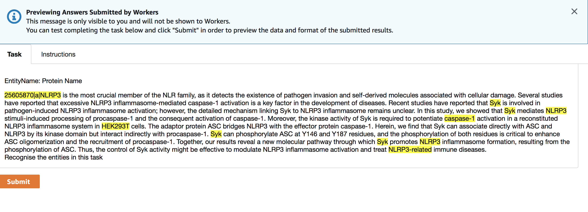
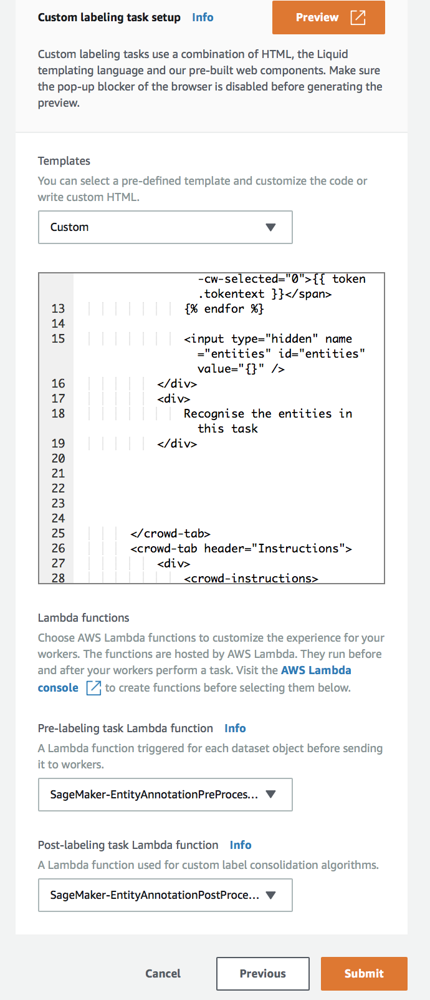

# SageMaker GroundTruth Custom Template  - Named Entity Recognition
This is a sample custom template for SageMaker named entity recognition ground truth solution.  

**Note** This is an example  on how to build custom template. The named entity task has a built in readily available in SageMaker Groundtruth to use

This exmaple has 3 components
1. The HTML template that the workers will use to work on the task
1. Lambda functions for pre and post processing rules.




## Setup
1. If you want try this sample but dont have the data to test this, you cam use this a sample file [tests/sample_input_data_pubtator.txt](tests/sample_input_data_pubtator.txt) as input data to evaluate the workflow.

1. Create pre and post processing lambda functions
    - **Note** Using the naming convention SageMaker-* for your lambda functions automatically gives access to Sagemaker using the standard template. Otherwise you would have to use create an IAM policy and provide access to Sagemaker to execute the lambda function
   
    - Create a lambda function SageMaker-EntityAnnotationPreProcessing with runtime python 3.6 using the code [source/lambda_preprocess/preprocess_handler.py](source/lambda_preprocess/preprocess_handler.py). 
   
    - Create a lambda function SageMaker-EntityAnnotationPostProcessing with runtime python 3.6 using the code [source/lambda_postprocess/postprocess_handler.py](source/lambda_postprocess/postprocess_handler.py). Make sure this has access to read the s3 bucket containing the results from Sagemaker groundtruth job you are about to create

1. Configure SageMaker Ground Truth as follows:
  
   - Choose custom template in Sagemaker Ground Truth
  
   - In the custom template section, copy paste the html from [source/template/entityrecognition.html](source/template/entityrecognition.html)
   
   - In the Pre-labelling task lambda function, select Sagemaker-EntityAnnotationPreProcessing
   
   - In the Post-labelling task lambda function, select Sagemaker-EntityAnnotationPostProcessing



 

## Run tests

```bash
export PYTHONPATH=./source
pytests
```
