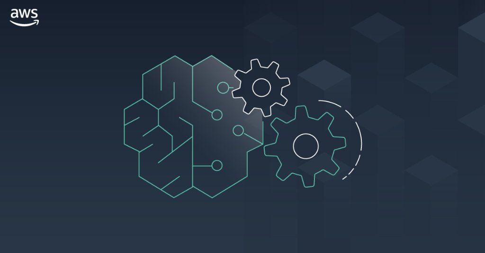

Amazon SageMaker Example Notebooks
==================================

.. image:: https://readthedocs.org/projects/sagemaker-examples-test-website/badge/?version=latest

Welcome to Amazon SageMaker.
This site highlights example Jupyter notebooks for a variety of machine learning use cases that you can run in SageMaker.

This site is based on the `SageMaker Examples repository <https://github.com/aws/amazon-sagemaker-examples>`_ on GitHub.
To run these notebooks, you will need a SageMaker Notebook Instance or SageMaker Studio.
Refer to the SageMaker developer guide's `Get Started <https://docs.aws.amazon.com/sagemaker/latest/dg/gs.html>`_ page to get one of these set up.

On a Notebook Instance, the examples are pre-installed and available from the examples menu item in JupyterLab.
On SageMaker Studio, you will need to open a terminal, go to your home folder, then clone the repo with the following::

   git clone https://github.com/aws/amazon-sagemaker-examples.git

----

.. toctree::
   :maxdepth: 1
   :caption: Introduction

   intro.rst

We recommend the following notebooks as a broad introduction to the capabilities that SageMaker offers. To explore in even more depth, we provide additional notebooks covering even more use cases and frameworks.

.. toctree::
   :maxdepth: 1
   :caption: Build and Train Models

   build_and_train_models/sm-forecast_deepar_time_series_modeling/sm-forecast_deepar_time_series_modeling
   build_and_train_models/sm-heterogeneous_clusters_training/sm-heterogeneous_clusters_training
   build_and_train_models/sm-introduction_to_blazingtext_word2vec_text8/sm-introduction_to_blazingtext_word2vec_text8
   build_and_train_models/sm-introduction_to_object2vec_sentence_similarity/sm-introduction_to_object2vec_sentence_similarity
   build_and_train_models/sm-jax_bring_your_own/sm-jax_bring_your_own
   build_and_train_models/sm-marketplace_building_your_own_container_as_package/sm-marketplace_building_your_own_container_as_package
   build_and_train_models/sm-deepar_example
   build_and_train_models/sm-introduction_to_auogluon_tabular_regression
   build_and_train_models/sm-lightgbm_catboost_tabular_classification
   build_and_train_models/sm-linear_learner_mnist
   build_and_train_models/sm-tabtransformer_tabular_classification

.. toctree::
   :maxdepth: 1
   :caption: Deploy and Monitor

   deploy_and_monitor/sm-async_inference_walkthrough/sm-async_inference_walkthrough
   deploy_and_monitor/sm-batch_inference_with_torchserve/sm-batch_inference_with_torchserve
   deploy_and_monitor/sm-deployment_guardrails_update_inference_endpoint_with_rolling_deployment/sm-deployment_guardrails_update_inference_endpoint_with_rolling_deployment
   deploy_and_monitor/sm-deployment_guardrails_update_inference_endpoint_with_with_canary_traffic_shifting/sm-deployment_guardrails_update_inference_endpoint_with_with_canary_traffic_shifting
   deploy_and_monitor/sm-marketplace_using_model_package_arn/sm-marketplace_using_model_package_arn
   deploy_and_monitor/sm-multi_model_endpoint_bring_your_own_container/sm-multi_model_endpoint_bring_your_own_container
   deploy_and_monitor/sm-app_autoscaling_realtime_endpoints/sm-app_autoscaling_realtime_endpoints
   deploy_and_monitor/sm-app_autoscaling_realtime_endpoints_step_scaling/sm-app_autoscaling_realtime_endpoints_step_scaling

.. toctree::
   :maxdepth: 1
   :caption: Generatative AI

   generative_ai/sm-djl_deepspeed_bloom_176b_deploy

.. toctree::
   :maxdepth: 1
   :caption: ML Ops

   ml_ops/sm-mlflow_deployment/sm-mlflow_deployment
   ml_ops/sm-pipelines_batch_inference_step_decorator/sm-pipelines_batch_inference_step_decorator
   ml_ops/sm-pipelines_emr_step_using_step_decorator/sm-pipelines_emr_step_using_step_decorator
