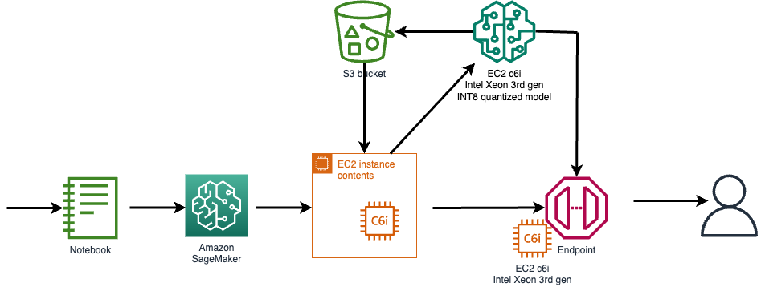

# Accelerate Amazon SageMaker inference with Intel based Amazon EC2 Instances (C6i)
Customers are always looking for ways to improve the performance and response times of their ML inference workloads without increasing the cost per transaction and without sacrificing the accuracy of the results. Executing machine learning workloads on SageMaker running Amazon EC2 (C6i) instances with Intel's INT8 inference deployment can help boost the overall performance by upto 4x per dollar spent while keeping the loss in inference accuracy to less than 1% as compared to FP32 when applied to certain ML workloads. When it comes to running the models in embedded devices where form factor and size of the model is of much importance, quantization can help.
Quantization is a technique to reduce the computational and memory costs of running inference by representing the weights and activations with low-precision datatypes like 8-bit integer (int8) instead of the usual 32-bit floating point (float32).

## Overview of the technology
Amazon EC2 C6i instances launched in the latter part of 2021 are powered by 3rd generation Intel Xeon Scalable processors (code named Ice Lake) with an all-core turbo frequency of 3.5 GHz.
In the context of deep learning, the predominant numerical format used for research and for deployment has so far been 32-bit floating point, or FP32. However, the need for reduced bandwidth and compute requirements of deep learning models has driven research into using lower-precision numerical formats. It has been demonstrated that weights and activations can be represented using 8-bit integers (or INT8) without incurring significant loss in accuracy.
Amazon EC2 C6i instances offer many new capabilities that will result in performance improvements for AI/ML workloads. C6i instances provide performance advantages in FP32 and INT8 model deployments. FP32 inference is enabled with AVX-512 improvements and INT8 inference is enabled by AVX-512 VNNI instructions.
C6i is now available on SageMaker endpoints, and developers should expect it to provide >2x perf/$ improvements for INT8 inference over FP32 Inference and up to 4x performance improvement when compared with C5 instance FP32 inference.
Deep learning deployment on the edge for real-time inference is key to many application areas. It significantly reduces the cost of communicating with the cloud in terms of network bandwidth, network latency, and power consumption. However, edge devices have limited memory, computing resources, and power. This means that a deep learning network must be optimized for embedded deployment. Int8 quantization has become a popular approach for such optimizations for machine learning frameworks like TensorFlow and PyTorch.

## Pre-requsites
1. Linux shell terminal with AWS CLI installed. 
2. AWS account with access to EC2 (C6i instance type) instance creation.
3. SageMaker access to deploy a SageMaker model, endpoint-configuration, endpoint.
4. IAM access to configure IAM role and policy.
5. Access to Elastic Container Registry (ECR).
6. SageMaker access to create a Notebook with instructions to launch an endpoint.
7. Access to S3 bucket for uploading model and code. 



## Steps Involved
1. Using an EC2 instance to build a docker image.
2. Execute the python scripts supplied to perform the quantization and model creation.
3. Copy the model and code tar file into the S3 bucket.
4. Push the docker image in the container registry for SageMaker to access it.
5. Deploy the model into SageMaker.
6. Create an inference endpoint in SageMaker to invoke the model.
7. Execute the test python scripts to test the SageMaker endpoint for both int8 and fp32 versions. 

### Role for SageMaker to access S3 and execution rights:
#### AWS IAM Role
- Documentation link: https://docs.aws.amazon.com/sagemaker/latest/dg/sagemaker-roles.html
- AmazonSageMaker-ExecutionRole
- AmazonSageMaker-ExecutionPolicy S3 access
```
{
    "Version": "2012-10-17",
    "Statement": [
        {
            "Effect": "Allow",
            "Action": [
                "s3:GetObject",
                "s3:PutObject",
                "s3:DeleteObject",
                "s3:ListBucket"
            ],
            "Resource": [
                "arn:aws:s3:::intelc6i"
            ]
        }
    ]
}
```

### Launch EC2 instance to generate the model, docker image and model artifcats

1. Launch an EC2 instance with C6i instance type and Ubuntu 20.04 linux AMI. 
1. SSH into the EC2 C6i instance. (All the steps after this are to be executed from within the EC2 instance.) 
1. Git clone the sagemaker samples repo.
``` git clone https://github.com/aws-samples/amazon-sagemaker-custom-container.git ```
1. Install Docker. (Learn more about using AWS CLI for ECR, docker here https://docs.aws.amazon.com/AmazonECR/latest/userguide/getting-started-cli.html)
```sudo apt install docker.io  ```
1. Install AWS CLI
``` sudo apt install awscli ```
1. Execute command to create the docker image that will run the quantization and generate a model. The script will create the image and push it to ECR as well. (Same image will be used for the Inference endpoint, as it contains the Python Flask config).
```build_and_push.sh <docker image name> ```
1. Run the docker image as follows and execute the following: 
``` sudo docker run --rm -it -p 8080:8080 -p 8081:8081 -p 8082:8082 -p 7070:7070 -p 7071:7071 bert_large_c6i ```
1. Inside the docker container, execute the following python script to generate both FP32 and INT8 models. (This process may take few minutes depending on the C6i instance size)
``` python quantize_with_ds_ep.py ``` 
1. The above script generate model artifacts required for SageMaker endpoint. In this step we will create and upload the model tar gzip file into AWS S3 bucket.

``` tar -czf both_bert_model.tar.gz model_int8.pt model_fp32.pt tokenizer.json vocab.txt special_tokens_map.json tokenizer_config.json ```

``` aws s3 cp both_bert_model.tar.gz s3://intelc6i ```

### Create SageMaker model and endpoint
1. Register the model in Sagemaker: 
```
aws sagemaker create-model --model-name c6ibothbert --execution-role-arn "<ROLE ARN>" --primary-container '{
  "ContainerHostname": "BertMainContainer1Hostname",
  "Image": "<AWS ACCOUNT NUMBER>.dkr.ecr.us-east-1.amazonaws.com/bert_dataset_flask:latest",
  "ModelDataUrl": "https://intelc6i.s3.amazonaws.com/bert_dataset_model.tar.gz",
  "Environment" : {
         "SAGEMAKER_CONTAINER_LOG_LEVEL": "20",
         "SAGEMAKER_REGION": "us-east-1"
         }
 }' 
``` 
1. Register the inference endpoint configuration for the endpoint referencing the model name and ec2 instance class.
```
aws sagemaker create-endpoint-config --endpoint-config-name c6ibothbert --production-variants '[
{
  "VariantName" : "TestVariant1",
  "ModelName" : "c6ibothbert",
  "InitialInstanceCount" : 1,
  "InstanceType" : "ml.c6i.4xlarge"
 }
]'
```
1. Register the endpoint referencing the endpoint config name.
```
 aws sagemaker create-endpoint --endpoint-name c6ibothbert --endpoint-config-name c6ibothbert 
```
1. Check the status of the endpoint to confirm that it is InService. 
1. To test the FP32 model, execute the following script:
``` python invoke-FP32.py ```
1. To test the INT8 model, execute the following script:
``` python invoke-INT8.py ```
1. Validate the response and check the answer. 
 
Remember to shutdown and cleanup the AWS services and artifacts created as part of this exercise.
Make sure that you save any code or artifacts that you may want for future reference, before you run the cleanup steps. 

### Steps for cleanup
2. Run the following commands to delete the SageMaker model and endpoint. 
``` 
aws sagemaker delete-endpoint --endpoint-name  c6ibothbert
aws sagemaker delete-endpoint-config --endpoing-config-name c6ibothbert 
aws sagemaker delete-model --model-name c6ibothbert
```
3. Delete the S3 objects created during this exercise.
4. Delete the IAM roles and policies created during this exercise.
5. Delete the docker image from ECR
```
aws ecr batch-delete-image \
      --repository-name <image name> \
      --image-ids imageTag=<tag> \
      --region <AWS region>
```
