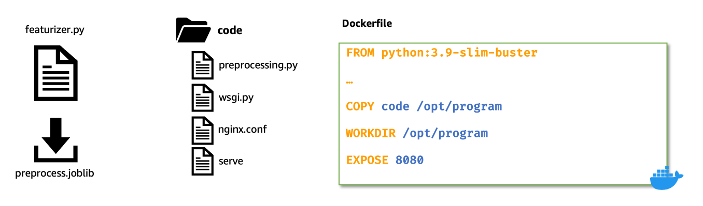
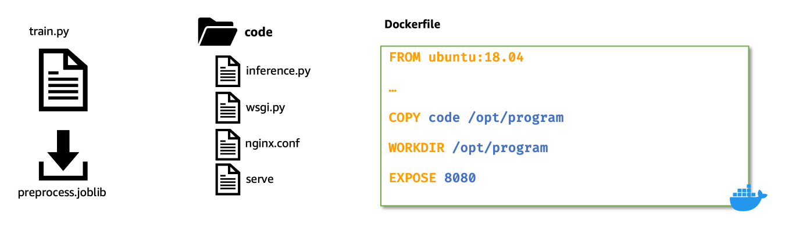

# Build and Deploy an ML Application from scratch to SageMaker

We demonstrate building a ML inference application to predict the rings of Abalone.

Payload will be sent as a raw (untransformed) csv string to the inference application hosted as a serial-inference-pipeline on a real-time endpoint.
The raw payload is first received by the featurizer container. The payload is then transformed by the featurizer, and the transformed record (float values) is returned as a csv string by the featurizer.

The transformed record is then passed to the predictor container (XGBoost model). The predictor then converts the transformed record into XGBMatrix format, loads the model and calls `booster.predict(input_data)` and returns the predictions (Rings) in a JSON format.

>Note: We use a pretrained XGBoost model trained on [Abalone Data Set](https://archive.ics.uci.edu/ml/datasets/abalone).

The [featurizer](./featurizer) and [predictor](./predictor) models are packaged as a serial inference pipeline and deployed to a Amazon SageMaker real-time endpoint.

## BYO Featurizer (pre-processing) container

Step 1: Build featurizer model and container.

Refer to [featurizer](./featurizer) folder for full implementation

## BYO XGBoost predictor container

Step 1: Build predictor model and container.

Refer to [predictor](./predictor) folder for full implementation

### References

1. [Abalone Data Set](https://archive.ics.uci.edu/ml/datasets/abalone)
2. [SageMaker local mode](https://sagemaker.readthedocs.io/en/stable/overview.html#local-mode)
3. [Host models along with pre-processing logic as serial inference pipeline behind one endpoint](https://docs.aws.amazon.com/sagemaker/latest/dg/inference-pipelines.html)
4. [Run Real-time Predictions with an Inference Pipeline](https://docs.aws.amazon.com/sagemaker/latest/dg/inference-pipeline-real-time.html)
