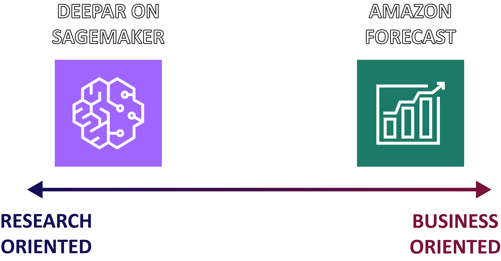
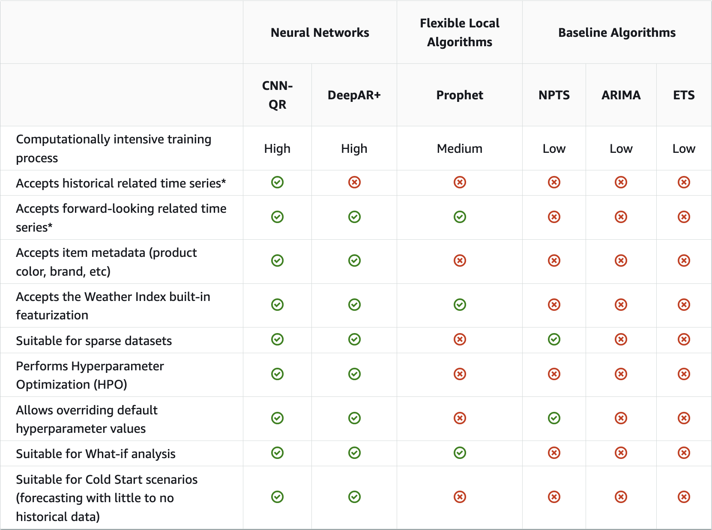

# Time Series Modeling with Amazon Forecast and DeepAR on SageMaker
## Overview
Amazon offers customers a multitude of time series prediction services, including [DeepAR on SageMaker](https://docs.aws.amazon.com/sagemaker/latest/dg/deepar.html) and the fully managed service [Amazon Forecast](https://aws.amazon.com/forecast/). The purpose of this notebook series is to compare the two services and highlight their features through two notebooks that demonstrate how to use each service:
 1. [DeepAR on SageMaker Example](./deepar_example.ipynb)
 2. [Amazon Forecast Example](./forecast_example.ipynb)
 
 This [README](./README.md) will offer a top-level comparison between the two services, while each notebook will serve as a guide in using their respective services as well as understanding their features. Both notebooks will use the UCI [Beijing Multi-Site Air-Quality Data Data Set](https://archive.ics.uci.edu/ml/datasets/Beijing+Multi-Site+Air-Quality+Data), allowing for simpler observation on how each service differs. 

## Introduction
 
 
**DeepAR** is a proprietary supervised learning algorithm developed by Amazon Research for forecasting scalar (one-dimensional) time series using recurrent neural networks (RNN). While classical forecasting methods such as autoregressive integrated moving average (ARIMA) and exponential smoothing (ETS) fit a single model to each individual time series, DeepAR trains a single model jointly over all of the time series. This is beneficial when there is a set of related time series, and DeepAR begins to outperform classical methods when datasets contain hundreds of related time series. **DeepAR** can be accessed through **Amazon SageMaker**, allowing users to prepare data, train and deploy models, and create forecasts.

**Amazon Forecast** is a fully managed deep learning service dedicated to time series forecasting. It offers a "codeless" solution, allowing users to prepare data, train and deploy models, and create forecasts with just a few clicks. This means that **Amazon Forecast** can be used without any prior ML knowledge. It currently uses multiple algorithms under the hood to provide increased accuracy, and can be used in a variety of business related domains such as inventory planning, web traffic forecasting, EC2 capacity forecasting, and work force planning.

## Comparison
### Prior Knowledge Requirements
The most obvious difference between the two services would be that **Amazon Forecast** requires no coding, which means little to no machine learning or even programming knowledge is required to use the service. However, **Amazon Forecast** can be accessed through the AWS Command Line Interface (AWS CLI), or Python notebooks as demonstrated in this notebook series. In contrast, **DeepAR on SageMaker** is accessed through the [Amazon SageMaker Python SDK](https://sagemaker.readthedocs.io/en/stable/), requiring some programming and ML knowledge to use the service.
### Models

**DeepAR on SageMaker** offers one algorithm: DeepAR. **Amazon Forecast** offers six algorithms:
 - CNN-QR
 - Autoregressive Integrated Moving Average (ARIMA)
 - DeepAR+
 - Exponential Smoothing (ETS)
 - Non-Parametric Time Series (NPTS)
 - Prophet

Use cases for each algorithm differ, but a general comparison can be found in the table below:

More information can be found here: [Comparing Forecast Algorithms](https://docs.aws.amazon.com/forecast/latest/dg/aws-forecast-choosing-recipes.html#comparing-algos)

When deploying a predictor in **Amazon Forecast**, three options are offered:
- **Manual Selection** - Manually select a single algorithm to apply to entire dataset
- **AutoML** - Service finds and applies best-performing algorithm to entire dataset
- **AutoPredictor** - Service runs all models and blends predictions with the goal of improving accuracy

Manual selection and AutoML are considered Legacy models, and new features will only be supported by the AutoPredictor model. More information on **Amazon Forecast**'s AutoPredictor can be found here: [Amazon Forecast AutoPredictor](https://github.com/aws-samples/amazon-forecast-samples/blob/main/library/content/AutoPredictor.md).

### Training Time
**DeepAR on SageMaker** uses **EC2** instances for training and prediction, allowing users to choose depending on their own needs. In contrast, **Amazon Forecast** uses fully managed infrastructure. This has an impact on training time, as **DeepAR**  on **SageMaker** instances immediately begin training. **Amazon Forecast** resources have a pending phase, and speed of training is not modifiable. In addition, training an AutoPredictor is recommended in **Amazon Forecast**. Since this type of predictor trains every available algorithm, the training time of **Amazon Forecast** is much greater than **DeepAR on SageMaker**. 

In this specific notebook series, the [DeepAR](./deepar_example.ipynb) model took approximately `25 minutes` to train, while Forecast's [AutoPredictor](./forecast_example.ipynb) took appoximately `6 hours and 30 minutes`.
### Accuracy
**Amazon Forecast** is generally more accurate than **DeepAR** on its own, since Forecast offers the **AutoPredictor** option. However, users can still choose to use one algorithm over their entire dataset if desired. 
### Pricing
#### DeepAR on SageMaker
There are two main costs to consider when using DeepAR on SageMaker: Training and Inference. Both of these costs are charged hourly, and pricing depending on **EC2** instance type can be found below:
 - [Available SageMaker Pricing](https://aws.amazon.com/sagemaker/pricing/)
 
 Since inference is charged hourly, the cost of querying predictions does not increase with the number of predictions, but rather the time one's predictor is running for. In this particular notebook series, an `ml.c4.2xlarge` instance is used for training, which is priced at `$0.478` an hour. The instance type of inference is an `ml.c5.large`, which is priced at `$0.102` an hour.
#### Amazon Forecast
Amazon Forecast has 4 cost types:
 - Imported Data
 - Training a predictor
 - Generated forecast data points
 - Forecast Explanations

Imported datasets are priced at a flat rate of `$0.088` per GB, while training a predictor has a flat rate of `$0.24` per hour. However, generated forecast data points and forecast explanations feature tiered pricing which can be found in the link below:
 - [Amazon Forecast Pricing](https://aws.amazon.com/forecast/pricing/)
 
 
*References:*
- Dua, D. and Graff, C. (2019). UCI Machine Learning Repository [http://archive.ics.uci.edu/ml]. Irvine, CA: University of California, School of Information and Computer Science.
- https://archive.ics.uci.edu/ml/datasets/Beijing+Multi-Site+Air-Quality+Data
- [DeepAR: Probabilistic Forecasting with  
Autoregressive Recurrent Networks](https://arxiv.org/pdf/1704.04110.pdf)
- https://github.com/aws-samples/amazon-forecast-samples/blob/main/library/content/AutoPredictor.md