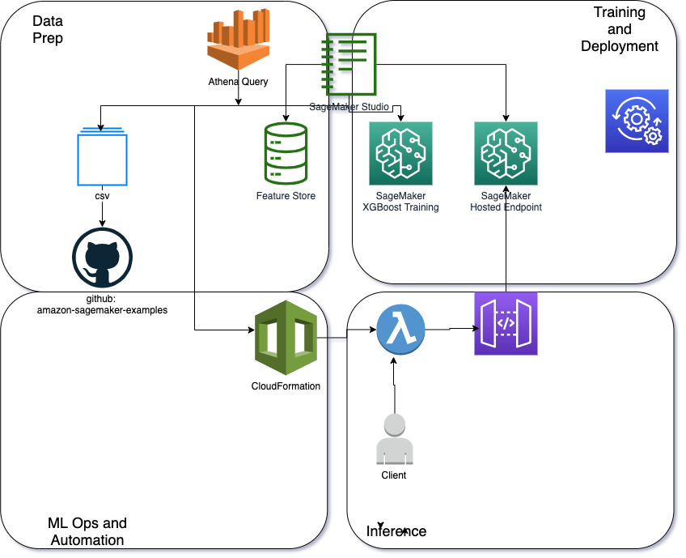

# Enterprise-Grade ML: Part 1 Prepare and Use the ML Gateway Pattern for Inference

## Data Prep and Inference using SageMaker Feature Store

Very often Data Science projects start in an experimental phase in which transformations on features are experimented with, algorithms are selected and tried for determining if they can fit the data distribution well enough for reliable predictions, tuning is done with various hyper-parameters and so on. 

As an organization matures in their Machine Learning (ML) Journey, they will find that they will then transition to an automated ML or MLOps phase where the pipelines for data preparation, training, deployment, monitoring will all need to be automated.

In order to raise the maturity of projects to an Enterprise Scale that can fulfill business needs, sustain business-level continuity, scale, security and performance, the need for integrating data science experiments with machine learning deployment patterns and best-practices will grow in importance and will save you time and money.

In this blog series on ML Patterns, we will start by focusing on Deployment Patterns and Best-Practices within the ML lifecycle : exploring the considerations and options that present themselves, post-training; on the serving/inference/prediction phases of the ML lifecycle.

There are many ways in which we can expose an endpoint that was deployed as a hosted SageMaker endpoint: these variations are summarized in the ML Gateway Pattern with mandatory and optional components. Through this series of blogs we will outline options and their context, pros and cons for helping you decide what components to use for your specific workload and use-case.

