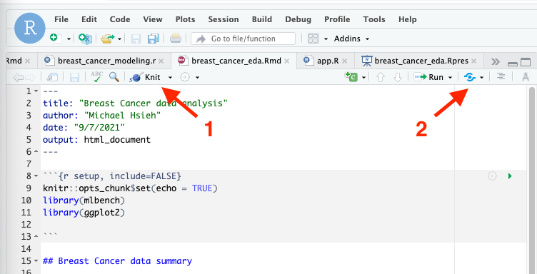
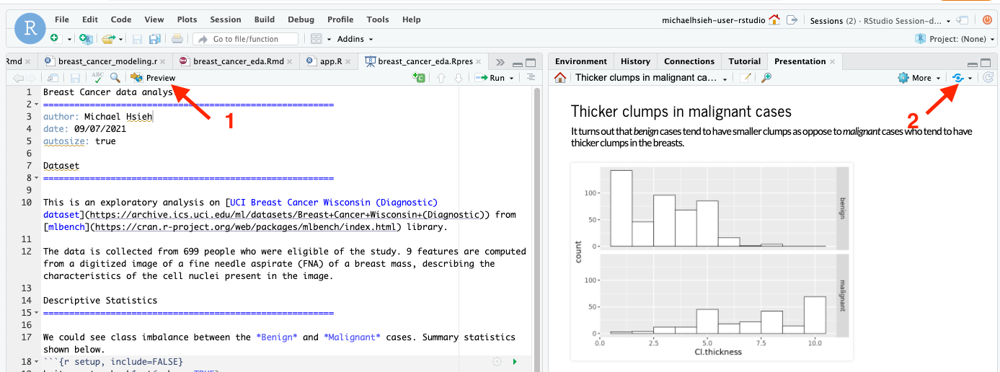

# Publishing R Markdown documents from RStudio Workbench in Amazon SageMaker to RStudio Connect

You can easily and programmatically create an analysis within RStudio Workbench on Amazon SageMaker and publish it to RStudio Connect so that your collaborators can easily consume your analysis. In this example, we use a [UCI breast cancer dataset](https://archive.ics.uci.edu/ml/datasets/breast+cancer+wisconsin+%28original%29) from [mlbench](https://cran.r-project.org/web/packages/mlbench/index.html) to walkthrough some of the common use case of publication: R Markdown, R Presentation documents.

## R Markdown

R Markdown is a great tool to run your analyses in R as part of a markdown file and share in RStudio Connect. In the rmarkdown example in [breast_cancer_eda.Rmd](./breast_cancer_eda.Rmd) in the GitHub repo, we perform two simple analyses and plotting on the dataset along with the texts in markdown. 

```{r}
    ```{r breastcancer}
    data(BreastCancer)
    df <- BreastCancer
    # convert input values to numeric
    for(i in 2:10) {
    df[,i] <- as.numeric(as.character(df[,i]))
    }
    summary(df)
    ```

    ```{r cl_thickness, echo=FALSE}
    ggplot(df, aes(x=Cl.thickness))+
        geom_histogram(color="black", fill="white", binwidth = 1)+
        facet_grid(Class ~ .)
    ```
```

We can preview the file by clicking on the **Knit** button (1) and publish it to our RStudio Connect with the **Publish** button (2).


## R Presentation

We could also run the similar analysis inline to create a R Presentation deck that can be published to your collaborators. 
In the example in [breast_cancer_eda.Rpres](./breast_cancer_eda.Rpres) in the GitHub repo, we combine the presentation, markdown and the R commands together to create a slide deck. You can preview the slides while writing codes with the **Preview** button (1). Once you complete, you can publish it with the **Publish** button (2) in the **Presentation** tab on the right. 



We showed you the static work that can be published and shared on RStudio Connect from RStudio Workbench on Amazon SageMaker. More often than not, you are building an interactive application or dashboard with Shiny.  Let’s take a look how we can publish Shiny apps from RStudio Workbench in Amazon SageMaker to RStudio Connect in [Publishing R Shiny Apps](../rsconnect_shiny).
