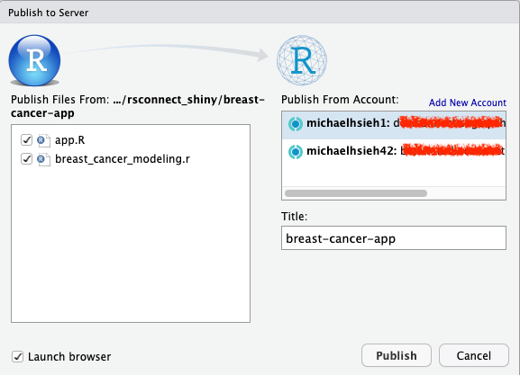

# Publishing R Shiny apps from RStudio on Amazon SageMaker to RStudio Connect

[Shiny](https://shiny.rstudio.com/) is an R package that makes it easy to create interactive web applications programmatically. It is popular among data scientists to share their analyses and models through a Shiny application to their stakeholders. In this example [breast-cancer-app](./breast-cancer-app), we develop a machine learning model using a [UCI breast cancer dataset](https://archive.ics.uci.edu/ml/datasets/breast+cancer+wisconsin+%28original%29) in `breast_cancer_modeling.r` and create a web application to allow users to interact with the data and ML model. 

To publish, open the [breast-cancer-app/app.R](./breast-cancer-app/app.R) and click the **Publish** button to publish the application. Please select both `app.R` and `breast_cancer_modeling.r` to publish. 

In the application, you can change the features to visualize in the plot and select the data points in the plot to see more details and model prediction whether they are benign or malignant cancer cases. By sliding the probability threshold, you can interact with the model and get a different classification count.

