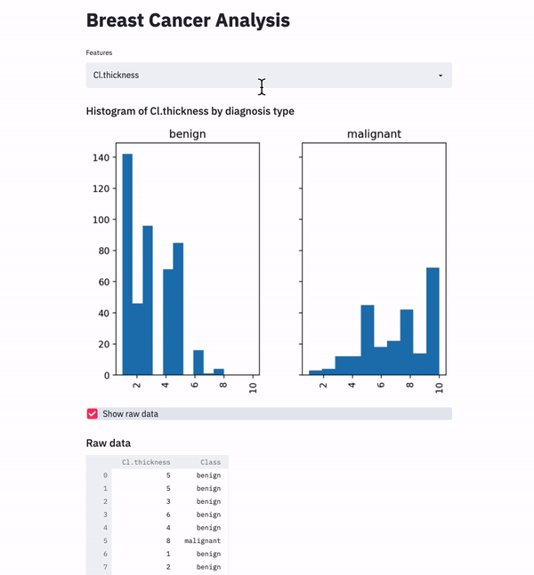

# Publishing Streamlit apps from Amazon SageMaker Studio to RStudio Connect

[Streamlit](https://docs.streamlit.io/en/latest/index.html) is an open source project in Python that makes it easy to create web applications for machine learning and data science developers. In this example, we develope a simple Streamlit application in `app.py` to allow interactive data exploration and visualization on the [UCI breast cancer dataset](https://archive.ics.uci.edu/ml/datasets/breast+cancer+wisconsin+%28original%29). Let’s see how we can deploy this app to RStudio Connect from SageMaker Studio. 

1. Before we proceed, we first need to create an API key from your RStudio Connect account. Please follow the instruction (https://docs.rstudio.com/connect/user/api-keys/#api-keys-creating) to create one, and save it for record as the publication process requires the API key.
1. Open a system terminal in SageMaker Studio in **File**->**New**->**Terminal**.
1. Install the [`rsconnect-python`](https://github.com/rstudio/rsconnect-python) library in the terminal. 

    ```python
    pip install rsconnect-python
    ```

1. Deploy the app using `rsconnect deploy` command in the terminal. In the command, we need to specify the deploy type, the server URL, an API key for the RStudio Connect account, and a file path to the folder containing `app.py` and `requirements.txt`. Note that you need to put required Python libraries in [`requirements.txt`](./breast-cancer-streamlit-app/requirements.txt) for deployment. 

    ```python
    rsconnect deploy streamlit \
        --server https://xxxx.rstudioconnect.com/ \
        --api-key <your-rstudio-connect-api-key> \
        /path/to/breast-cancer-streamlit-app/
    ```

At the end of the execution, you should see URLs for the app in RStudio Connect. You can open the URL to see the published Streamlit app.



Note that [RStudio Connect insists on matching `<MAJOR.MINOR>` versions of Python](https://github.com/rstudio/rsconnect-python#deploying-python-content-to-rstudio-connect). You need to make sure that your RStudio Connect instance has a compatible version to what is available on the notebook kernel. You can verify the Python version in the terminal in SageMaker Studio with `python --version`. You can check the version available on RStudio Connect in the **Documentation** page in your RStudio Connect, for example, `https://xxxx.rstudioconnect.com/connect/#/help/docs`.