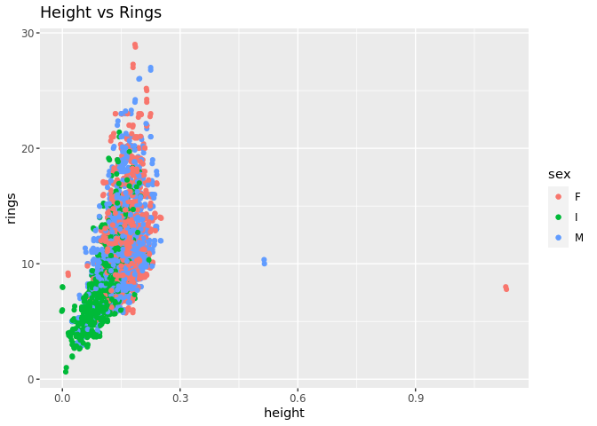
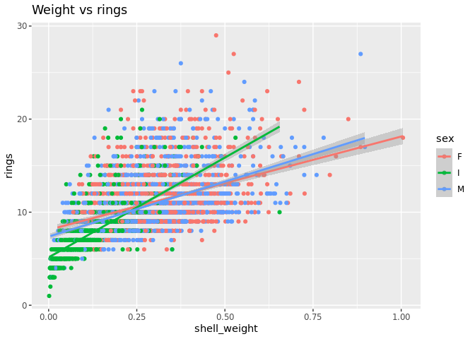
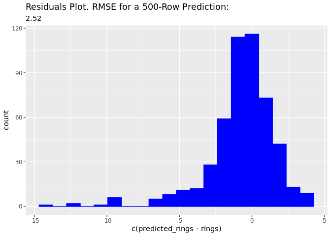
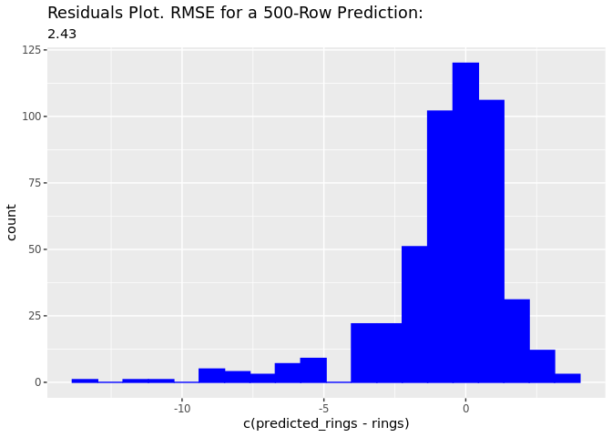

# Train and Deploy an XGBoost model in Amazon SageMaker from RStudio on SageMaker

This is a notebook showcasing how to use RStudio on SageMaker to
interact and use other SageMaker services. To get started with RStudio,
you can bring your existing license for RStudio Workbench or if you
don’t have any, you’ll need to get one from [RStudio
PBC](https://www.rstudio.com/).

To get started check out [Get started with RStudio on Amazon
SageMaker](https://aws.amazon.com/blogs/machine-learning/get-started-with-rstudio-on-amazon-sagemaker/)

Once you have setup your license and created your SageMaker RStudio
domain, you can follow the rest of this notebook.

Interacting with the rest of the SageMaker features and services from R
& RStudio is achieved through the SageMaker Python SDK which can be
loaded in our environment using
[Reticulate](https://rstudio.github.io/reticulate/). Reticulate creates
an interface between our R environment and the Python packages we
install.    

## Setup

When running this notebook for the first time, you may need to install
some necessary packages. The following cell will install all that is
needed.

Once this is done, we can load all the libraries we will be needing for
this example.    Load libraries and initialise some variables that
we will need later.

    library(reticulate)
    library(readr)
    library(ggplot2)
    library(dplyr)

    ## 
    ## Attaching package: 'dplyr'

    ## The following objects are masked from 'package:stats':
    ## 
    ##     filter, lag

    ## The following objects are masked from 'package:base':
    ## 
    ##     intersect, setdiff, setequal, union

    library(stringr)
    library(Metrics)

    sagemaker <- import('sagemaker')

    session <- sagemaker$Session()
    bucket <- session$default_bucket()
    role_arn <- sagemaker$get_execution_role()

  

## Download Data

For this example we will be using the famous abalone dataset as can be
found on the [UCI dataset
archive](https://archive.ics.uci.edu/ml/datasets/Abalone) where we will
create a model to predict the age of an abalone shell based on physical
measurements.

Dua, D. and Graff, C. (2019). UCI Machine Learning Repository
\[<http://archive.ics.uci.edu/ml>\]. Irvine, CA: University of
California, School of Information and Computer Science.

    data_file <- 's3://sagemaker-sample-files/datasets/tabular/uci_abalone/abalone.csv'
    data_string <- sagemaker$s3$S3Downloader$read_file(data_file)
    abalone <- read_csv(file = data_string, col_names = FALSE, show_col_types = FALSE)
    names(abalone) <- c('sex', 'length', 'diameter', 'height', 'whole_weight', 'shucked_weight', 'viscera_weight', 'shell_weight', 'rings')
    head(abalone)

    ## # A tibble: 6 × 9
    ##   sex   length diameter height whole_weight shucked_weight viscera_weight
    ##   <chr>  <dbl>    <dbl>  <dbl>        <dbl>          <dbl>          <dbl>
    ## 1 M      0.455    0.365  0.095        0.514         0.224          0.101 
    ## 2 M      0.35     0.265  0.09         0.226         0.0995         0.0485
    ## 3 F      0.53     0.42   0.135        0.677         0.256          0.142 
    ## 4 M      0.44     0.365  0.125        0.516         0.216          0.114 
    ## 5 I      0.33     0.255  0.08         0.205         0.0895         0.0395
    ## 6 I      0.425    0.3    0.095        0.352         0.141          0.0775
    ## # … with 2 more variables: shell_weight <dbl>, rings <dbl>

  

## Explore data & preprocess

As with any Machine Learning project, the first step we take is to
explore data, plot and try to better understand the data. You can use
your favourite R libraries to explore, plot and process your data the
same way you would do if running RStudio on a local or self-managed
instance.

    abalone$sex <- as.factor(abalone$sex)
    summary(abalone)

    ##  sex          length         diameter          height        whole_weight   
    ##  F:1307   Min.   :0.075   Min.   :0.0550   Min.   :0.0000   Min.   :0.0020  
    ##  I:1342   1st Qu.:0.450   1st Qu.:0.3500   1st Qu.:0.1150   1st Qu.:0.4415  
    ##  M:1528   Median :0.545   Median :0.4250   Median :0.1400   Median :0.7995  
    ##           Mean   :0.524   Mean   :0.4079   Mean   :0.1395   Mean   :0.8287  
    ##           3rd Qu.:0.615   3rd Qu.:0.4800   3rd Qu.:0.1650   3rd Qu.:1.1530  
    ##           Max.   :0.815   Max.   :0.6500   Max.   :1.1300   Max.   :2.8255  
    ##  shucked_weight   viscera_weight    shell_weight        rings       
    ##  Min.   :0.0010   Min.   :0.0005   Min.   :0.0015   Min.   : 1.000  
    ##  1st Qu.:0.1860   1st Qu.:0.0935   1st Qu.:0.1300   1st Qu.: 8.000  
    ##  Median :0.3360   Median :0.1710   Median :0.2340   Median : 9.000  
    ##  Mean   :0.3594   Mean   :0.1806   Mean   :0.2388   Mean   : 9.934  
    ##  3rd Qu.:0.5020   3rd Qu.:0.2530   3rd Qu.:0.3290   3rd Qu.:11.000  
    ##  Max.   :1.4880   Max.   :0.7600   Max.   :1.0050   Max.   :29.000

    options(repr.plot.width = 5, repr.plot.height = 4) 
    ggplot(abalone, aes(x = height, y = rings, color = sex)) + geom_point() + geom_jitter() +ggtitle("Height vs Rings") 

    ggplot(data=abalone,aes(x=shell_weight,y=rings,color=sex))+geom_point()+geom_smooth(method="lm")+ggtitle("Weight vs rings") 

    ## `geom_smooth()` using formula 'y ~ x'

    abalone <- abalone %>% filter(height != 0)
    abalone <- abalone %>% filter(height < 0.4)

  

## Prepare data for training

Once happy with the above step, it is time to prepare the data for
training. We split the data and upload them to an s3 bucket.

    abalone <- abalone %>%
      mutate(female = as.integer(ifelse(sex == 'F', 1, 0)),
             male = as.integer(ifelse(sex == 'M', 1, 0)),
             infant = as.integer(ifelse(sex == 'I', 1, 0))) %>%
      select(-sex)
    abalone <- abalone %>% select(rings:infant, length:shell_weight)

    abalone_train <- abalone %>%
      sample_frac(size = 0.7)
    abalone <- anti_join(abalone, abalone_train)

    ## Joining, by = c("rings", "female", "male", "infant", "length", "diameter", "height", "whole_weight", "shucked_weight", "viscera_weight", "shell_weight")

    abalone_test <- abalone %>%
      sample_frac(size = 0.5)
    abalone_valid <- anti_join(abalone, abalone_test)

    ## Joining, by = c("rings", "female", "male", "infant", "length", "diameter", "height", "whole_weight", "shucked_weight", "viscera_weight", "shell_weight")

    num_predict_rows <- 500
    abalone_test <- abalone_test[1:num_predict_rows, ]

    write_csv(abalone_train, 'abalone_train.csv', col_names = FALSE)
    write_csv(abalone_valid, 'abalone_valid.csv', col_names = FALSE)

    # Remove target from test
    write_csv(abalone_test[-1], 'abalone_test.csv', col_names = FALSE)

    s3_train <- session$upload_data(path = 'abalone_train.csv', 
                                    bucket = bucket, 
                                    key_prefix = 'r_example/data')
    s3_valid <- session$upload_data(path = 'abalone_valid.csv', 
                                    bucket = bucket, 
                                    key_prefix = 'r_example/data')

    s3_test <- session$upload_data(path = 'abalone_test.csv', 
                                   bucket = bucket, 
                                   key_prefix = 'r_example/data')

  

## Train model using SageMaker Training Jobs

We are now ready to train an ML model. We will train an XGBoost using
the XGBoost
[built-in](https://docs.aws.amazon.com/sagemaker/latest/dg/xgboost.html)
algorithm of SageMaker.

    s3_train_input <- sagemaker$inputs$TrainingInput(s3_data = s3_train,
                                                     content_type = 'csv')
    s3_valid_input <- sagemaker$inputs$TrainingInput(s3_data = s3_valid,
                                                     content_type = 'csv')

    input_data <- list('train' = s3_train_input,
                       'validation' = s3_valid_input)

    container <- sagemaker$image_uris$retrieve(framework='xgboost', region= session$boto_region_name, version='latest')
    cat('XGBoost Container Image URL: ', container)

    ## XGBoost Container Image URL:  685385470294.dkr.ecr.eu-west-1.amazonaws.com/xgboost:latest

    s3_output <- paste0('s3://', bucket, '/r_example/output')
    estimator <- sagemaker$estimator$Estimator(image_uri = container,
                                               role = role_arn,
                                               instance_count = 1L,
                                               instance_type = 'ml.m5.xlarge',
                                               input_mode = 'File',
                                               output_path = s3_output)
    estimator$set_hyperparameters(eval_metric='rmse',
                                  objective='reg:linear',
                                  num_round=100L)

    estimator$fit(inputs = input_data)

  

## Deploy Model

We are now deploying the trained model into a real-time endpoint

    model_endpoint <- estimator$deploy(initial_instance_count=1L,
                                       instance_type='ml.m4.xlarge')

    model_endpoint$serializer <- sagemaker$serializers$CSVSerializer(content_type='text/csv')

## Test Model

Using the test data we can now test the deployed model endpoint and plot
the error

    test_sample <- as.matrix(abalone_test[-1])
    dimnames(test_sample)[[2]] <- NULL

    predictions_ep <- model_endpoint$predict(test_sample)
    predictions_ep <- str_split(predictions_ep, pattern = ',', simplify = TRUE)
    predictions_ep <- as.integer(unlist(predictions_ep))

    # Convert predictions to Integer
    abalone_predictions_ep <- cbind(predicted_rings = predictions_ep, 
                                    abalone_test)

    head(abalone_predictions_ep)

    ##   predicted_rings rings female male infant length diameter height whole_weight
    ## 1              12    21      1    0      0  0.490    0.365  0.130       0.6835
    ## 2               7     6      0    0      1  0.375    0.275  0.095       0.2465
    ## 3              10    10      0    0      1  0.550    0.405  0.150       0.6755
    ## 4              11    12      1    0      0  0.635    0.500  0.175       1.4770
    ## 5              10    12      1    0      0  0.610    0.490  0.170       1.1370
    ## 6              10     9      0    1      0  0.570    0.450  0.140       0.7950
    ##   shucked_weight viscera_weight shell_weight
    ## 1         0.1650         0.1315       0.2050
    ## 2         0.1100         0.0415       0.0775
    ## 3         0.3015         0.1465       0.2100
    ## 4         0.6840         0.3005       0.3900
    ## 5         0.4605         0.2825       0.3440
    ## 6         0.3385         0.1480       0.2450

    abalone_rmse_ep <- rmse(abalone_predictions_ep$rings, abalone_predictions_ep$predicted_rings)
    cat('RMSE for Endpoint 500-Row Prediction: ', round(abalone_rmse_ep, digits = 2))

    ## RMSE for Endpoint 500-Row Prediction:  2.52

    ggplot(abalone_predictions_ep, aes(x=c(predicted_rings - rings))) + geom_histogram(color="blue", fill='blue', bins=20) + ggtitle("Residuals Plot. RMSE for a 500-Row Prediction: ", round(abalone_rmse_ep, digits = 2))

## Delete endpoint

Once done testing, make sure to delete the endpoint so you are not being
charged for an endpoint that you are not using.

    model_endpoint$delete_endpoint(delete_endpoint_config=TRUE)

# HPO (Optional)

Optionally, let’s use SageMaker [Automatic Model
Tuning](https://docs.aws.amazon.com/sagemaker/latest/dg/automatic-model-tuning.html)
to perform hyperparametre optimisation. Then, taking similar steps as
before we will be deploying and testing the best model found.

    hyperparameter_ranges <- list('eta'= sagemaker$tuner$ContinuousParameter(0, 1),
                                'min_child_weight'= sagemaker$tuner$ContinuousParameter(1, 10),
                                'alpha'= sagemaker$tuner$ContinuousParameter(0, 2),
                                'max_depth'= sagemaker$tuner$IntegerParameter(1L, 10L)
                                )

    objective_metric_name <- 'validation:rmse'

    tuner <- sagemaker$tuner$HyperparameterTuner(estimator,
                                                objective_metric_name,
                                                hyperparameter_ranges,
                                                objective_type="Minimize",
                                                max_jobs=10L,
                                                max_parallel_jobs=3L)
    tuner$fit(inputs = input_data)

    tuner$best_training_job()

    ## [1] "xgboost-220329-0949-003-f17b9075"

Deploying the model, is similar to how we deployed it before.

    model_endpoint <- tuner$deploy(initial_instance_count=1L,
                                       instance_type='ml.m4.xlarge')

    model_endpoint$serializer <- sagemaker$serializers$CSVSerializer(content_type='text/csv')

Similarly, we test the endpoint using the test data and we plot the
residuals plot

    test_sample <- as.matrix(abalone_test[-1])
    dimnames(test_sample)[[2]] <- NULL

    predictions_ep <- model_endpoint$predict(test_sample)
    predictions_ep <- str_split(predictions_ep, pattern = ',', simplify = TRUE)
    predictions_ep <- as.integer(unlist(predictions_ep))

    # Convert predictions to Integer
    abalone_predictions_ep <- cbind(predicted_rings = predictions_ep, 
                                    abalone_test)

    head(abalone_predictions_ep)

    ##   predicted_rings rings female male infant length diameter height whole_weight
    ## 1              12    21      1    0      0  0.490    0.365  0.130       0.6835
    ## 2               6     6      0    0      1  0.375    0.275  0.095       0.2465
    ## 3              10    10      0    0      1  0.550    0.405  0.150       0.6755
    ## 4              11    12      1    0      0  0.635    0.500  0.175       1.4770
    ## 5              11    12      1    0      0  0.610    0.490  0.170       1.1370
    ## 6               9     9      0    1      0  0.570    0.450  0.140       0.7950
    ##   shucked_weight viscera_weight shell_weight
    ## 1         0.1650         0.1315       0.2050
    ## 2         0.1100         0.0415       0.0775
    ## 3         0.3015         0.1465       0.2100
    ## 4         0.6840         0.3005       0.3900
    ## 5         0.4605         0.2825       0.3440
    ## 6         0.3385         0.1480       0.2450

    abalone_rmse_ep <- rmse(abalone_predictions_ep$rings, abalone_predictions_ep$predicted_rings)
    cat('RMSE for Endpoint 500-Row Prediction: ', round(abalone_rmse_ep, digits = 2))

    ## RMSE for Endpoint 500-Row Prediction:  2.43

    ggplot(abalone_predictions_ep, aes(x=c(predicted_rings - rings))) + geom_histogram(color="blue", fill='blue', bins=20) + ggtitle("Residuals Plot. RMSE for a 500-Row Prediction: ", round(abalone_rmse_ep, digits = 2))

# Delete endpoint

    model_endpoint$delete_endpoint(delete_endpoint_config=TRUE)
