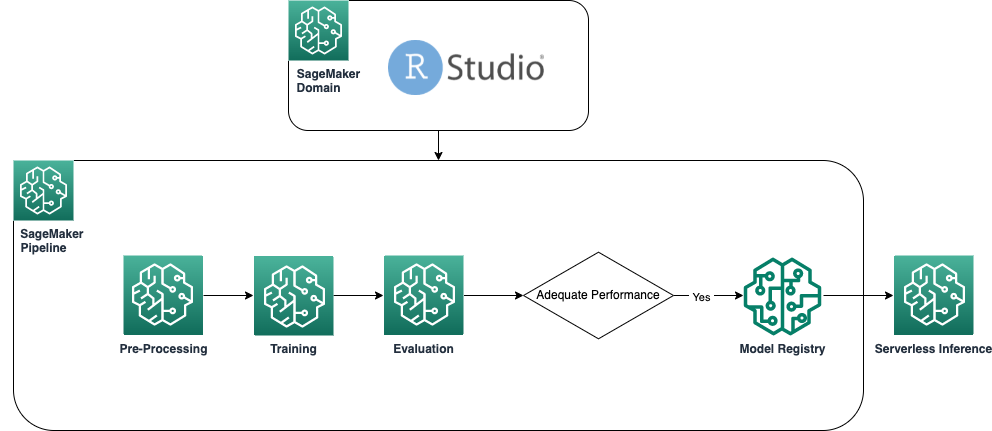

# Use RStudio on SageMaker to create a SageMaker Pipeline and deploy to a serverless endpoint

This is an example of using RStudio on SageMaker showing how you can create a SageMaker Pipeline with R as well as deploying your R model in a serverless endpoint. 

The following diagram shows the architecture used in this example.

Open & run the `main.R` file. This file contains the logic to run the end to end process along with comments for each of the steps.

## Folder/File Structure

- `iam_policy.json` & `trust_relationship.json` contain the additional IAM policy and trust relationship that needs to be added to your assumed role and contain the permissions you will need to use CodeBuild to build the custom R containers
- `docker/` contains the docker file definitions and helper files needed by the custom containers
- `preprocessing`, `postprocessing` and `training` folders container the  code for the respective steps
- `pipeline.R` is the file containing the definition of the SageMaker Pipeline. 