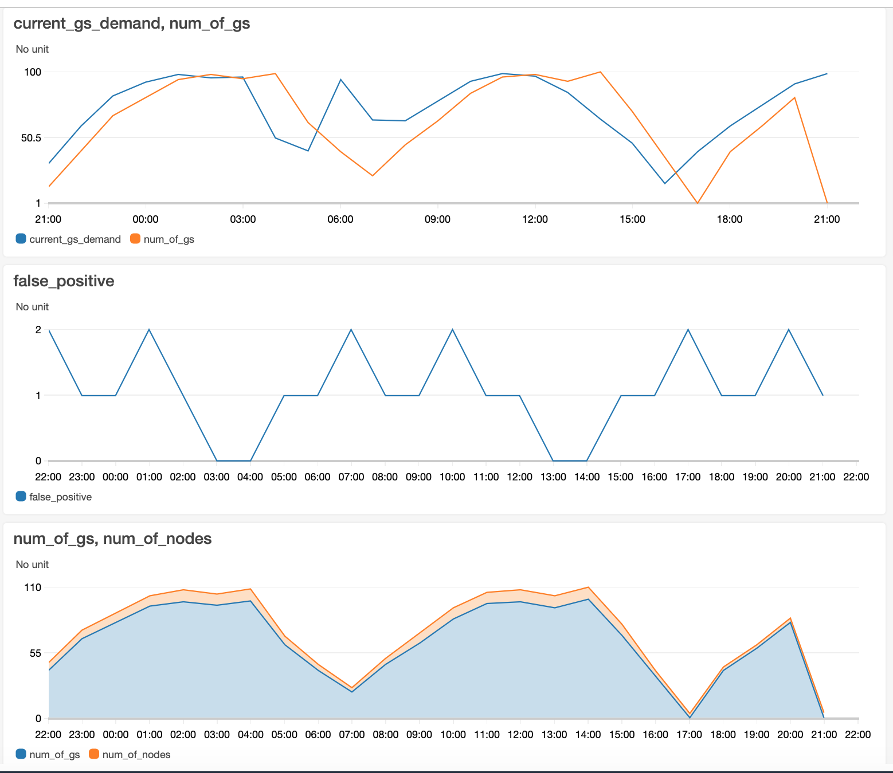

## Environment Preparation
Here we describe how to setup the AWS envrionment setup. It includes EKS cluster, SQS Queues, DynamoDB tables, Lambda functions and API gateway endpoints.

### Workspace preparation
1. Clone the github repo from [amazon-sagemaker-examples](https://github.com/TBD).
2. Create an admin role to assign the cloud9 workspace so we can provision the required resources (EKS cluster, SQS queues, DynamoDB tables, ECR registries and more). Click [here](https://console.aws.amazon.com/iam/home?region=eu-central-1#/roles$new?step=type). Under ***Choose the service that will use this role*** choose EC2. Click next and add the first role **AdministratorAccess**.
3. Create a Cloud9 Environment in your favorite region e.g., `us-west-2` (Oregon region). Using the [link](https://us-west-2.console.aws.amazon.com/cloud9/home?region=us-west-2). Name it `rl-game-server-autopilot`. Choose the `t2.micro` instance. Cloud9 will spin up an EC2 instance in your account in `us-west-2`. Choose the IAM Role that you created in Step 2.
* Cloud9 normally manages IAM credentials dynamically. This isn’t currently compatible with the EKS IAM authentication, so we will disable it and rely on the IAM role instead. Therefore, we are going to disable the assigned Cloud9 credentials as indicated in the  below.
4. Inside the Cloud9 instance, clone the GitHub repository into your workspace. Your github repository should be public, so you can clone it using the HTTPS Url.
    ```bash
    git clone git@github.com:awslabs/amazon-sagemaker-examples.git
    ```
5. Execute the script [env_prep.sh](env_prep.sh) via the Cloud9 workspace. *Please note that there are a few message prompts during the ssh key generator install*
   ```bash
   cd reinforcement_learning/rl_game_server_autopilot/game-env
   ./workspace_prep.sh
   ```
6. Execute the script [create_aws_objects.sh](create_aws_objects.sh) via the Cloud9 workspace.
This script will provision AWS objects like Docker image registry through ECR to store the game-server images as well as other workloads we deploy on EKS. It will also create SQS queues for the game-server to report status e.g., `init` or `terminating`. Finally, we will create few DynamoDB tables to persist system events.
   ```
   # In the same env_prep folder
   ./create_aws_objects.sh
   ```

## The EKS cluster setup
The recommended EKS cluster setup is listed in https://docs.aws.amazon.com/eks/latest/userguide/create-cluster.html
For that you need to install `eksctl`
1. The `eksctl` tool is pre-installed on the Cloud9 instance, but if you prefer to run in on your own computer there is a [getting started guide](https://docs.aws.amazon.com/eks/latest/userguide/getting-started-eksctl.html).
2. Configure the cluster spec and execute the create cluster command.

Create the cluster by executing:
```bash
eksctl create cluster -f /specs/cluster.yaml
```

3. Enable the game-servers to perform actions like autoscaling i.e., spin-up or spin-down nodes when needed.

    3.1 Discover the IAM role attached to the node-group created with the cluster by searching roles in the IAM console with the following pattern:`eksctl-CLUSTER_NAME-NODEGROUP_NAME-NodeInstanceRole`. e.g.,
    ```bash
    aws iam list-roles | grep eksctl-rl-gs-autopilot-nodegroup-NodeInstanceRole | grep RoleName
    
    3.2 Create the following inline policies 
    
```
***CloudWatch*** - PutMetricData. The cloudwatch policy will look like:

```json
{
    "Version": "2012-10-17",
    "Statement": [
        {
            "Sid": "VisualEditor0",
            "Effect": "Allow",
            "Action": "cloudwatch:PutMetricData",
            "Resource": "*"
        }
    ]
}

```
***EC2 Auto Scaling*** - DescribeAutoScalingGroups, DescribeAutoScalingInstances, SetDesiredCapacity, TerminateInstanceInAutoScalingGroup. Discover the ASG ARN by executing:
```bash
aws autoscaling describe-auto-scaling-groups | jq '.AutoScalingGroups[].AutoScalingGroupARN'
```

The autoscale inline policy will look like:

```json
{
    "Version": "2012-10-17",
    "Statement": [
        {
            "Sid": "VisualEditor0",
            "Effect": "Allow",
            "Action": [
                "autoscaling:SetDesiredCapacity",
                "autoscaling:TerminateInstanceInAutoScalingGroup"
            ],
            "Resource": "arn:aws:autoscaling:eu-central-1:num:autoScalingGroup:guid:autoScalingGroupName/eksctl-gs-us-east-1-nodegroup-mixed-instances-1-NodeGroup-guid"
        },
        {
            "Sid": "VisualEditor1",
            "Effect": "Allow",
            "Action": [
                "autoscaling:DescribeAutoScalingInstances",
                "autoscaling:DescribeAutoScalingGroups"
            ],
            "Resource": "*"
        }
    ]
}
```

4. The last step is deploying cluster-autoscaler so new EC2 instances can be added or remove per the demand for game/chat servers dictated by autopilot. The spec for cluster-autoscaler is [cluster_autoscaler-deploy.yaml](/workshop/eks/specs/cluster_autoscaler-deploy.yaml).
    
   4.1 Edit [cluster-autoscaler.yaml](/specs/cluster-autoscaler.yaml) by adding the cluster name to line #139cluster `--nodes=` and modify the `AWS_REGION` value. e.g., `rl-gs-autopilot` is the cluster name

```yaml
139             - --node-group-auto-discovery=asg:tag=k8s.io/cluster-autoscaler/enabled,k8s.io/cluster-autoscaler/rl-gs-autopilot
140           env:
141             - name: AWS_REGION
142               value: us-west-2
142
```

   4.3 Deploy cluster autoscaler by executing:
   ```bash
   kubectl apply -f specs/cluster-autoscaler.yaml
   ```
   Review the logs by discovering the pods name
   ```bash
   kubectl logs `kubectl get po -n kube-system| grep cluster-autoscaler | awk '{print $1}'` -n kube-system
   ```


## Sample workload deployment
   In this section we deploy to EKS a game-server. This example includes a sample game-server image that required to be built and pushed to ECR.
    
    
   Deploy the game-server to EKS
   ```bash
   kubectl create -f specs/minecraft-r1-12-deploy.yaml
   ```
    
   After few minutes the game-server image we built will be deployed and running in the EKS cluster. To view the game-server pods, execute:
    
   ```
   kubectl get pods
   ```
   
   Our next step will deploy the game-server autopilot for prediction-based game-server auto-scale.


 ## Deploy game-server autopilot client
Now that we have the game server running, we can schedule the autopilot client to autoscale based on predictions. It uses a trained model that predicts the number of game-servers needed. In this workshop, we are going to focus on the client side only. The client is backed by a model that learns usage patterns and adopts the predictions based on emerging game-server allocation in a specific cluster. The Autopilot client sets the necessary number of game-servers. If there is a need for more EC2 instances, there will be game-server jobs that are pending. That will trigger the cluster_autoscaler that we deployed in previous step to add more EC2 instances, making space for more pods.

   To deploy autopilot execute:
   1. Build and deploy the image to ECR.
   ```
   cd autopilot-image
   ./build.sh
   cd ../..
   ```

   Then update the [autopilot-client-deploy.yaml](specs/autopilot-client-deploy.yaml) with the image name, and deploy it
   ```
   kubectl apply -f specs/autopilot-client-deploy.yaml
   ```

   After the pod is scheduled check its stdour/err by executing:

   ```
   kubectl logs `kubectl get po | grep autopilot | awk '{print $1}'`
   ```

   After few minutes, we can start seeing metrics populated in cloudwatch.
   Using CloudWatch console, discover the `multiplayersample` CloudWatch namespace under Custom Namespaces. There are five metrics that help us to assess the system health.
   * `num_of_gs` - Describes the predicated number of game-server that was set on the cluster.
   * `current_gs_demand` - Describes the current demand for game-servers by players.
   * `num_of_nodes` - Describes the number of EC2 instances allocated.
   * `false-positive` - Counter of cases where the predictions `num_of_gs` was smaller than `current_gs_demand` and could cause live session interruption.
   1. Create a line graph that includes `num_of_gs` and `current_gs_demand` to assess the prediction quality. Set the metric data aggregation to 5min **(Statistics=Average)**
   2. Create a line graph that includes `num_of_gs` and `num_of_nodes` to assess the correlation between game-server allocation and EC2 instances allocation. Set the metric data aggregation to 5min **(Statistics=Average)**
   3. Create a line graph that aggregates the number of **false positives** by the autopilot model. Set the metric aggregation to 5min **(Statistics=Sum)**
   Resulted 

