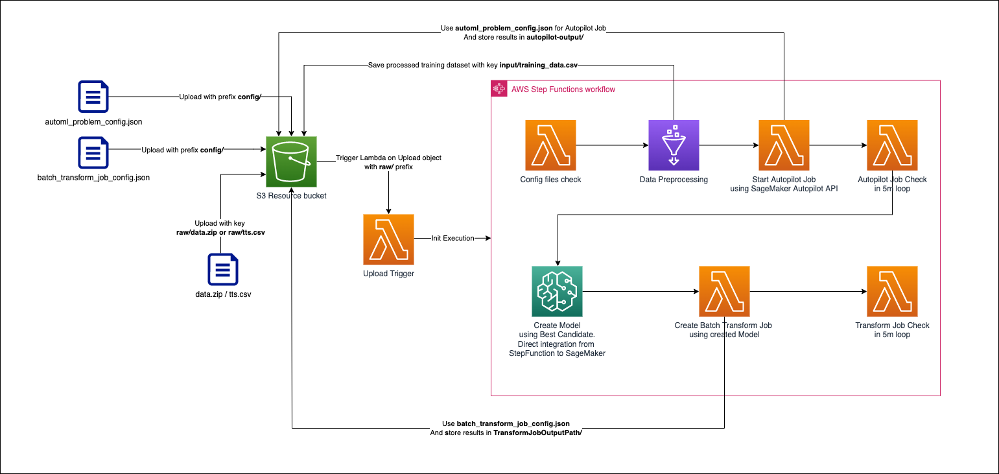
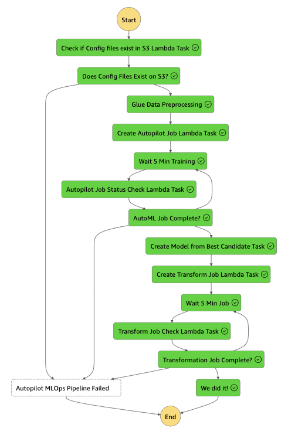

# Serverless Autopilot MLOps Pipeline for Time Series using CDK

This is a CDK implementation demonstrates how to build custom model for Time Series Forecasting workflow using Amazon SageMaker Autopilot for Time Series data. The MLOps is built on top of AWS Serverless services to minimize the operations overhead - you will work with Step Functions, Lambdas, Glue, SageMaker, S3.

The solution is written in AWS CDK using TypeScript.

> **Warning**
> This application is not ready for production use. It was written for demonstration and educational purposes. No warranty is implied in this example.

> **Note**
> This architecture creates resources that have costs associated with them. Please see the [AWS Pricing](https://aws.amazon.com/pricing/) page for details and make sure to understand the costs before deploying this stack.

## Prerequisites

AWS CDK v2 is required to deploy this application.
See [Installation Guide](https://docs.aws.amazon.com/cdk/latest/guide/work-with-cdk-typescript.html) to install AWS CDK in TypeScript.  

Once complete with the previous step, run below command on the root of this project to deploy the pipeline.

```bash
npm install
```
```bash
npm run cdk deploy AutoML-TS-MLOps
```

> CAUTION! If you deploy something via CDK for the first time for this AWS Account in this AWS Region, then you need to do a CDK Bootstrap via `cdk bootstrap` command.

If successfully deployed, we are ready to launch 🚀🚀🚀

## Solutions Architecture



This package contains a CDK implementation of a MLOps Pipeline for Amazon SageMaker Autopilot for Time Series data. The pipeline automatically execute Amazon SageMaker Autopilot operations and relevant services operations. Basically, each of the pipeline step are either implemente with AWS Lambda, AWS Glue, or direct call of SageMaker from Step Functions, and the entire workflow orchestrated by AWS Step Functions.

The pipeline consist of the following steps:

### Trigger the MLOps Pipeline
Implemented in Lambda Function which is triggered by S3 Bucket when a new file is uploaded into __/raw__  prefixe in a S3 Bucket created by CDK. Lambda Function triggers the Step Function pipeline.

### Config files Check
Implemented in Lambda Function which is the first step of the AWS Step Functions pipeline, it checks the existence of both `automl_problem_config.json` and `batch_transform_job_config.json` config files in S3 `config/`  prefixe. If they are not there, the pipeline execution fails.
It is used as a pre-caution step to ensure you won't spend money on resources as other steps in pipeline will fail without config files.

### Data Preprocessing
Implemented in Glue Python Job. Performs data operations defined in python scripts. It has implementation for scenarios when __.zip__ or __TTS.csv__ files uploaded.

In case of  __.zip__ file upload, it expects to have at least `TTS.csv` and optionally `RTS.csv` and `metadata.csv`. The script provided does merge of these files (`TTS.csv`, `RTS.csv`, `metadata.csv`) into 1 input file which Amazon SageMaker Autopilot for Time Series expects. 
Then merged file is saved as `input/training_data.csv` in the same S3 bucket.

In case of __TTS.csv__ file upload, it doesn't do any transformations, but saves it as `input/training_data.csv` in the same S3 bucket.


### Autopilot Training Creation
Implemented in Lambda Function. Creates Amazon SageMaker Autopilot Training job for Time Series data using a newest version of SageMaker API [CreateAutoMLJobV2](https://docs.aws.amazon.com/sagemaker/latest/APIReference/API_CreateAutoMLJobV2.html), as there no direct intergation from Step Functions for this API.

It uses the configuration file from S3 `config/automl_problem_config.json`. 

> **Warning**
> Make sure you have it uploaded before! Otherwise the pipeline won't work properly!
> Also, make sure you adjusted the config file based on your use-case and data structure! More about expected format you could find in documentation [CreateAutoMLJobV2](https://docs.aws.amazon.com/sagemaker/latest/APIReference/API_CreateAutoMLJobV2.html#API_CreateAutoMLJobV2_RequestSyntax).

### Autopilot Job Check
Implemented in Lambda Function with Step Functions loop process. Step Functions does a loop and each 5 minutes runs Lambda Function which checks the status of created Amazon SageMaker Autopilot Training job using a newest version of SageMaker API [DescribeAutoMLJobV2](https://docs.aws.amazon.com/sagemaker/latest/APIReference/API_DescribeAutoMLJobV2.html), as there no direct intergation from Step Functions for this API.

### Create Model
Implemented as direct call of Amazon SageMaker APIs from Step Functions task to create an AI Model using the best performing trained model from Amazon SageMaker Autopilot Training.

### Batch Transform Job
Implemented in Lambda Function. Using сonfig file for Batch Transform Job, so it can be adjusted based on reqirements. Lambda Function calls Amazon SageMaker API [CreateTransformJob](https://docs.aws.amazon.com/sagemaker/latest/APIReference/API_CreateTransformJob.html).

It uses config file provided in S3 bucket in `config/batch_transform_job_config.json`.

> **Warning**
> Make sure you have it uploaded before! Otherwise the pipeline won't work properly!
> Also, make sure you adjusted the config file based on your use-case and data structure! More about expected format you could find in documentation [CreateAutoMLJobV2](https://docs.aws.amazon.com/sagemaker/latest/APIReference/API_CreateAutoMLJobV2.html#API_CreateAutoMLJobV2_RequestSyntax).

### Batch Transform Job Check
Implemented as a Lambda with Step Functions loop process. Step Function does a loop and each 5 minutes runs Lambda Function which checks the status of created Batch Transform Job from previous step. Lambda is used as there is no direct integration from Step Functions tasks with SageMaker API [DescribeTransformJob](https://docs.aws.amazon.com/sagemaker/latest/APIReference/API_DescribeTransformJob.html).

## How to Run

This section explains how to trigger the pipeline. Follow the instructions in order.

### Prepare Dataset

Prepare your own dataset in csv files formatted for Amazon Autopilot.
You could find more details about Amazon SageMaker Autopilot for Time Series dataset format in [documentation](https://docs.aws.amazon.com/sagemaker/latest/dg/timeseries-forecasting-data-format.html).

For those who want to execute the pipeline before preparing your own dataset, sample dataset is included in this project. Please see __sample-data/data.zip__.

> In __sample-data/data.zip__, `TTS.csv` contains weekly products demand history. `RTS.csv` contains related time series data with additional fields for products. `metadata.csv` contains metadata for products.

When you prepare your own dataset, be sure to match the directory structure of the dataset file __data.zip__. The directory structure should look like below.

```bash
data.zip
│────TTS.csv # mandatory
│────RTS.csv # optional
│────metadata.csv # optional
```

> Please note that the names of csv files should be `TTS.csv`, `RTS.csv`, `metadata.csv`.

> Be aware, that if you are doing simple .zip of the folder on MacOS via Finder app, then it adds additional files into the .zip, so create this .zip file and then remove these files by commands in terminal like `zip -d data.zip __MACOSX .DS_Store`.

Also, you can provide already merged dataset in a single `TTS.csv` file.

### AutoML Problem Configuration

Amazon SageMaker Autopilot requires a Problem Configuration to be provided in a specific format. Problem Configuration must be problem specific and must be available in Resource Bucket __automl_problem_config.json__ in `config/`  prefixe before you initiate the MLOps Pipeline by uploading __data.zip__ into Resource Bucket in __raw/__  prefixe.

As your data might be very different from provided synthetic data, the solution is prepared for being reused with different datasets. For that, you need to review/change the configuration file provided in __sample-data__ folder.

> **Warning**
> You must upload `automl_problem_config.json` file to the Resource S3 Bucket created by CDK in `config/`  prefixe __BEFORE__ you will upload `data.zip` file into `raw/`, so the process won't fail as there will be missing Problem Configuration for SageMaker Autopilot for Time Series.
> Example of `automl_problem_config.json` file is available in `sample-data` folder in this solution.

> **Warning**
> You must upload `batch_transform_job_config.json` file to the Resource S3 Bucket created by CDK in `config/`  prefixe __BEFORE__ you will upload `data.zip` file into `raw/`, so the process won't fail as there will be missing Batch Transform Job Configuration used for SageMaker API.
> Example of `batch_transform_job_config.json` file is available in `sample-data` folder in this solution.

### Upload to Launch

Finally, you are ready to launch the pipeline. After you deploy this pipeline,
you will see an S3 bucket named `automl-ts-mlops-pipeline-resource-bucket-{YOUR-12DIGIT-AWS-ACCOUNT-ID}`. All you have to do now is to upload files prepared from the previous steps. 

First - upload your `automl_problem_config.json` file the newly created S3 Bucket (Resource Bucket) with `config/` prefix. You will find example of the file in `sample-data` folder in CDK project.

```bash
aws s3 cp automl_problem_config.json s3://automl-ts-mlops-pipeline-resource-bucket-{YOUR-12DIGIT-AWS-ACCOUNT-ID}/config/
```

Then - upload your `batch_transform_job_config.json` to the same S3 Bucket (Resource Bucket) with with `config/` prefix. You will find example of the file in `sample-data` folder in CDK project.

```bash
aws s3 cp batch_transform_job_config.json s3://automl-ts-mlops-pipeline-resource-bucket-{YOUR-12DIGIT-AWS-ACCOUNT-ID}/config/
```

Now, You have to upload your on `data.zip` or your custom `TTS.csv` file to `raw/`  prefixe in the same bucket. You will find example of the file in `sample-data` folder in CDK project.

```bash
aws s3 cp data.zip s3://automl-ts-mlops-pipeline-resource-bucket-{YOUR-12DIGIT-AWS-ACCOUNT-ID}/raw/
```

> You should upload `data.zip` or `TTS.csv` as the final step because `raw/*` is registered as the upload trigger key of the pipeline. Therefore the pipeline will be triggered immediately after `raw/data.zip` is uploaded.
> There is a first Config Check Lambda in AWS Step Functions pipeline which will check if you have both Config files uploaded in S3. Otherwise it will fail the pipeline at the very beginning.


Navigate to the AWS Step Functions console to monitor the excecution. You will see the progress like below while execution.



When all steps are completed, the __Resource Bucket__ will have the following structure:

```bash
raw/                                        # Where you uploaded the raw dataset
input/                                      # Where preprocessed csv file is stored
autopilot-output/                           # Where experiment models artifacts created by SageMaker Autopilot are stored
output-forecasted-data/                     # Where final csv file with predictions using AIML model is stored
config/automl_problem_config.json           # Sagemaker Autopilot Problem Configuration file 
config/batch_transform_job_config.json      # Sagemaker Batch Transform Job Configuration file 
```


## Project Structure
This project follows typical AWS CDK project structure. The below directories are important from the user perspective.

```bash
bin/                    # Entrypoint of the entire project
lib/                    # CDK Constructs and Stacks are defined
lambda/                 # Python scripts for Lambda Functions
glue/                   # Python scripts for Glue Jobs
cdk-config/             # ADVANCED: CDK config which can allow you to reuse same CDK for multiple MLOps pipelines
```

## Clean up
Run the following command to cleanup all recources created during AutoML-TS-MLOps deployement
```bash
npm run cdk destroy AutoML-TS-MLOps
```

## Advanced settings

Provided CDK is made in a configurable way, so you can deploy multiple pipelines into the same AWS Account in the same AWS Region. It is done using `cdk-config/cdk-config.json` file, where you must specify __baseResourceBucket__ and __baseConstructName__.

These 2 variables then are used by AWS CDK, so you can change these 2 variables to deploy separate pipeline in the same AWS Account in the same AWS Region to have multiple pipelines with separate S3 Buckets and completely separate resources for different use-cases.

> **Warning**
> This should be executed with __VERY__ carefully and __ONLY__ when you are aware of what you are doing and why.
> Recommended is to use __Default__ settings and using single pipeline.
> Running multiple pipelines migh face AWS Service Limits.
> You costs will be multiplied by how many pipelines you are executing, as each will have separate AWS Resources.

## 👀 Got Problems?

Please open an issue to let the maintainer know. Or PR would be also appreciated.
The maintainer will reach out!

## Security

See [CONTRIBUTING](CONTRIBUTING.md#security-issue-notifications) for more information.

## License

This library is licensed under the MIT-0 License. See the LICENSE file.