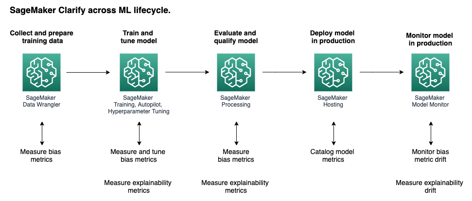

## Bias and Explainability with Amazon SageMaker Clarify
### Overview
Biases are imbalances in the training data, or the prediction behavior of the model across different groups. Sometimes these biases can cause harms to demographic subgroups, e.g. based age or income bracket. The field of machine learning provides an opportunity to address biases by detecting them and measuring them in your data and model.

Amazon SageMaker Clarify provides machine learning developers with greater visibility into their training data and models so they can identify and limit bias and explain predictions.

We are going to go through each stage of the ML lifecycle, and show where you can include Clarify.

### Problem Formation
In this notebook, we are looking to predict the final grade for a students in a maths class, from the popular Student Performance dataset courtesy of UC Irvine.

For this dataset, final grades range from 0-20, where 14-20 are the most favourable outcomes. This is a multiclass classification problem, where we want to predict which grade a given student will get from 0 to 20.

The benefit of using ML to predict this, is to be able to provide an accurate grade for the student if they aren't able to attend the final exam, due to circumstances outside their control.

