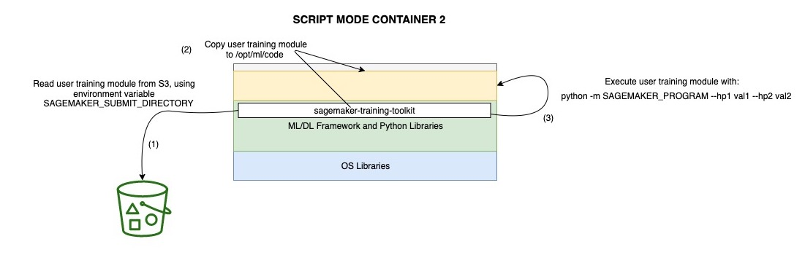

# Amazon SageMaker Custom Training containers

This folder contains skeleton implementations of Amazon SageMaker-compatible training containers.

The purpose of these examples is to explain how to build a custom container for training using the Amazon SageMaker Training Toolkit. This toolkit facilitates the development of SageMaker-compatible training containers and enables dynamic loading of user scripts from Amazon S3, thus separating the execution environment (Docker container) from the script being executed. For additional info, please see: [https://github.com/aws/sagemaker-training-toolkit](https://github.com/aws/sagemaker-training-toolkit).


These examples deliberately do not use any specific ML framework or algorithm. The custom training container functionality is demonstrated by training dummy models.

Each example is structured as follows:

```
example
└───docker     # Dockerfile and dependencies
└───notebook   # Notebook with detailed walkthrough 
└───scripts    # Build scripts

```

Four examples are provided and listed below.

### [Basic Training Container](basic-training-container/)
The bare minimum that is required for building a custom Docker container to run training in Amazon SageMaker.
See additional details here: [https://docs.aws.amazon.com/sagemaker/latest/dg/your-algorithms.html](https://docs.aws.amazon.com/sagemaker/latest/dg/your-algorithms.html).


### [Script Mode Container](script-mode-container/)
A custom container where we install the Amazon SageMaker Training toolkit and enable the Script Mode execution through the training toolkit.


### [Script Mode Container 2](script-mode-container-2/)
Similar to the _Script Mode Container_ example, but loading the user-provided training module from Amazon S3.



### [Framework Container](framework-container/)
Similar to the _Script Mode Container 2_ example, but installing an additional module that allows to customize a ML/DL framework before executing the user-provided training module.


