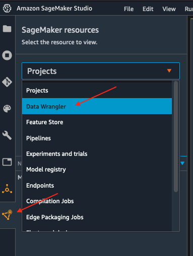
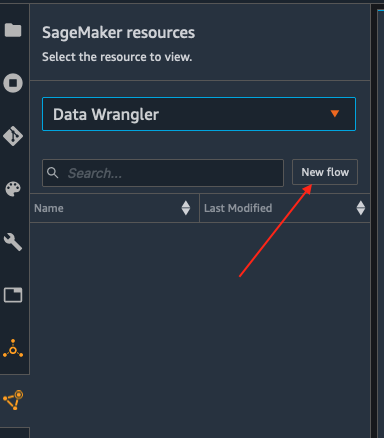
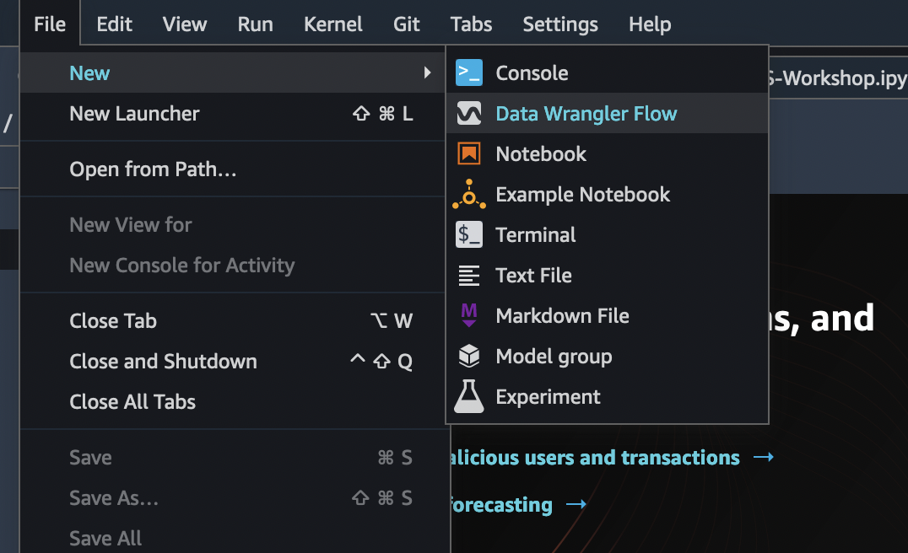
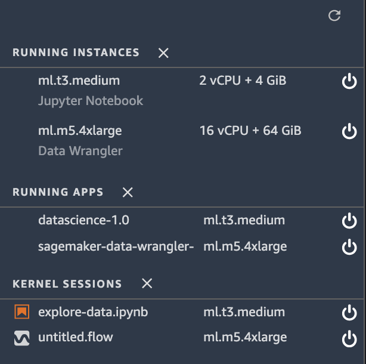
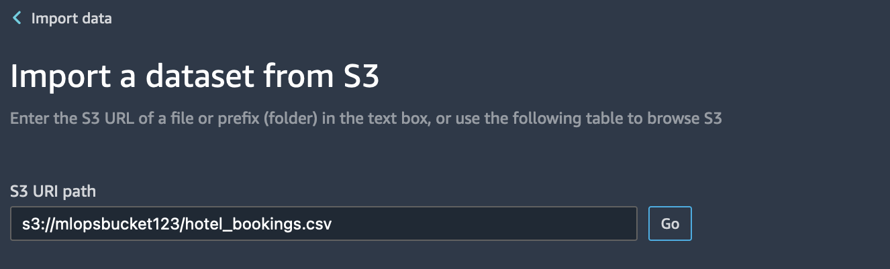
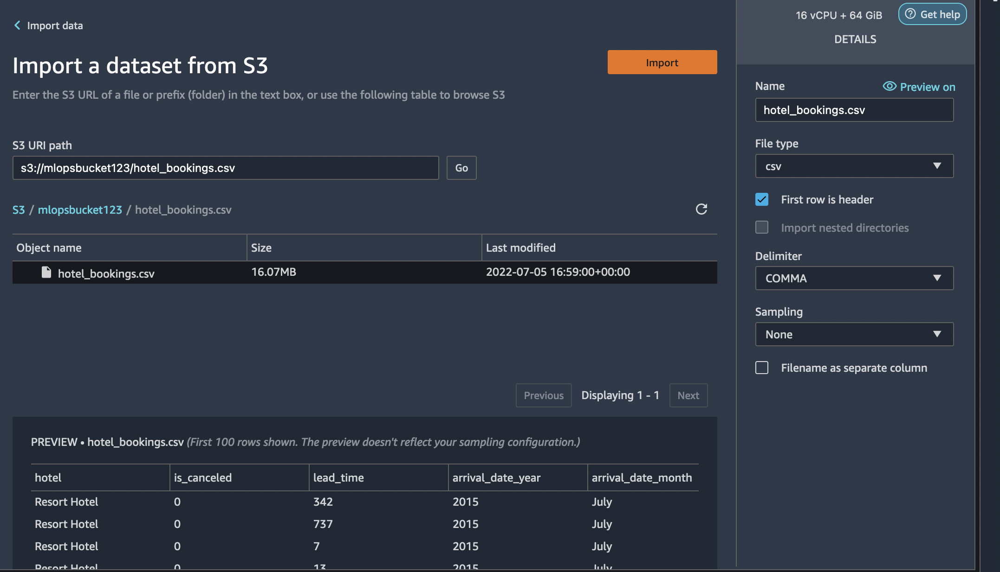
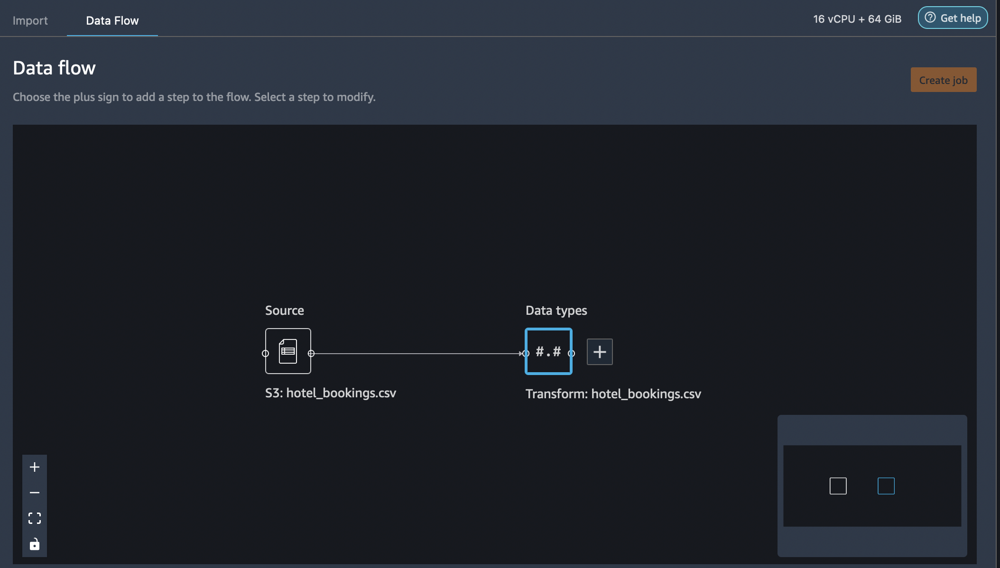

# Importing Dataset into Data Wrangler using SageMaker Studio

Following steps outline how to import data into Sagemaker to be consumed by Data Wrangler

<b>Steps to import data</b>    
1. Initialize SageMaker Data Wrangler via SageMaker Studio UI. You can use any one of the options specified below. 
   

    -  <b>Option 1.</b>   Use the Sage Maker Launcher screen as depicted here:
    
    

    -  <b>Option 2.</b>    You can use the SageMaker resources menu on the left, selecting Data Wrangler, and new flow
    
    
    
    -  <b>Option 3.</b>   You can also use the File -> New -> DataWrangler option as shown here
    
    
2. Data Wrangler takes a few minutes to load.

3. Once Data Wrangler is loaded, you should be able to see it under running instances and apps as shown below.

4. Once Data Wrangler is up and running, you can see the following data flow interface with options for import, creating data flows and export as shown below.

5. Make sure to rename the untitled.flow to your preference (for e.g., hotel-bookings.flow)

6. Now you will have the option to select your data source. Because the data is in Amazon S3, select Amazon S3 to import data. Paste the S3 URL for the hotel-bookings.csv file into the search box below and hit go.

7. Data Wrangler will show you a preview of the data. Select the CSV file from the drop down results. On the right pane, make sure COMMA is chosen as the delimiter and Sampling is *None*. Our data set is small enough to run Data Wrangler transformations on the full data set. If you have a large data set, consider using sampling. Finally select *Import* to import this dataset to Data Wrangler.

8. Once the dataset is imported, Data Wrangler automatically validates the dataset and detects the data types. The flow editor now shows 2 blocks showcasing that the data was imported from a source and data types recognized. You are also allowed to edit the data types if needed.

### Next Steps

As a next step, we will explore the data that we uploaded. Please refer to **[Exploratory Data Analysis](./Data-Exploration.md)** and follow steps for Data exploration.
