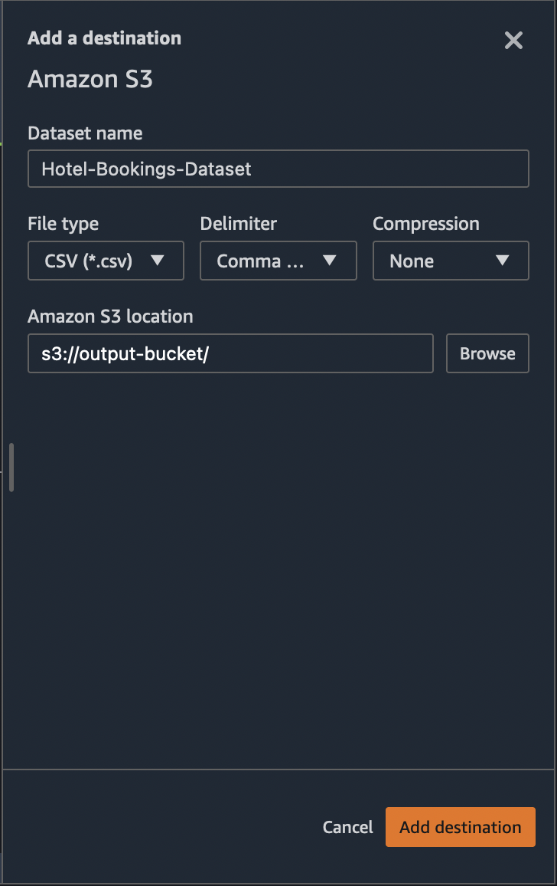
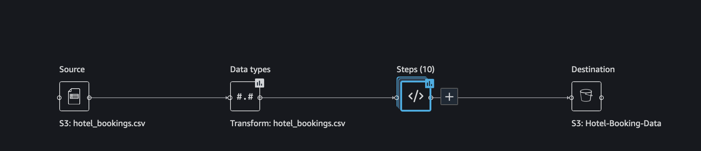
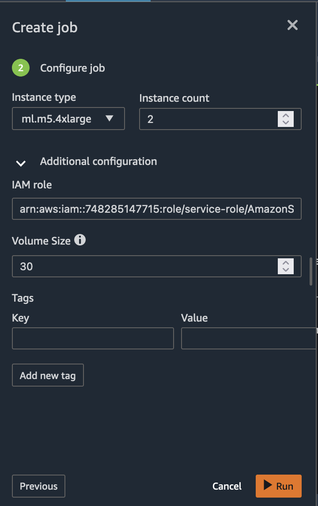
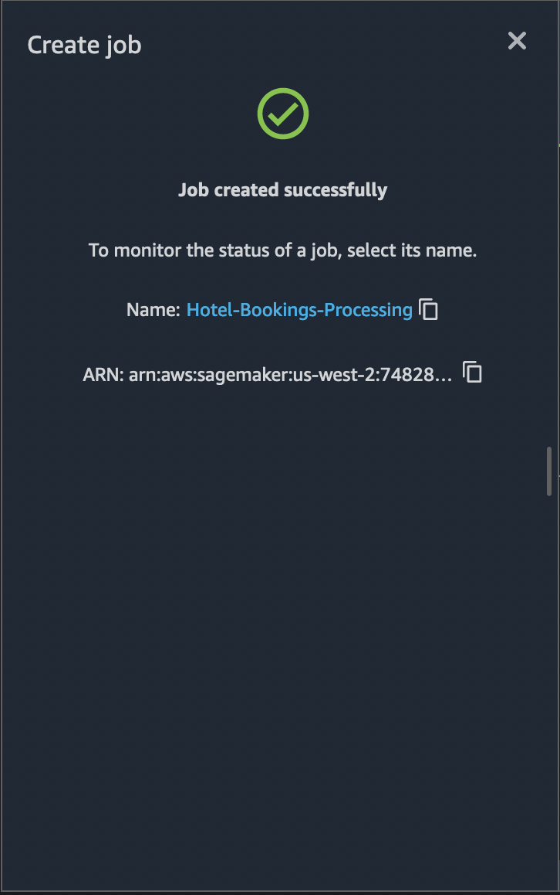
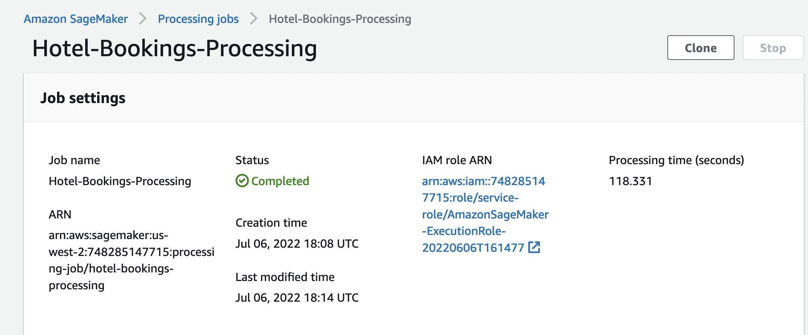

# Hotel Booking Demand Example

## Background

Amazon SageMaker helps data scientists and developers to prepare, build, train, and deploy machine learning models quickly by bringing together a broad set of purpose-built capabilities. This example shows how SageMaker can accelerate machine learning development during the data preprocessing stage to help process the hotel demand data and find relevant features for the training model to predict hotel cancellations. 

### Dataset

<b>Dataset</b>

We will be using the [Hotel Booking Demand dataset](https://www.kaggle.com/jessemostipak/hotel-booking-demand) that is publically available. This data set contains booking information for a city hotel and a resort hotel, and includes information such as when the booking was made, length of stay, the number of adults, children, and/or babies, and the number of available parking spaces, among other things.    

The data needs to be downloaded from the locations specified, and uploaded to S3 bucket before we start the Data Preprocessing phase. Please follow the Experiment Steps  outlined in later sections, to download the data and notebooks.   

## Description of the Columns 

| Column Name  | Description  | 
|---|---|
| `hotel`  | Type of the hotel (`H1` = Resort Hotel or `H2` = City Hotel)  |   
| `is_canceled` | Value indicating if the booking was canceled (1) or not (0) |   
| `lead_time` | Number of days that elapsed between the entering date of the booking into the PMS and the arrival date |
| `arrival_date_year` | Year of arrival date |
| `arrival_date_month` | Month of arrival date |
| `arrival_date_week_number` | Week number of year for arrival date |
| `arrival_date_day_of_month` | Day of arrival date |
| `stays_in_weekend_nights` | Number of weekend nights (Saturday or Sunday) the guest stayed or booked to stay at the hotel |
| `stays_in_week_nights` | Number of week nights (Monday to Friday) the guest stayed or booked to stay at the hotel |
| `adults` | Number of adults |
| `children` | Number of children |
| `babies` | Number of babies |
| `meal` | Type of meal booked. Categories are presented in standard hospitality meal packages: `Undefined/SC` – no meal package; `BB` – Bed & Breakfast; `HB` – Half board (breakfast and one other meal – usually dinner); `FB` – Full board (breakfast, lunch and dinner) |
| `country`| Country of origin. Categories are represented in the `ISO 3155–3:2013` format |
|`market_segment`|Market segment designation. In categories, the term `TA` means “Travel Agents” and `TO` means “Tour Operators”|
|`distribution_channel`|Booking distribution channel. The term `TA` means “Travel Agents” and `TO` means “Tour Operators”|
|`is_repeated_guest`|Value indicating if the booking name was from a repeated guest (1) or not (0)|
|`previous_cancellations`|Number of previous bookings that were cancelled by the customer prior to the current booking|
|`previous_bookings_not_canceled`|Number of previous bookings not cancelled by the customer prior to the current booking|
|`reserved_room_type`|Code of room type reserved. Code is presented instead of designation for anonymity reasons.|
|`assigned_room_type`|Code for the type of room assigned to the booking. Sometimes the assigned room type differs from the reserved room type due to hotel operation reasons (e.g. overbooking) or by customer request. Code is presented instead of designation for anonymity reasons.|
|`booking_changes`|Number of changes/amendments made to the booking from the moment the booking was entered on the PMS until the moment of check-in or cancellation|
|`deposit_type`|Indication on if the customer made a deposit to guarantee the booking. This variable can assume three categories: No Deposit – no deposit was made; `Non Refund` – a deposit was made in the value of the total stay cost; `Refundable` – a deposit was made with a value under the total cost of stay.|
|`agent`|ID of the travel agency that made the booking|
|`company`|ID of the company/entity that made the booking or responsible for paying the booking. ID is presented instead of designation for anonymity reasons|
|`days_in_waiting_list`|Number of days the booking was in the waiting list before it was confirmed to the customer|
|`customer_type`|Type of booking, assuming one of four categories: `Contract` - when the booking has an allotment or other type of contract associated to it; `Group` – when the booking is associated to a group; `Transient` – when the booking is not part of a group or contract, and is not associated to other transient booking; `Transient-party` – when the booking is transient, but is associated to at least other transient booking|
|`adr`|Average Daily Rate as defined by dividing the sum of all lodging transactions by the total number of staying nights|
|`required_car_parking_spaces`|Number of car parking spaces required by the customer|
|`total_of_special_requests`|Number of special requests made by the customer (e.g. twin bed or high floor)|
|`reservation_status`|Reservation last status, assuming one of three categories: `Canceled` – booking was canceled by the customer; `Check-Out` – customer has checked in but already departed; `No-Show` – customer did not check-in and did inform the hotel of the reason why|
|`reservation_status_date`|Date at which the last status was set. This variable can be used in conjunction with the ReservationStatus to understand when was the booking canceled or when did the customer checked-out of the hotel|

---

## Pre-requisites:

  * We need to ensure dataset (tracks and ratings dataset) for ML is uploaded to a data source (instructions to download the dataset to Amazon S3 is available in the following section). 
  * Data source can be any one of the following options:
       * S3
       * Athena
       * RedShift
       * SnowFlake
       
       

<b>Data Source</b>

For this experiment the Data Source will be [Amazon S3](https://aws.amazon.com/s3/)

## Experiment steps

### Downloading the dataset 

* Ensure that you have a working [Amazon SageMaker Studio](https://aws.amazon.com/sagemaker/studio/) environment and that it has been updated.

* Follow the steps below to download the dataset.
1. Download the [Hotel Booking Demand dataset](https://www.kaggle.com/jessemostipak/hotel-booking-demand) from the specified location. 
2. Create a private S3 bucket to upload the dataset in. You can reference the instructions for bucket creaiton [here] https://docs.aws.amazon.com/AmazonS3/latest/userguide/create-bucket-overview.html
3.  Upload the data in step 1 to the bucket created in step 2. Steps to upload the data can be found [here] https://docs.aws.amazon.com/AmazonS3/latest/userguide/upload-objects.html
4. Note the S3 URL for the file uploaded in Step 3 before moving to the next sextion. This data will be used as input to the Datawrangler. The S3 URL will be used in the next step. 

### Data Import from S3 to Data Wrangler
The hotel-bookings.csv file uploaded in previous section needs to be imported in Data Wrangler as input. Please refer to **[Data Import from S3](./Data-Import.md)** and follow steps for importing the data.

### Exploratory Data Analysis
Before applying various data transformations, we need to explore the data to find correlations, duplicate rows as well as target leakage. Please refer to **[Exploratory Data Analysis](./Data-Exploration.md)** and follow steps for Data exploration.

### Data Transformation 
Based on the Data explorations carried out in previous step, we are now ready to apply transformations to the data. Please refer to **[Data Transformations](./Data-Transformations.md)** and follow steps for Data Transformation.

### Data Export
Data Wrangler UI can also be used to export the transformed data to Amazon S3. To get started with this process, first let's create a destination node. Right click on the final transform on your data and choose `Add destination` → `Amazon S3`. Assign a name for your output data and choose the S3 location where you want the data to be stored and click Add destination button at the bottom as shown below.

This adds a destination node to our data flow. The destination node acts as a sink to your data flow. 

Next, click on the Create job button in the upper right corner of the page. In the configuration page for the SageMaker Processing job we are about to create, choose the Instance type and Instance count for our processing cluster. Advance configuration is optional, where you can assign tags as needed and choose the appropriate Volume Size. 

Select `Run` to start the export job. The job created will have Job Name and Job ARN which can be used to search for the job status. 

The job created in the previous step will be available in the monitoring page for `SageMaker Processing job` as shown in the figure below.

After a certain time, the job will be complete. The image below shows the completed job. Exported data should be available in the output S3 bucket. 

 
 
 This exported data can now be used for running the ML Models
 
 :bulb:**NOTE**   - Also, you can import the [flow file](./Hotel-Bookings-Classification.flow) by following the steps [here](../import-flow.md)
