# Amazon SageMaker Data Wrangler time series example

Our business goal: predict the number of NY City yellow taxi pickups in the next 24 hour for each pickup zones per hour and provide some insights for a drivers like average tips, average distance, etc.
First and important step to achive our goal is a data preparation. This example will be focused on this step. 

Data used in this demo notebook:
- Original data source for all open data from 2008-now: https://www1.nyc.gov/site/tlc/about/tlc-trip-record-data.page
- AWS-hosted location: https://registry.opendata.aws/nyc-tlc-trip-records-pds/

The raw data is split 1 month per file, per Yellow, Green, or ForHire from 2008 through 2020, with each file around 600MB. The entire raw data S3 bucket is HUGE. 

We will use just 14 files: yellow cabs Jan-Dec 2019, Jan-Feb 2020 to avoid COVID effects.


Amazon SageMaker Data Wrangler could use diffrent sources, but we will need an S3 bucket to act as the source of your data. The code bellow will create a bucket with a unique `bucket_name`.

We recommend to have a S3 bucket in the same region as the Amazon SageMaker Data Wrangler. 

## Instructions to download the dataset
You can use Amazon SageMaker Data Wrangler to import data from the following data sources: Amazon Simple Storage Service (Amazon S3), Amazon Athena, Amazon Redshift, and Snowflake. The dataset that you import can include up to 1000 columns. For this lab, we will be using Amazon S3 as the preferred data source. Before we import the dataset into Data Wrangler, let's ensure we copy the dataset first from the publicly hosted location to our local S3 bucket in our own account.

To copy the dataset, copy and execute the Python code below within SageMaker Studio. It is recommended to execute this code in a notebook setting. We also recommend to have your S3 bucket in the same region as SageMaker Data Wrangler.

To create a SageMaker Studio notebook, from the launcher page, click on the Notebook Python 3 options under Notebooks and compute resources as show in the figure below. 

Note - For this exercise please use us-east-1 as the region for your Data wrangler workbooks

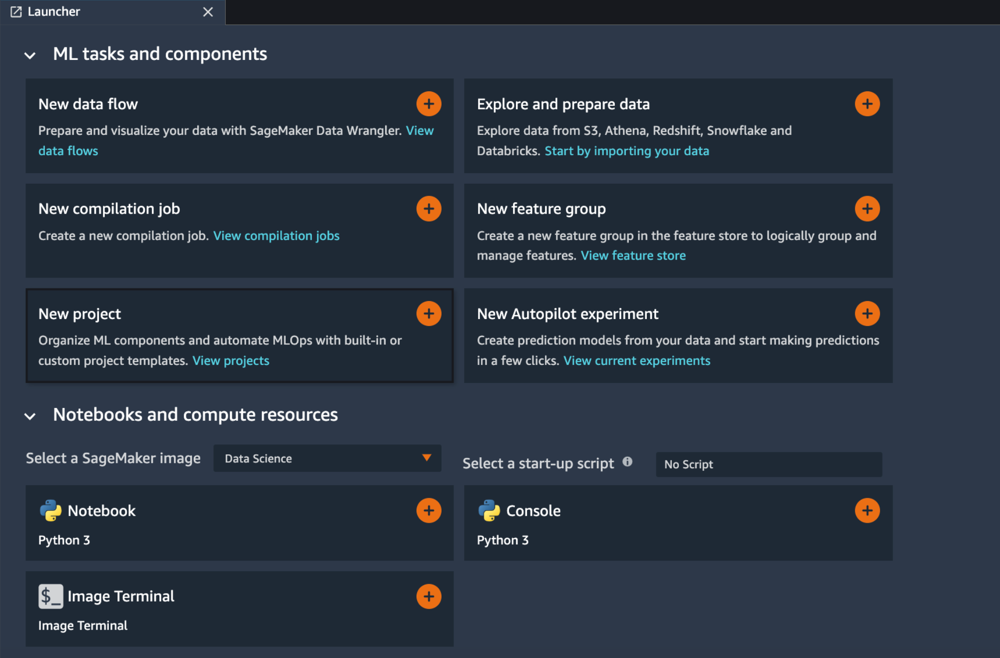

Copy and paste the shared code snippet below into the launched notebook's cell (shown below) and execute it by clicking on the play icon on the top bar.

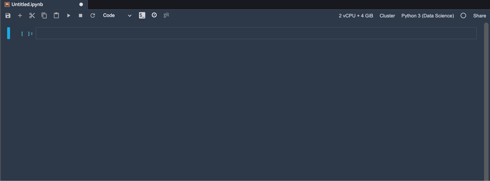

```python
import boto3
import json
import random
```

```python
%store -r bucket_name
%store -r data_uploaded
%store -r region

try:
    bucket_name
    data_uploaded
except NameError:
    data_uploaded = False
```

```python
if data_uploaded:
    print(f'using previously uploaded data into {bucket_name}')
else:
    # Sets the same region as current Amazon SageMaker Notebook
    with open('/opt/ml/metadata/resource-metadata.json') as notebook_info:
        data = json.load(notebook_info)
        resource_arn = data['ResourceArn']
        region = resource_arn.split(':')[3]
    print('region:', region)

    # Or you can specify the region where your bucket and model will be located in this region
    # region = "us-east-1" 

    s3 = boto3.resource('s3')
    account_id = boto3.client('sts').get_caller_identity().get('Account')
    bucket_name = account_id + "-" + region + "-" + "datawranglertimeseries" + "-" + str(random.randrange(0, 10001, 4))
    print('bucket_name:', bucket_name)

    try: 
        print(f'creating a S3 bucket in {region}')
        if region == "us-east-1":
            s3.create_bucket(Bucket=bucket_name)
        else:
            s3.create_bucket(
                Bucket = bucket_name,
                CreateBucketConfiguration={'LocationConstraint': region}
                )
    except Exception as e:
        print (e)
        print("Bucket already exists. Using bucket", bucket_name)
```

First we need to download the data (training data) to our new bucket

```python
CopySource = [
    {'Bucket': 'nyc-tlc', 'Key': 'trip data/yellow_tripdata_2019-01.parquet'},
    {'Bucket': 'nyc-tlc', 'Key': 'trip data/yellow_tripdata_2019-02.parquet'},
    {'Bucket': 'nyc-tlc', 'Key': 'trip data/yellow_tripdata_2019-03.parquet'},
    {'Bucket': 'nyc-tlc', 'Key': 'trip data/yellow_tripdata_2019-04.parquet'},
    {'Bucket': 'nyc-tlc', 'Key': 'trip data/yellow_tripdata_2019-05.parquet'},
    {'Bucket': 'nyc-tlc', 'Key': 'trip data/yellow_tripdata_2019-06.parquet'},
    {'Bucket': 'nyc-tlc', 'Key': 'trip data/yellow_tripdata_2019-07.parquet'},
    {'Bucket': 'nyc-tlc', 'Key': 'trip data/yellow_tripdata_2019-08.parquet'},
    {'Bucket': 'nyc-tlc', 'Key': 'trip data/yellow_tripdata_2019-09.parquet'},
    {'Bucket': 'nyc-tlc', 'Key': 'trip data/yellow_tripdata_2019-10.parquet'},
    {'Bucket': 'nyc-tlc', 'Key': 'trip data/yellow_tripdata_2019-11.parquet'},
    {'Bucket': 'nyc-tlc', 'Key': 'trip data/yellow_tripdata_2019-12.parquet'},
    {'Bucket': 'nyc-tlc', 'Key': 'trip data/yellow_tripdata_2020-01.parquet'},
    {'Bucket': 'nyc-tlc', 'Key': 'trip data/yellow_tripdata_2020-02.parquet'}
]

if not data_uploaded:
    for copy_source in CopySource:
        s3.meta.client.copy(copy_source, bucket_name, copy_source['Key'])
    
    data_uploaded = True
else:
    print(f'skipping data upload as data already in the bucket {bucket_name}')
```

```python
!aws s3 ls s3://{bucket_name}/'trip data'/
```

```python
%store bucket_name
%store data_uploaded
%store region
```

Now we have raw data in our S3 bucket and ready to explore it and build a training dataset


## Dataset Import

Our first step is to launch a new Data Wrangler session and there are multiple ways how to do that. For example, use the following: Click File -> New -> Data Wrangler Flow


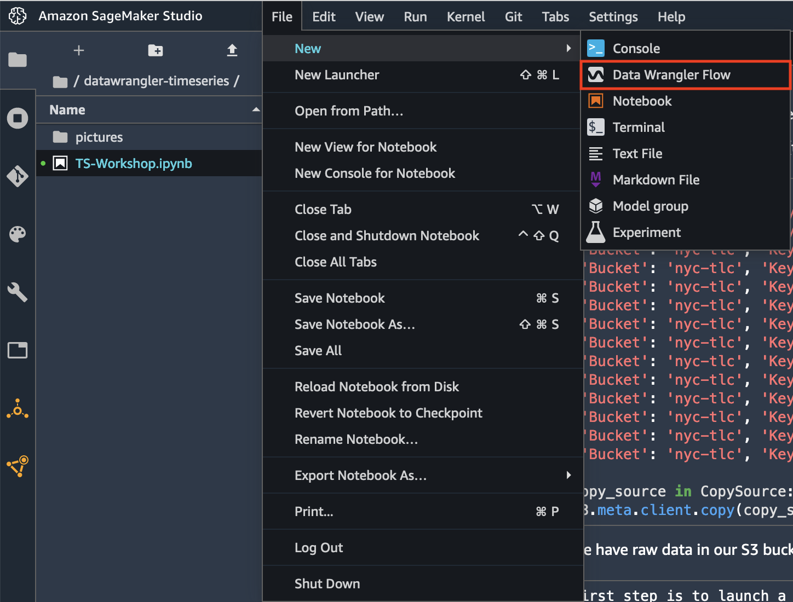


Amazon SageMaker will start to provision a resources for you and you a could find a new Data Wrangler Flow file in a File Browser section
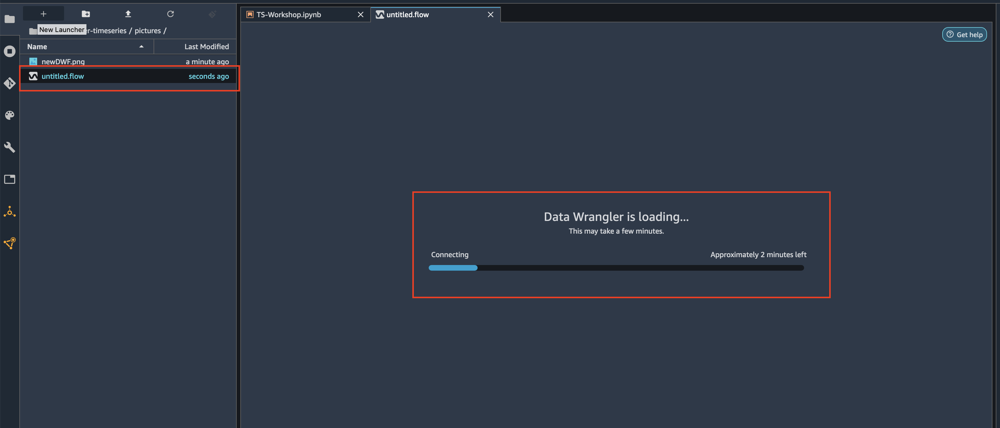


Lets rename our new workflow: Right click on file -> Rename Data Wrangler Flow

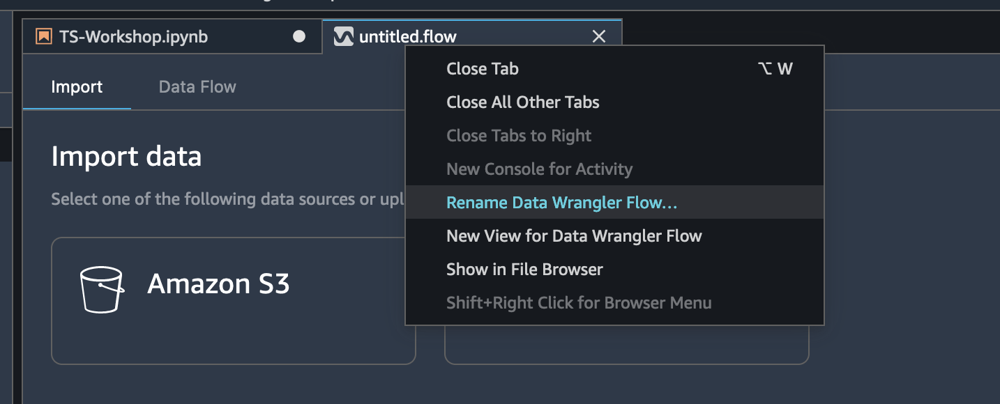

Put a new name, for example: `TS-Workshop-DataPreparation.flow`

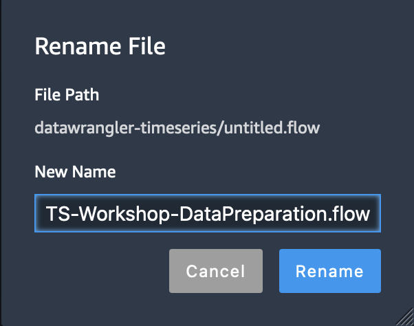


In a few minutes DataWragler will finish to provision recources and you could see "Import Data" screen. 
Data Wrangles support many data sources: Amazon S3, Amazon Athena, Amazon Redshift, Snowflake, Databricks.
Our data already in S3, let's import it by clicking "Amazon S3" button.

Note - Please wait for the import button to be enabled

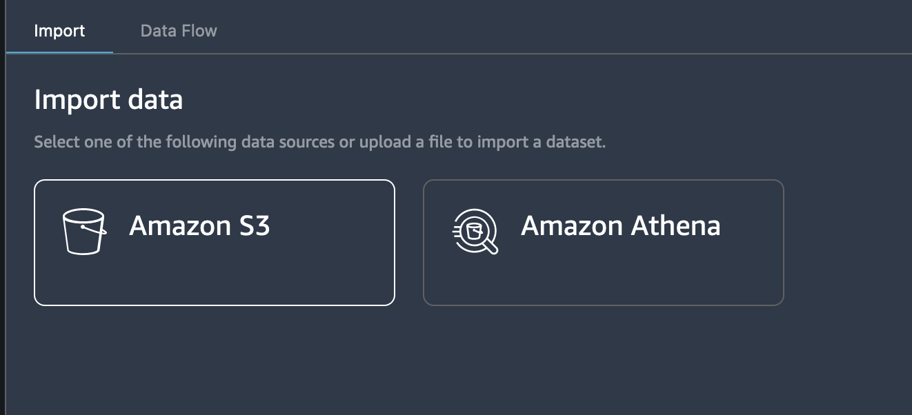

```python
print(f'S3 bucket name with data: {bucket_name}')
```

You will see all your S3 buckets and if you want you could manually select a bucket which we created at the begining of the example. 

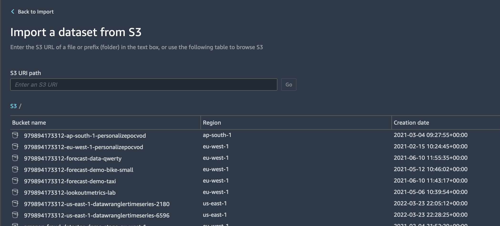

As you might have thouthands of buckets I recommend to provide a name in a "S3 URI path field". Use a `s3`-format `s3://<YOUR_BUCKET_NAME`. As soon as you click "go" button you will be automatically redirected to a bucket and you will see its contect. All our files are in "trip data" folder, so lets select it. Data Wrangler will import all files from a folder and sample first 50000 rows for an interactive preview (you could change number of sampled rows and strategy). On a right side menu you could customize import job settings like Name, File type, Delimiter, etc. More infortaion about import process could be found [here](https://docs.aws.amazon.com/sagemaker/latest/dg/data-wrangler-import.html).

To finish setting up import step select "parquet" in "File type" drop down menu and press the orange button "Import"
    
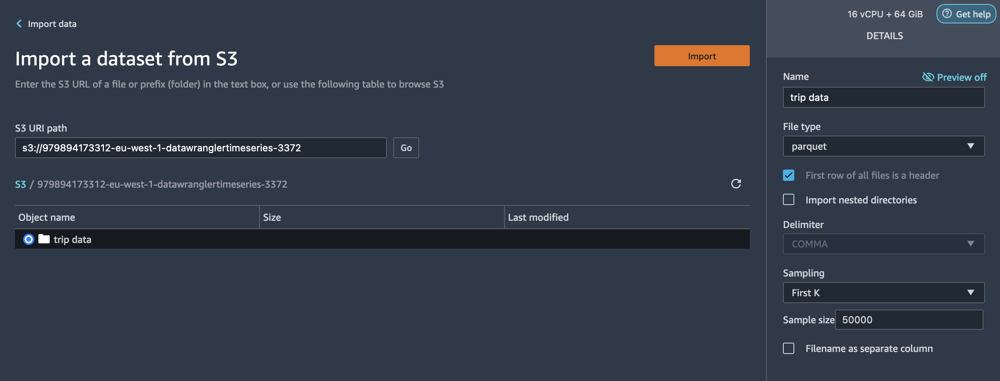

It will take a few minutes to import data and validate it. DataWarangler will automatically recognise data types. You should see "Validation complete 0 errors message"

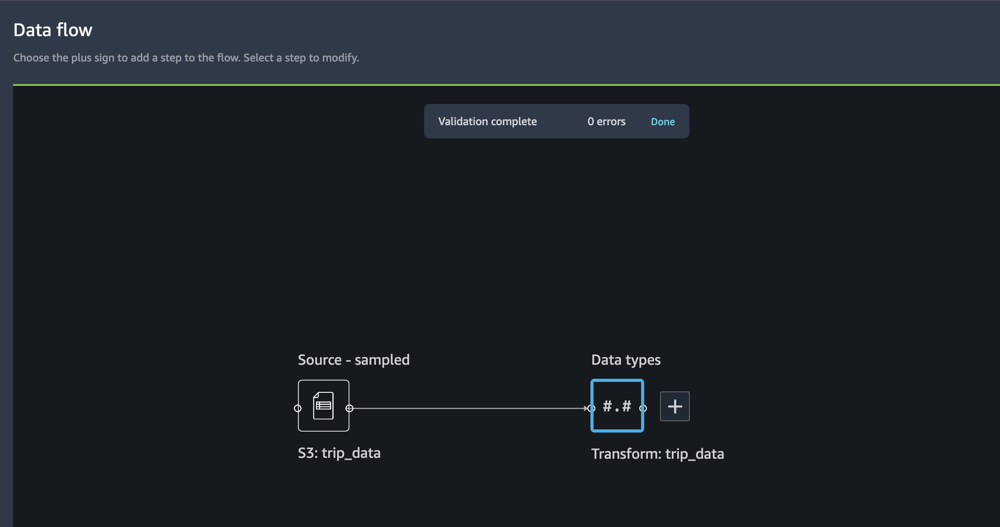


## Check and change data types

First of all we have to check thet data types were correctly recognised and change them. This might be nescessary as Data Wrangler selects data types based on a sampled data which is limited to 50000 rows. Sampled data might potentially miss some variations. 

Any data manipulation called "data transformations step". To add a data transformation step use the plus sign next to Data types and choose Edit data types.

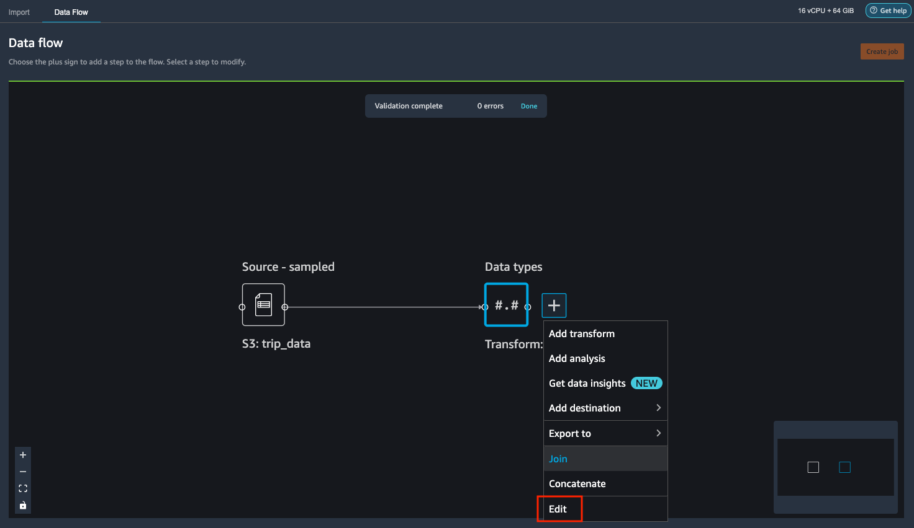

In our case several columns were incorrectly recognised: 
- `passenger_count` (must be `long` instead of `float`)
- `RatecodeID` (must be `long` instead of `float`)
- `airport_fee` (must be `float` instead of `long`)

I know correct data types from dataset description. In real life you could also easily find such information. Let's correct data types by selecting a correct type from a drop down menu. 

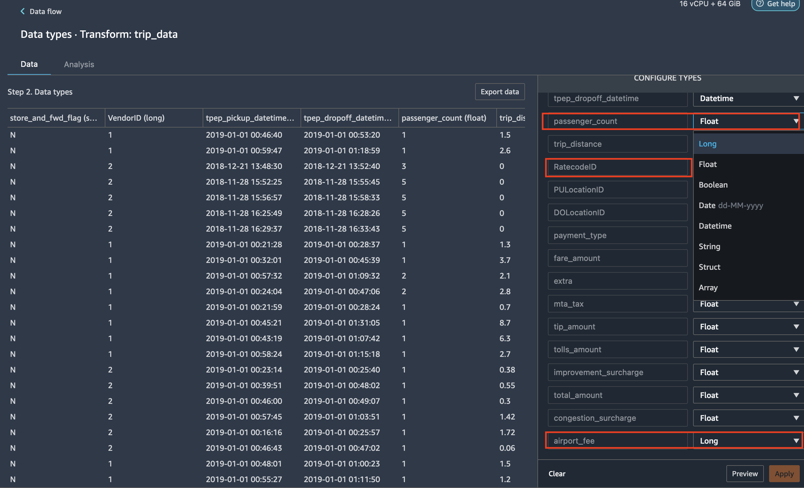


Click Preview and then Apply button. \
Click Back to data flow.


## Dataset preparation
### Drop columns
Before we analyse data and do feature engeneering we have to clean dataset from data which we will not use in next steps. 

To re-interate our business goal: 
Predict the number of NY City yellow taxi pickups in the next 24 hour for each pickup per hour zones and provide some insights for a drivers like average tips, average distance, etc. 

As we are interesting in per hour forecast we have to agregate some features and remove features which is impossible to aggregate. For this purpose we don't need the following columns: 

1. `VendorID` (A code indicating the TPEP provider that provided the record) 
1. `RatecodeID` (The final rate code in effect at the end of the trip)
1. `Store_and_fwd_flag` (This flag indicates whether the trip record was held in vehicle memory before sending to the vendor, aka “store and forward,”because the vehicle did not have a connection to the server)
1. `DOLocationID` (TLC Taxi Zone in which the taximeter was disengaged)
1. `Payment_type` (A numeric code signifying how the passenger paid for the trip)
1. `Fare_amount` (The time-and-distance fare calculated by the meter) - we will use total amount feature
1. `Extra` (Miscellaneous extras and surcharges)
1. `MTA_tax` (0.50 MTA tax that is automatically triggered based on the metered rate in use)
1. `Tolls_amount` (Total amount of all tolls paid in trip)
1. `Improvement_surcharge` (improvement surcharge assessed trips at the flag drop. The improvement surcharge began being levied in 2015)
1. `Passenger_count` (This is a driver-entered value)
1. `congestion_surcharge` (Total amount collected in trip for NYS congestion surcharge)
1. `Airport_fee` (Only at LaGuardia and John F. Kennedy Airports)

To remove those columns:
1. Click the plus sign next to "Data types" element and choose Add transform.
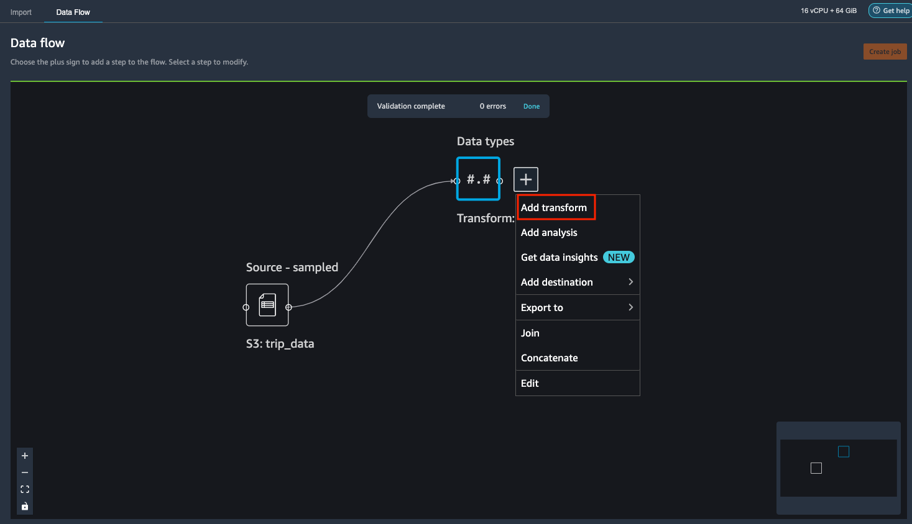
1. Click "+ Add step" orange button in the TRANSFORMS menu.
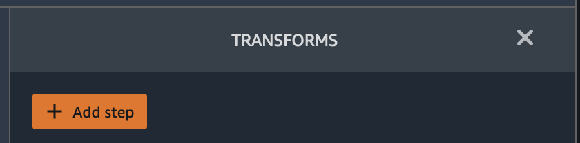
1. Choose Manage columns. \
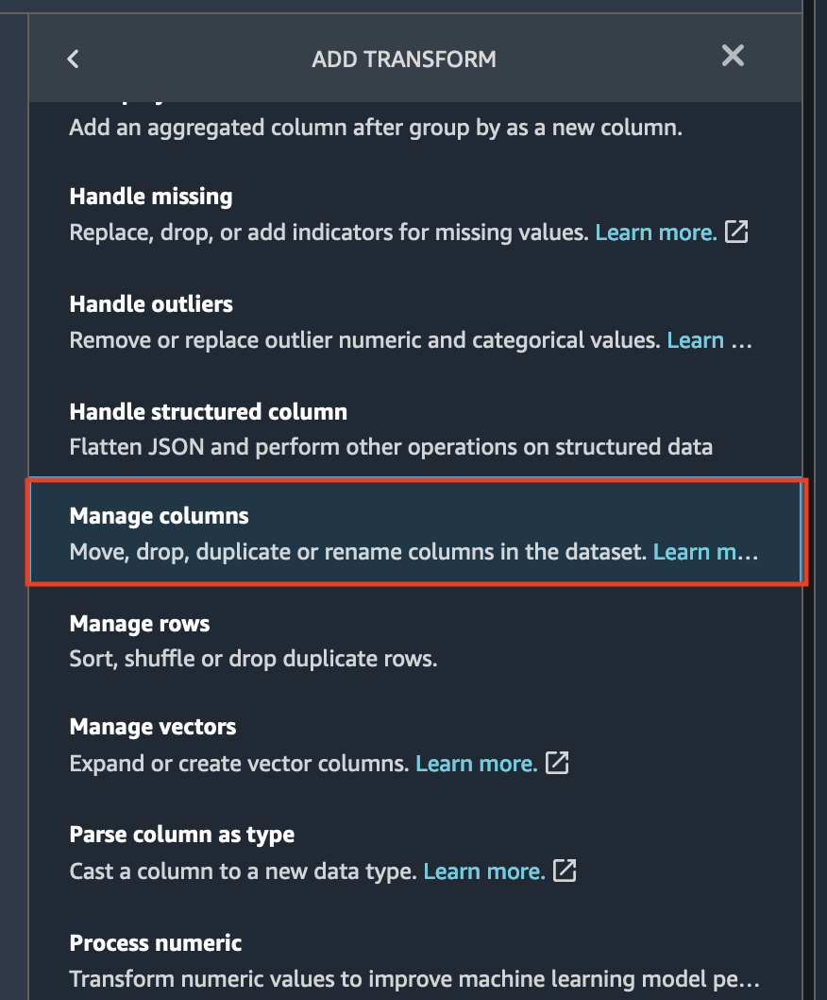
1. For Transform, choose Drop columm and for Column to drop, choose all mentioned above.
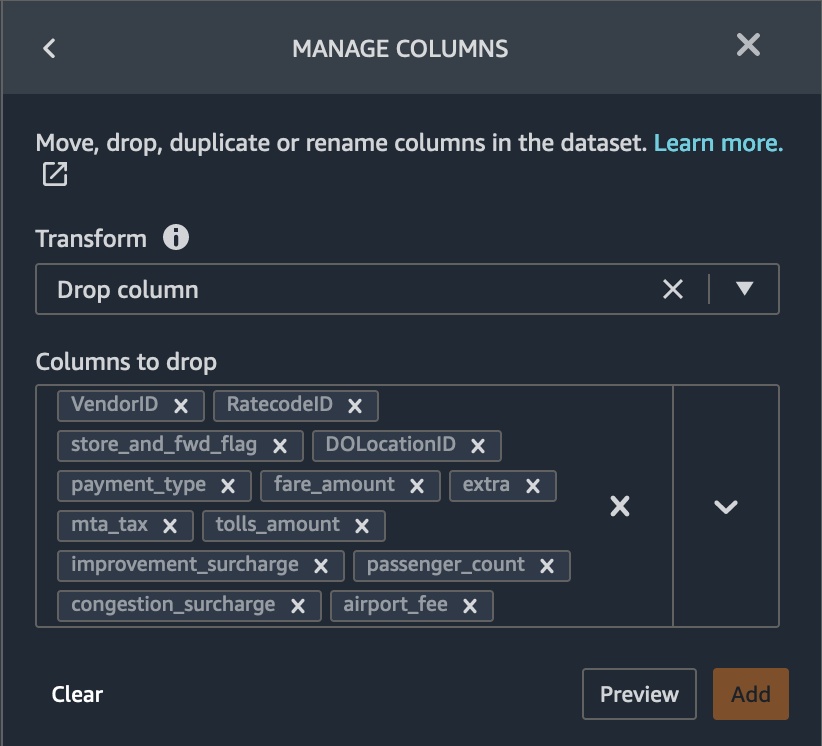
1. Choose Preview
1. Choose Add to save the step.

When transfromation will be applied on a sampled data you should see all curent steps and a preview of a resulted dataset. 
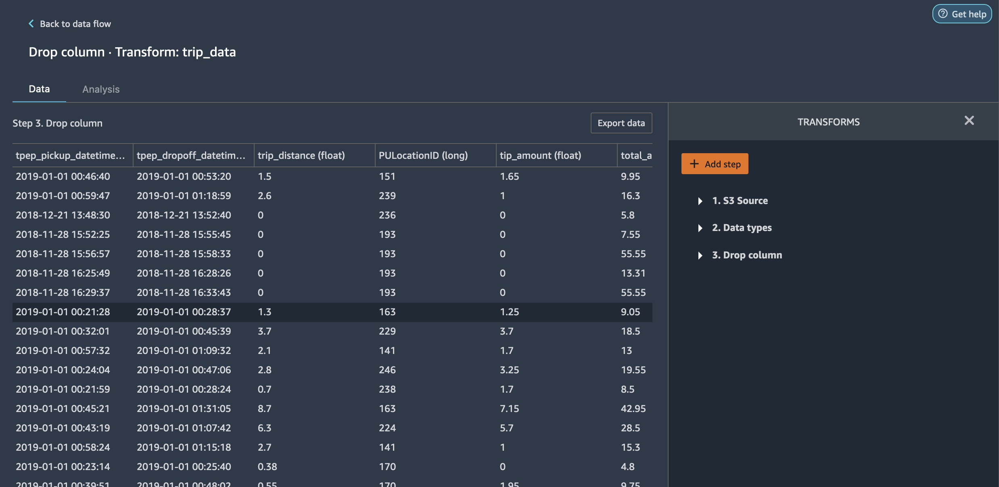


Click Back to data flow.


### Handle missing and invalid data in timestamps
Missing data is a common problem in real life, it could be a result of data corruption, data loss or issues in data ingestion. The best practice is to verify the presence of any missing or invalid values and handle them appropriately. 

The are many different strategies how missing or invalid data could be handled, for example dropping rows with missing values or filling the missing values with static or calculated values. Depending on a dataset size you could choose what to do: fix values or just drop them. The **Time Series - Handle missing** transform allows you to choose from multiple strategies.

All future agregations will be based on a time stamps, so we have to make sure that we dont have any lines with a missing time stamps in `tpep_pickup_datetime` and `tpep_dropoff_datetime` features. Data Wrangler have several time series specific transformations, including **Validate timestamps** which includes check for two situations:
1. Your timestamp column has missing values.
1. The values in your time stamp column are not formatted correctly.


To validate timestamps in `tpep_dropoff_datetime` and `tpep_pickup_datetime` columns:
1. Click the plus sign next to "Drop colums" element and choose Add transform.
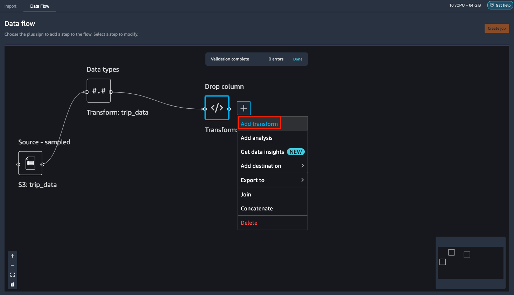
1. Click "+ Add step" orange button in the TRANSFORMS menu.

1. Choose Time Series. \
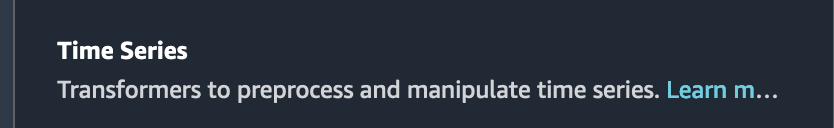
1. For Transform choose Validate Timestamps, For TimeStamp colums choose `tpep_pickup_datetime`, for Policy select drop. 
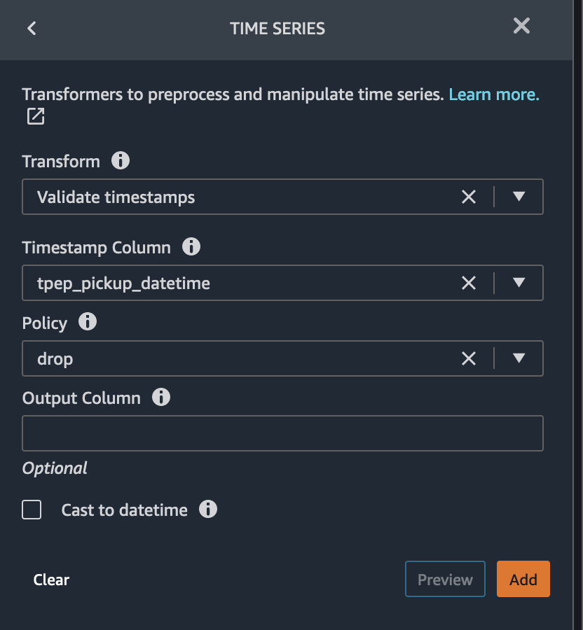
1. Choose Preview
1. Choose Add to save the step.
1. Repeat same steps again for `tpep_dropoff_datetime` column

When you apply a transformation a sampled data you should see all curent steps and a preview of a resulted dataset. 
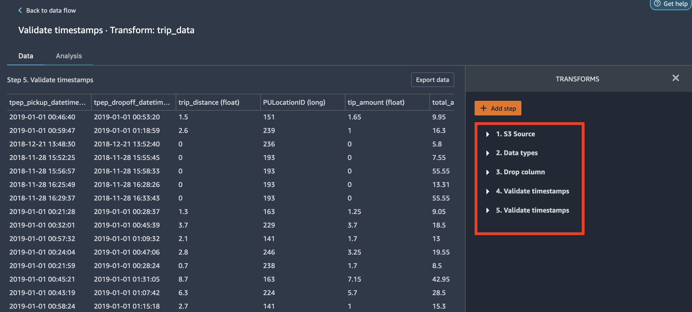


Click Back to data flow.


### Feature engeenering based on a timestamp with a custom transformation. 

At this stage we have a pickup and dropoff timestamps, but we are more interested in a pickup timestamp and ride duration. We have to createa a new feature `ride duration` as a difference between pick up and drop off time in minutes. There is no built-in date diffrence transformation in a Data Wrangler, but we could create it with a custom transformation. The **Custom Transforms** allows you to use Pyspark, Pandas, or Pyspark (SQL) to define your own transformations. For all three options, you use the variable `df` to access a dataframe to which you want to apply the transform. You do not need to include a return statement.

To create a custom transformation you have to:
1. Click the plus sign next to a collection of transformation elements and choose Add transform.
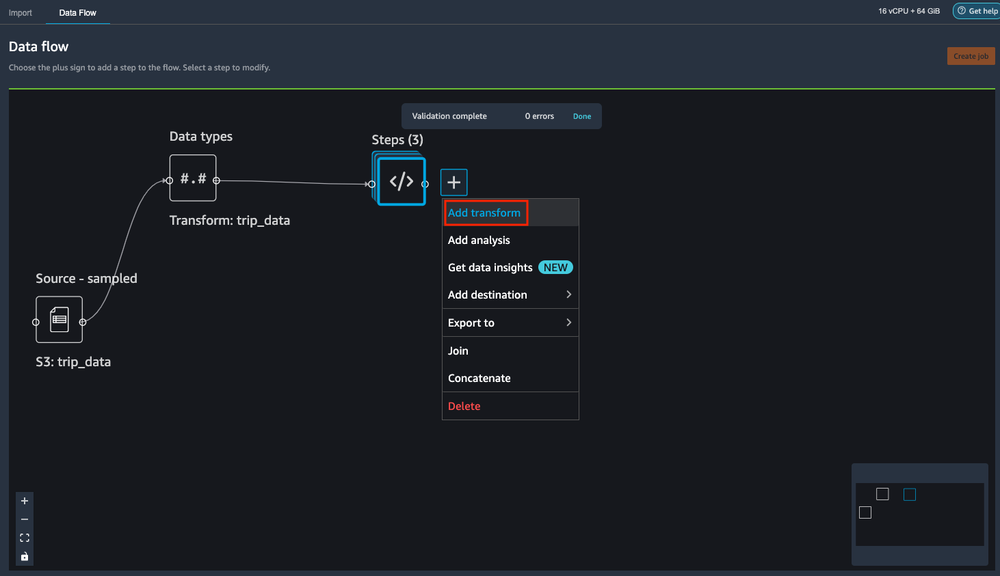
1. Click "+ Add step" orange button in the TRANSFORMS menu.

1. Choose Custom transform. \
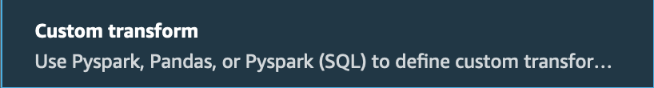
1. In drop down menu select Python (PySpark) and use code below. This code will import functions, calculate difference beetween two timestamps by converting them to unix format (real number) and round result and drop tpep_dropoff_datetime column

```Python
from pyspark.sql.functions import col, round
df = df.withColumn('duration', round((col("tpep_dropoff_datetime").cast("long")-col("tpep_pickup_datetime").cast("long"))/60,2))
df = df.drop("tpep_dropoff_datetime")
```  

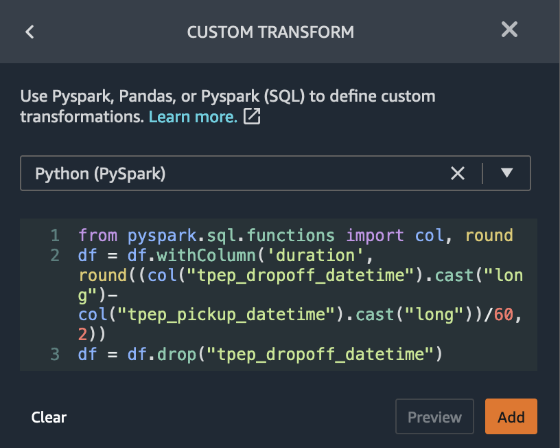
1. Choose Preview
1. Choose Add to save the step.

When transfromation is applied on a sampled data you should see all curent steps and a preview of a resulted dataset with a new column duration and without column tpep_dropoff_datetime
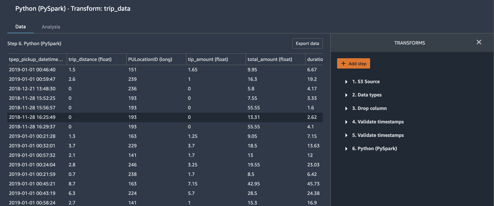


Click Back to data flow.


### Handling missing data in numeric attributes

We already discussed what is a missing values and why it is important to handle them. So far we were working with timestamps only. Now we are going to handle missing values in the rest of attributes. 

We exclude `duration` feature from this operation as it was calculated from the timestamps. As we discussed previously, there are several ways to handle missing data: fill a static number or calculate a correct value (for example: median or mean for last 7 days). It might make sense to calculate value if your timeseries represent a continues process like sensor reading or product sale quantity. In our case all trips are independent from each other and we cannot calculate values based on previous trips as it might bring data bias and increase an error. We replace all missing values with zeros. Sometimes it might make sense to drop rows with a missing values. 

Data Wrangler has two transformations to handle missing data: general and special for time series. We demonstrate how to use both of them and describe when to use each of them. 


#### Handle missing data with general Handle missing values transformation
This transformation could be used if you want to:
1. Replace missing values with a same static value for all time series
1. Replace missing values with a calculated value and you have only one time serie (for example: one sensor or one product in a shop)

To create this transformation you have to:
1. Click the plus sign next to a collection of transformation elements and choose Add transform.
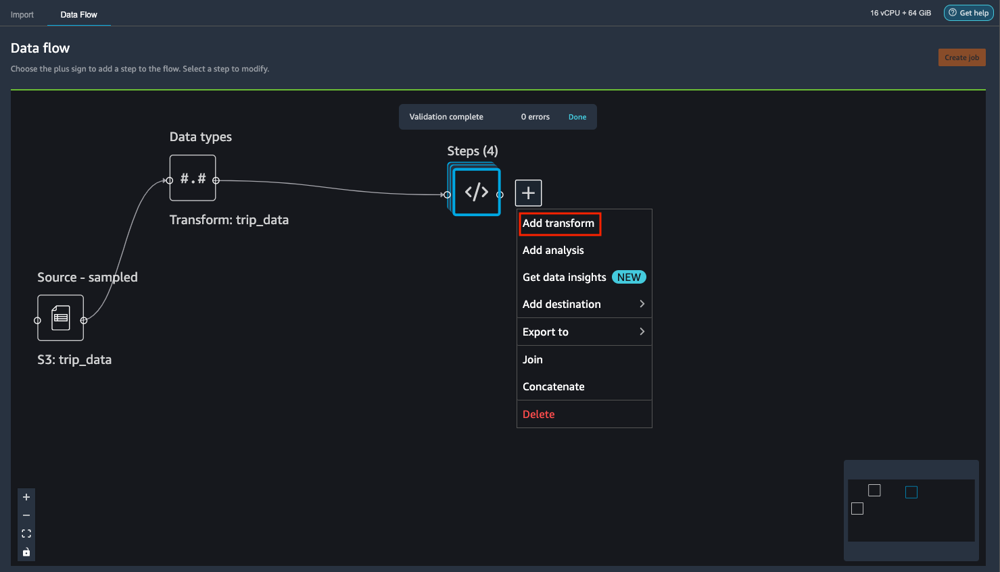
1. Click "+ Add step" orange button in the TRANSFORMS menu.

1. Choose Handle Missing. \

    1. For "Transform" choose Fill missing
    1. For "inputs columns" choose `PULocationID`, `tip_amount`, and `total_amount`
    1. For "Fill value" put 0. \

1. Choose Preview
1. Choose Add to save the step.

When transfromation is applied on a sampled data you should see all curent steps and a preview of a resulted dataset. 
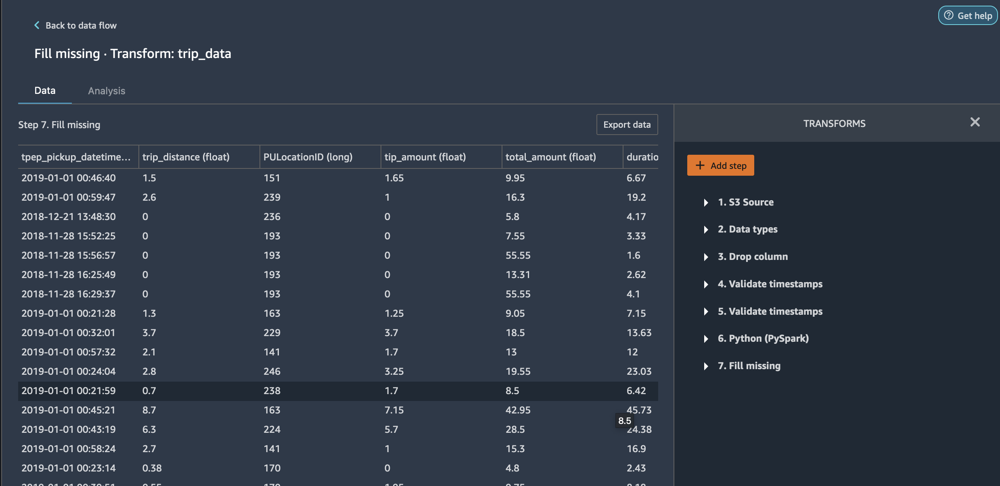


#### Handle missing data with special Time Series transformation
In real life datasets we have many time series in a same dataset and to separate them we use some IDs, for example sensor ID or item SKU. If we want to replace missing values with calculated values, for example mean for last 10 sensor observations, we must calculate it based on data for each time serie independently. Instead of writing code you could use a special Time Series transformation in Data Wrangler. 

To create this transformation you have to:
1. Click "+ Add step" orange button in the TRANSFORMS menu.

1. Choose Time Series. \

    1. For "Transform" choose Handle missing
    1. For "Time series input type" choose Along column
    1. For "Impute missing values for this column" choose `trip_distance`
    1. For "Timestamp column" choose tpep_pickup_datetime
    1. For "ID column" choose PULocationID
    1. For "Method for imputing values" choose Constant value
    1. For "Custom value" put 0.0 \
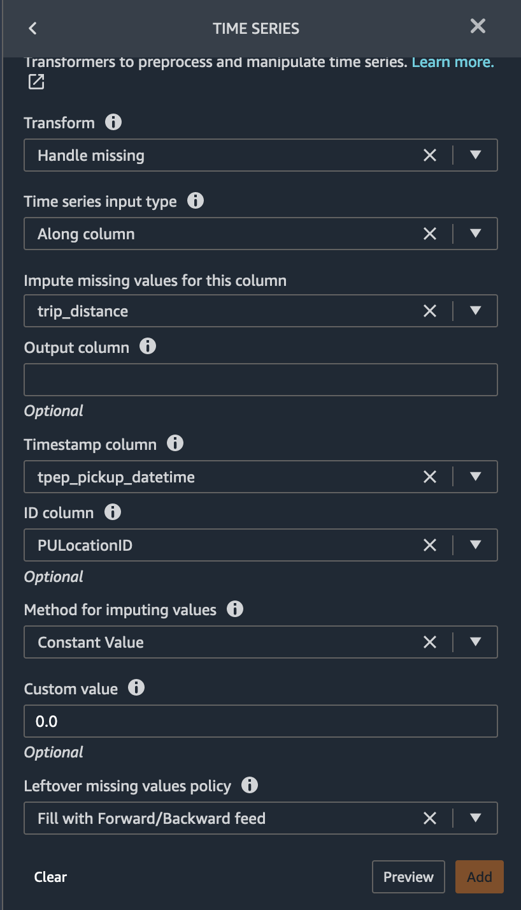
1. Choose Preview
1. Choose Add to save the step.

When transfromation is applied on a sampled data you should see all curent steps and a preview of a resulted dataset. 
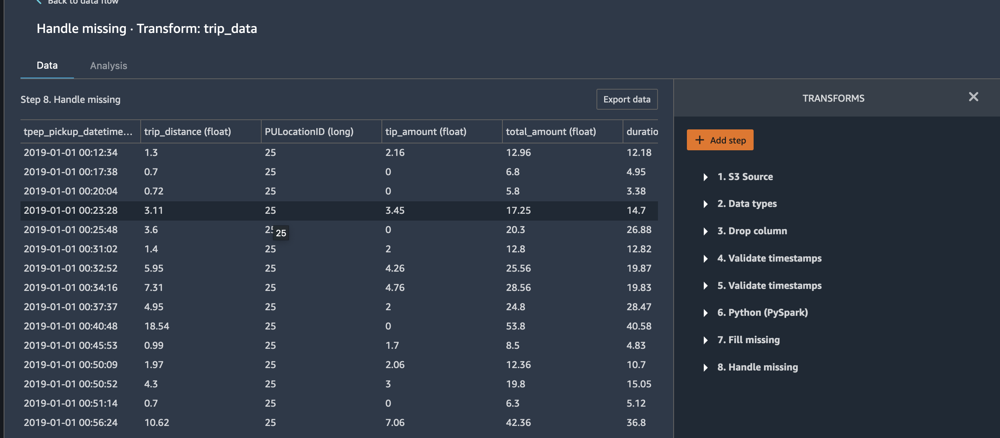


### Filter rows with invalid data

Based on our understanding of data we could also apply several filters to remove invalid or corrupted data from a business point of view. This transformation improves accuracy of a ML model as we feed only correct data to a model during training. 

We filter data based on following rules:
1. `tpep_pickup_datetime` - have to be in range from 1 Jan 2019 (included) till 1 March 2020 (excluded)
1. `trip_distance` - have to be greater than or equal to 0 (only positive numbers)
1. `tip_amount` - have to be greater than or equal to 0 (only positive numbers)
1. `total_amount` - have to be greater than or equal to 0 (only positive numbers)
1. `duration` - have to be greater than or equal to 1 (we are not interested in super short trips).
1. `PULocationID` - have to be in range from 1 to 263

There is no built-in filter transformation in Data Wrangler, so we will again create a custom transformation. 

To create a custom transformation you have to:
1. Click the plus sign next to a collection of transformation elements and choose Add transform.
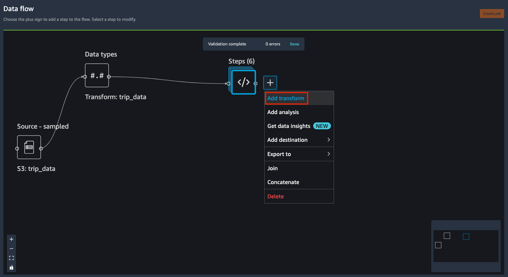
1. Click "+ Add step" orange button in the TRANSFORMS menu.

1. Choose Custom Transform. \

1. In drop down menu select Python (PySpark) and use code below. This code will filter rows based on a conditions. 

```Python
df = df.filter(df.trip_distance >= 0)
df = df.filter(df.tip_amount >= 0)
df = df.filter(df.total_amount >= 0)
df = df.filter(df.duration >= 1)
df = df.filter((1 <= df.PULocationID) & (df.PULocationID <= 263))
df = df.filter((df.tpep_pickup_datetime >= "2019-01-01 00:00:00") & (df.tpep_pickup_datetime < "2020-03-01 00:00:00"))
``` 

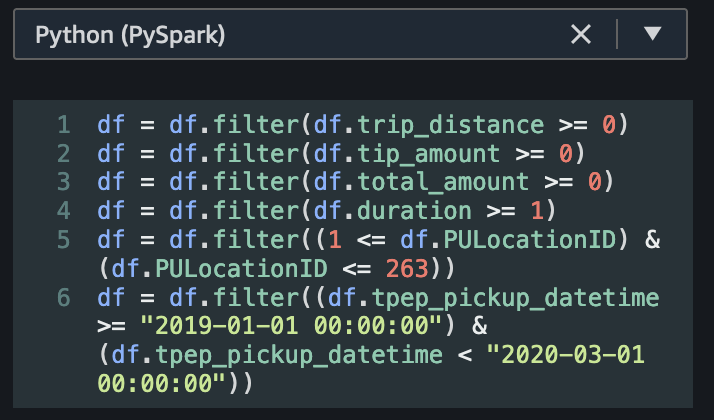
1. Choose Preview
1. Choose Add to save the step.

When transfromation is applied on a sampled data you should see all curent steps and a preview of a resulted dataset with a new column duration and without column tpep_dropoff_datetime
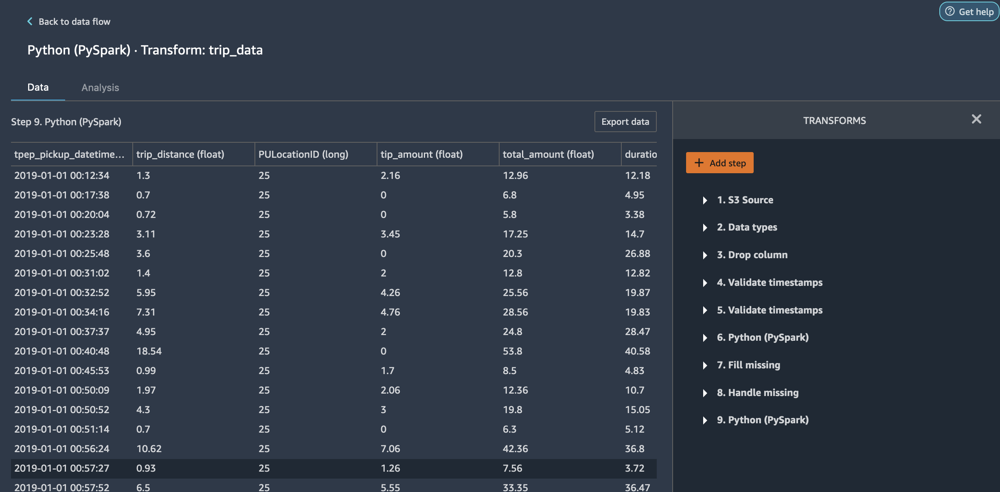


### Quick analysis of dataset

Amazon SageMaker Data Wrangler includes built-in analysis that help you generate visualizations and data insights in a few clicks. You can create custom analysis using your own code. We use the **Table Summary** analysis to quickly summarize our data. 

For columns with numerical data, including long and float data, table summary reports the number of entries (`count`), minimum (`min`), maximum (`max`), mean, and standard deviation (`stddev`) for each column. 

For columns with non-numerical data, including columns with String, Boolean, or DateTime data, table summary reports the number of entries (`count`), least frequent value (`min`), and most frequent value (`max`). 

To create this analyses you have to:
1. Click the plus sign next to a collection of transformation elements and choose "Add analyses".
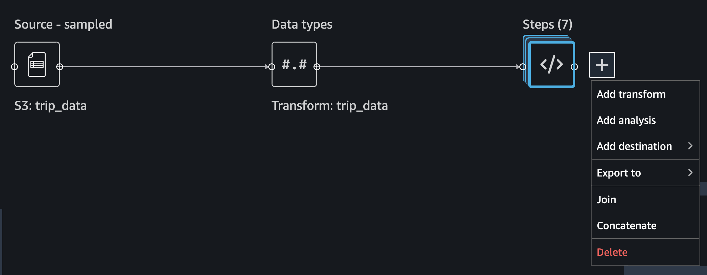
1. In a "analyses type" drop down menu select "Table Summary" and provide a name for "Analysis name", for example: "Cleaned dataset summary"
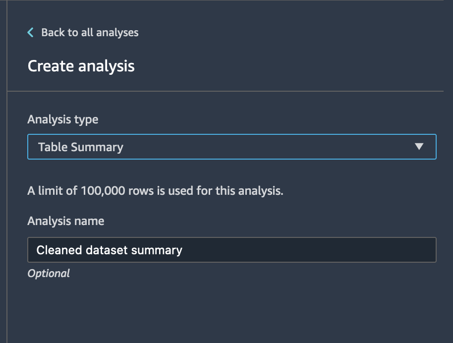
1. Choose Preview
1. Choose Add to save the analyses.
1. You could find your first analyses on a "Analysis" tab. All future visualisations will could be also found here. 
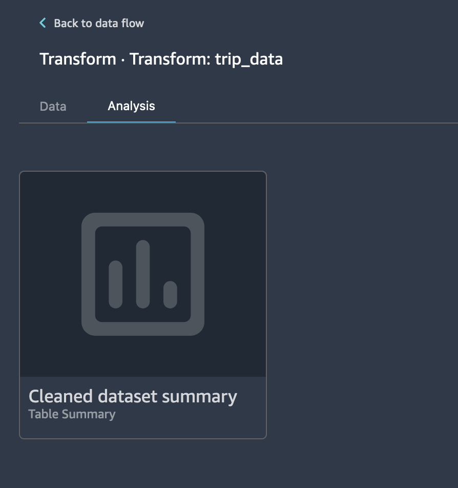
1. Click on analyses icon to open it. Take a look on a data. Most interesting part is a summary for "duration" column: maximum value is 1439 and this is minutes! 1439 minutes = almost 24 hours and this is defenetly an error which will reduce quality of our model. Such errors also could be called outliers and our next step is to handle them. 
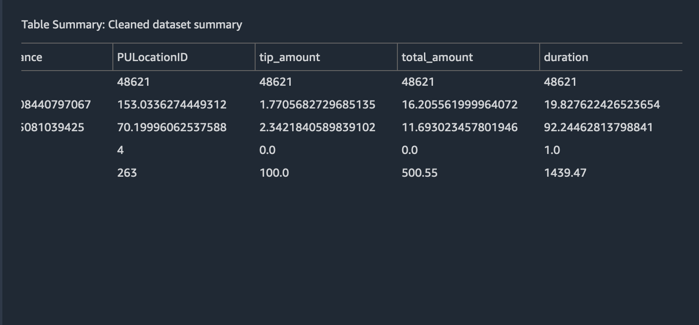


### Handling outliers in numeric attributes
In statistics, an outlier is a data point that differs significantly from other observations in the same dataset. An outlier may be due to variability in the measurement or it may indicate experimental error. The latter are sometimes excluded from the dataset. For example, in our dataset we have `tip_amount` feature and usually it is less than 10 dollars, but due to an error in a data collection, some values can show thousands of dollar as a tip. Such data errors will skew statistics and aggregated values which will lead to a lower model accuracy. 

An outlier can cause serious problems in statistical analysis. Machine learning models are sensitive to the distribution and range of feature values. Outliers, or rare values, can negatively impact model accuracy and lead to longer training times. 

When you define a **Handle outliers** transform step, the statistics used to detect outliers are generated on the data available in Data Wrangler when defining this step. These same statistics are used when running a Data Wrangler job. 

Data Wrangler support several outliers detection and handle methods. We are going to use **Standard Deviation Numeric Outliers** and we remove all outliers as our dataset is big enough. This transform detects and fixes outliers in numeric features using the mean and standard deviation. You specify the number of standard deviations a value must vary from the mean to be considered an outlier. For example, if you specify 3 for standard deviations, a value falling more than 3 standard deviations from the mean is considered an outlier. 

To create this transformation you have to:
1. Click the plus sign next to a collection of transformation elements and choose Add transform.
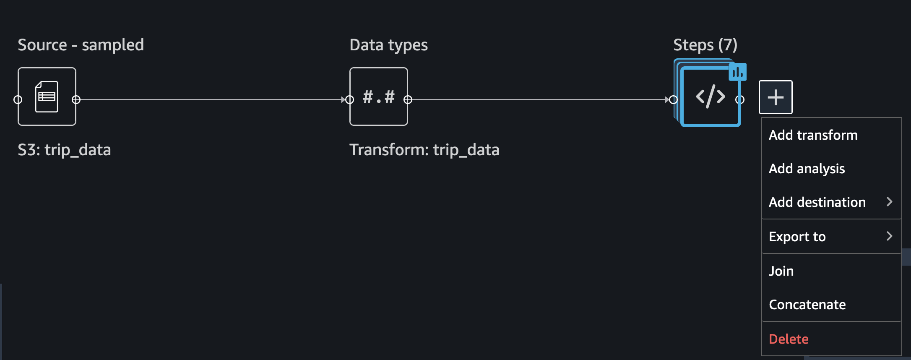
1. Click "+ Add step" orange button in the TRANSFORMS menu.

1. Choose Handle Outliers. \

    1. For "Transform" choose "Standard deviation numeric outliers"
    1. For "Inputs columns" choose `tip_amount`, `total_amount`, `duration`, and `trip_distance`
    1. For "Fix method" choose "Remove" 
    1. For "Standard deviations" put 4 \
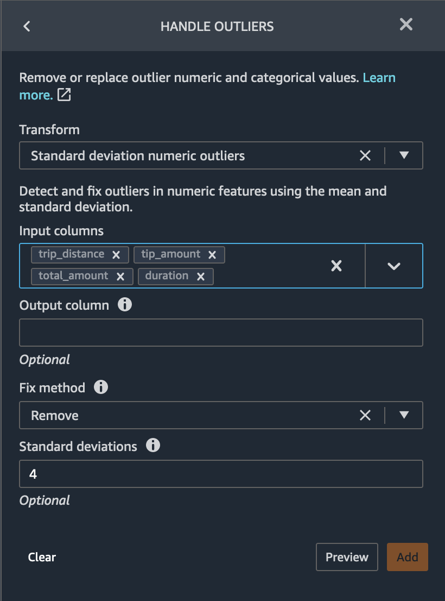
1. Choose Preview
1. Choose Add to save the step.

When transfromation is applied on a sampled data you should see all curent steps and a preview of a resulted dataset. 
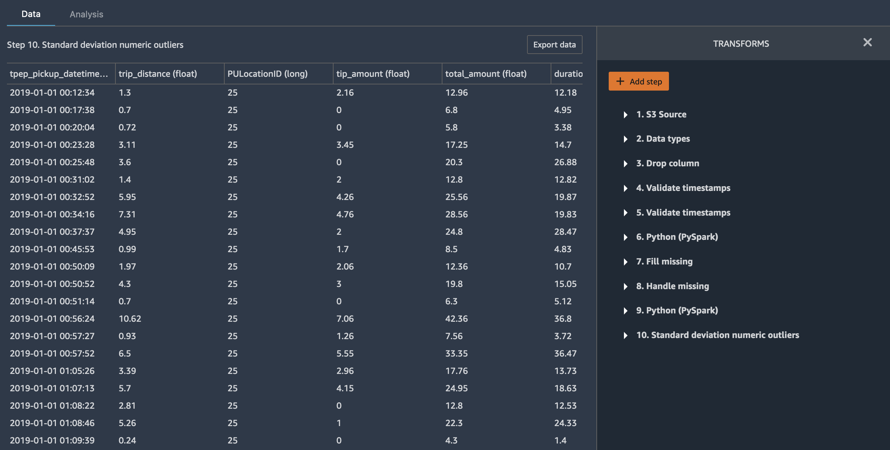

Optional: if you want you could repeat steps from a previous step ("Quick analysis of a current dataset") to create a new table summary and check new maximum for duration. Now the max value for `duration` is 130 minutes, which is more realistic. 
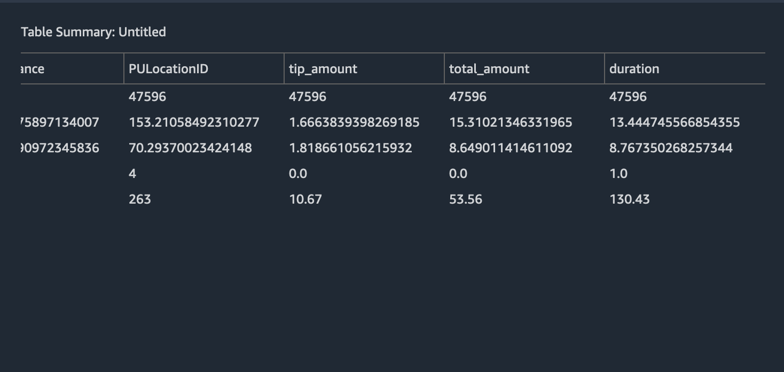


### Grouping and aggregating data
At this moment we have cleaned dataset by removing outliers, invalid values, and added new features. There are few more steps before we start training our forecasting model. 

As we are interested in a hourly forecast we have to count number of trips per hour per station and also aggregate (with mean) all metrics such as distance, duration, tip, total amount. 


#### Truncating timestamp
We don't need minutes and seconds in out timestamp, so we remove them.
There is no built-in filter transformation in Data Wrangler, so we create a custom transformation again.

To create a custom transformation you have to:
1. Click the plus sign next to a collection of transformation elements and choose Add transform.
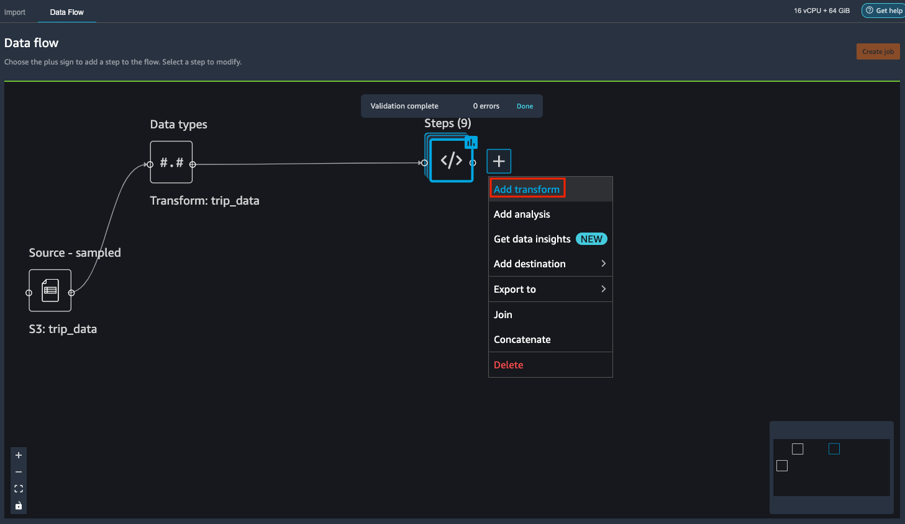
1. Click "+ Add step" orange button in the TRANSFORMS menu.

1. Choose Custom Transform. \

1. In drop down menu select Python (PySpark) and use code below. This code will create a new column with a truncated timestemp and then drop original pickup column. 

```Python
from pyspark.sql.functions import col, date_trunc
df = df.withColumn('pickup_time', date_trunc("hour",col("tpep_pickup_datetime")))
df = df.drop("tpep_pickup_datetime")
``` 

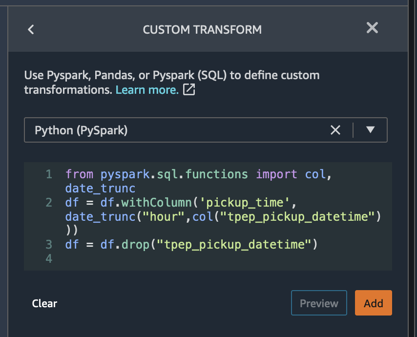
1. Choose Preview
1. Choose Add to save the step.

When you apply the transfromation on sampled data, you must see all curent steps and a preview of a resulted dataset with a new column `pickup_time` and without column `tpep_pickup_datetime`
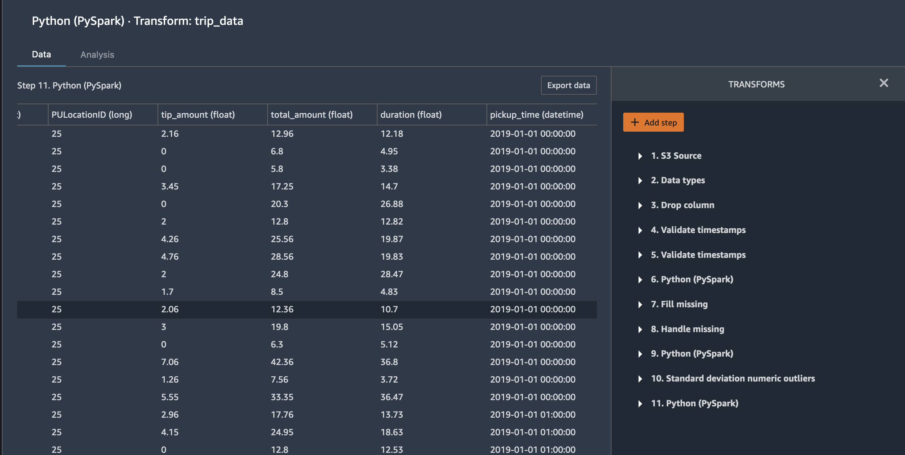


#### Count number of trips per hour per station
Currenly we have only piece of information about each trip, but we don't know how many trips were made from each station per hour. The simplest way to do that is count number of records per stationID per hourly timestamp. While DataWrangles provide **GroupBy** transfromation. This transformation doesn't support grouping by multiple columns, so we use a custom transformation again. 

To create a custom transformation you have to:
1. Click the plus sign next to a collection of transformation elements and choose Add transform.

1. Click "+ Add step" orange button in the TRANSFORMS menu.

1. Choose Custom Transform. \

1. In drop down menu select Python (PySpark) and use code below. This code will create a new column with a number of trips from each location for each timestamp. 

```Python
from pyspark.sql import functions as f
from pyspark.sql import Window
df = df.withColumn('count', f.count('duration').over(Window.partitionBy([f.col("pickup_time"), f.col("PULocationID")])))
``` 

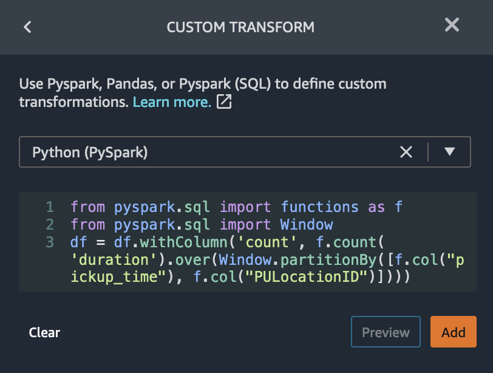
1. Choose Preview
1. Choose Add to save the step.

When transfromation is applied on a sampled data you should see all curent steps and a preview of a resulted dataset with a new column count.
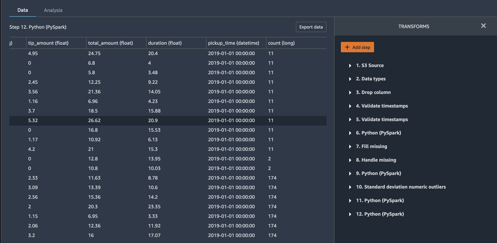


#### Resample time series
Now we are ready to make a final agregation! We aggregate all rows by combination of `PULocationID` and `pickup_time` timestamp while features should be replaced by mean value for each combination. 

We use special built-in Time Series transformation **Resample**. The Resample transformation changes the frequency of the time series observations to a specified granularity. It also comes with both upsampling and downsampling options. Applying upsampling increases the frequency of the observations, for example from daily to hourly, whereas downsampling decreases the frequency of the observations, for example from hourly to daily.

To create this transformation you have to:
1. Click the plus sign next to a collection of transformation elements and choose Add transform.
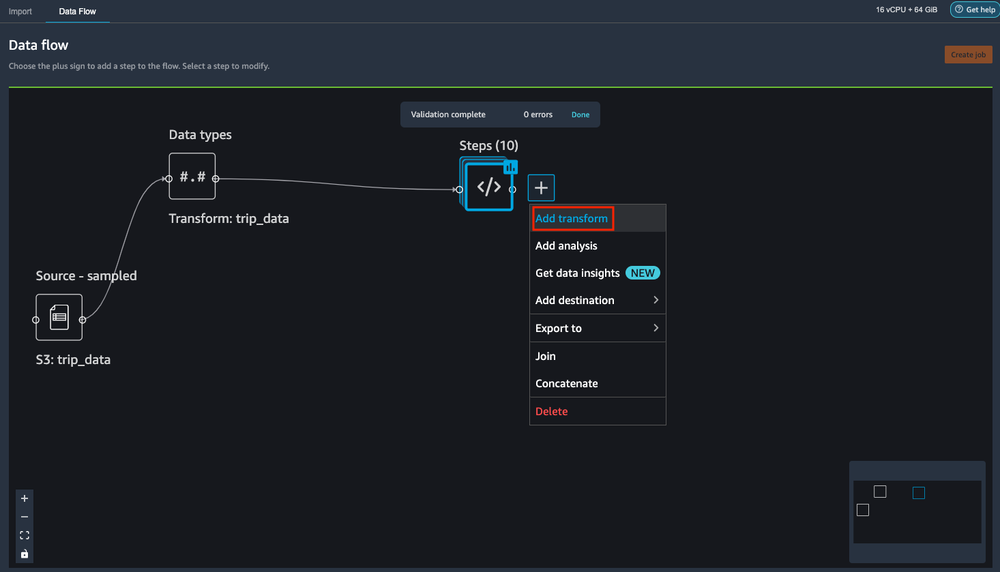
1. Click "+ Add step" orange button in the TRANSFORMS menu.

1. Choose Time Series. \

    1. For "Transform" choose "Resample"
    1. For "Timestamp" choose pickup_time
    1. For "ID column" choose "PULocationID" 
    1. For "Frequency unit" choose "Hourly"
    1. For "Frequency quantity" put 1
    1. For "Method to aggregate numeric values" choose "mean"
    1. Use default values for the rest of parameters
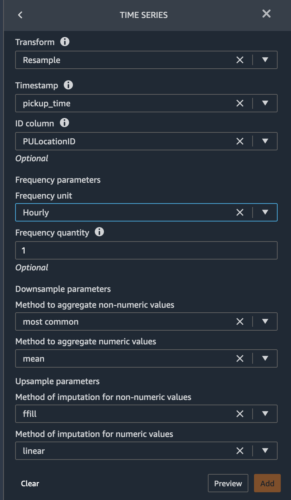
1. Choose Preview
1. Choose Add to save the step.

When transfromation is applied on a sampled data you should see all curent steps and a preview of a resulted dataset. 
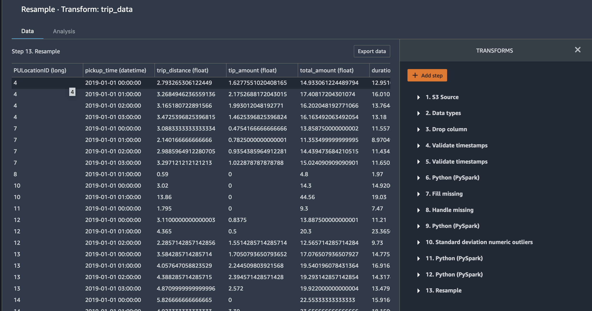


## Dataset export

Lets summarize our steps before this stage:
1. Data import
1. Data types validation
1. Columns drop
1. Handle missing and invalid timestamps
1. Feature engeneering
1. Handle missing and invalid data in features
1. Removed corrupted data
1. Quick analyses 
1. Handling outliers
1. Grouping and aggregating data

At this stage we have a new dataset with cleaned data and new engineered features. This dataset already could be used to create a forecast with open source libraries or low-code / no-code tools like Amazon SageMaker Canvas or Amazon Forecast service. 

We only have to run the Data Wrangler processing flow for the entire dataset. You could export this processing flow in many ways: as as single processing job, as a SageMaker pipline step, or as Python code.

We are going to export data to S3. 


### Export to S3
This option creates a SageMaker processing job which runs the Data Wrangler processing flow and saves the resulting dataset to a specified S3 bucket.

Follow the next steps to setup export to S3.
1. Click the plus sign next to a collection of transformation elements and choose "Add destination"->"Amazon S3".
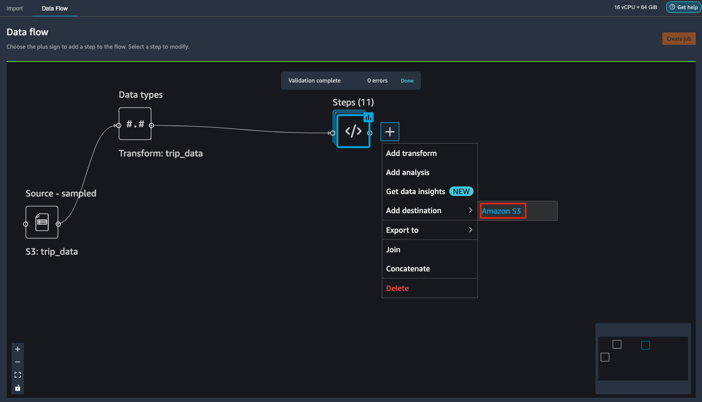
1. Provide parameters for S3 destination:
    1. Dataset name - name for new dataset, for example used "NYC_export"
    1. File type - CSV
    1. Delimeter - Comma
    1. Compression - none
    1. Amazon S3 location - You can use the same bucket name which we created at the begining
1. Click "Add destination" orange button \
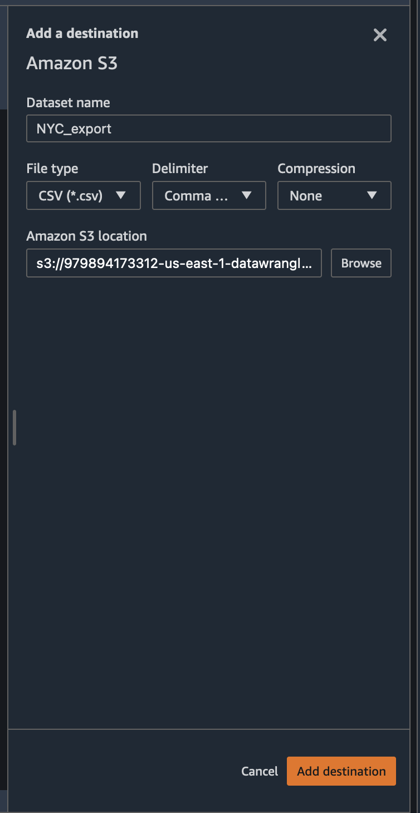
1. Now your dataflow has a final step and you see a new "Create job" orange button. Click it. 
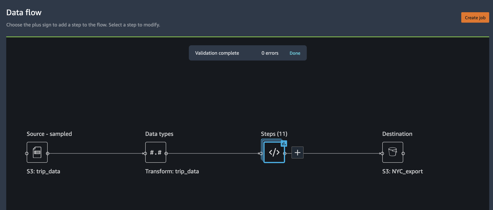
1. Provide a "Job name" or keep autogenerated option and select "destination". We have only one "S3:NYC_export", but you might have multiple destinations from different steps in your workflow. Leave a "KMS key ARN" field empty and click "Next" orange button. 
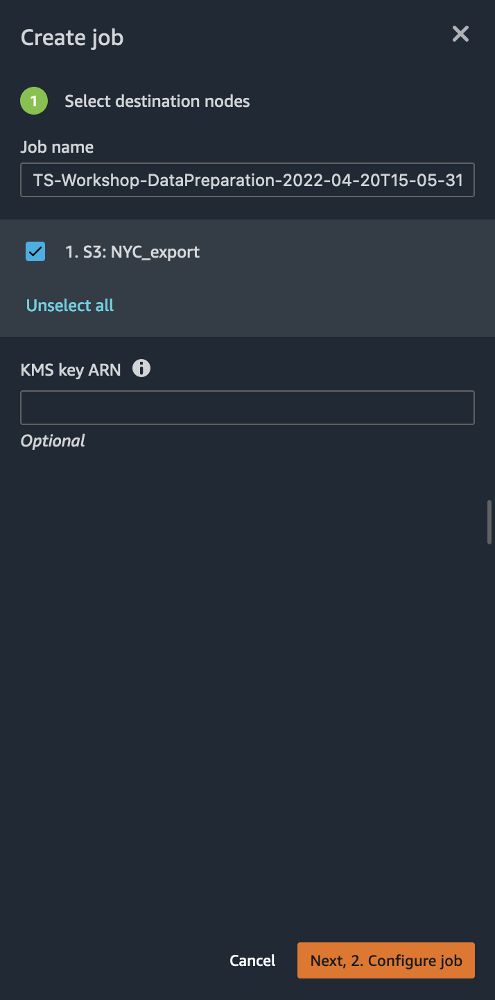
1. Now your have to provide configuration for a compute capacity for a job. You can keep all defaults values:
    1. For Instance type use "ml.m5.4xlarge"
    1. For Instance count use "2"
    1. You can explore "Additional configuration", but keep them without change. 
    1. Click "Run" orange button \
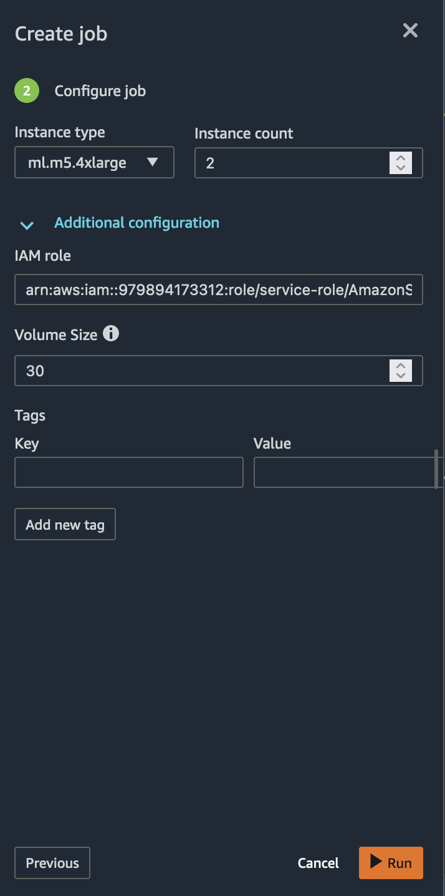
1. Now your job is started and it takes about 1 hour to process 6 GB of data according to our Data Wrangler processing flow. Cost for this job will be around 2 USD as "ml.m5.4xlarge" cost 0.922 USD per hour and we are using two of them. \
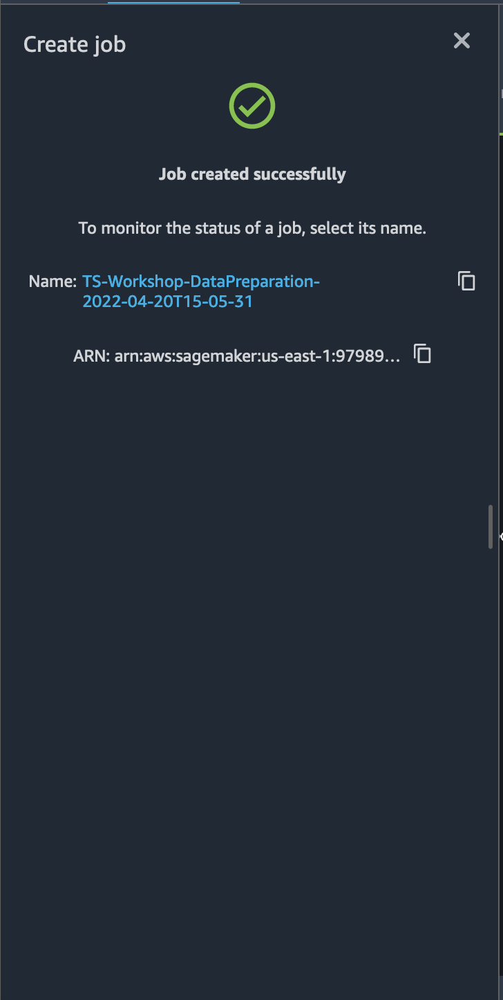
1. If you click on the job name you will be redirected to a new window with the job details. On the job details page you see all parameters from a previous steps.
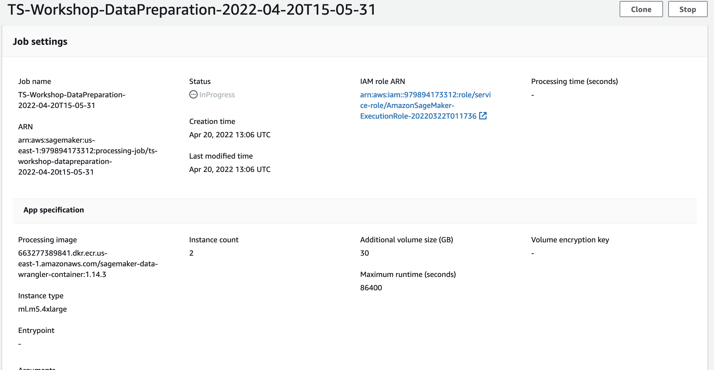


If you already closed previous window and want to take a look on job detais, run the following code cell and click on the "Processing Jobs" link.

```python
from IPython.core.display import display, HTML

display(
    HTML(
        '<b>Open <a target="blank" href="https://{}.console.aws.amazon.com/sagemaker/home?region={}#/processing-jobs/">Processing Jobs</a></b>'.format(
            region, region
        )
    )
)
```

Approximately in one hour you should see that job status changed to "Completed" and you could also check "Processing time (seconds)" value.  
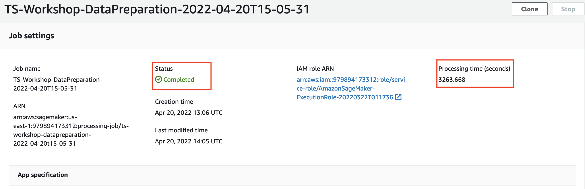
Now you could close job details page.


## Check data processing results
After the Data Wrangler processing job is completed, we can check the results saved in our S3 bucket. Do not forget to update "job_name" variable with your job name. 

```python
# Data Wrangler exported data to a selected bucket (created at the begining) with a prefix of job name
print(f'checking files in s3://{bucket_name}')

job_name = "TS-Workshop-DataPreparation-2022-05-17T00-04-33" #!!! Replace with your job name!!!

s3_client = boto3.client("s3")
response = s3_client.list_objects_v2(Bucket=bucket_name, Prefix=job_name)
files = response.get("Contents")
if not files:
    print(f'no files found in the location s3://{bucket_name}/{job_name}. Check that the processing job is completed.')
else:
    for file in files:
        print(f"file_name: {file['Key']}, size: {file['Size']}")
```

We have just one file with size of 223 Mb. Let's import it and explore a little bit.

```python
!mkdir "./data"
s3_client.download_file(bucket_name, files[0]['Key'], "./data/data.csv")
```

```python
import pandas as pd
df = pd.read_csv('./data/data.csv')  
df.dtypes
```

Our file schema look exactly as we expected: all columns are in place. 

```python
df.describe().apply(lambda s: s.apply('{0:.5f}'.format))
```

Statistics also looks good. Maximum numbers might be a little bit high, but we could fix it by adjusting "Standard deviations" value in "Handling outliers" step. You could build several models with different values and select which one will produce more accurate model. 

Congratulations! At this stage you have designed a workflow and sucesfully launched it. Of course it is not  mandatory to always run a job by clicking on a "Run" button and you could automate it, but this is a topic of another example in this serires. 


<div class="alert alert-info"> 💡
<b>Congratulations!</b></br>
You reached the end of this part. Now you know how to use Amazon SageMaker Data Wrangler for time series dataset preparation!
</div>

 :bulb:**NOTE**   - Also, you can import the [flow file](./timeseries.flow) by following the steps [here](../import-flow.md)

You can now move to an optional advanced time series transformation exercise in the notebook [`TS-Workshop-Advanced.ipynb`](./TS-Workshop-Advanced.ipynb)


## Clean up
If you choose not to run the notebook with advanced transformation, please move to the cleanup notebook [`TS-Workshop-Cleanup.ipynb`](./TS-Workshop-Cleanup.ipynb)


# Release resources
The following code will stop the kernel in this notebook.

```html

<p><b>Shutting down your kernel for this notebook to release resources.</b></p>
<button class="sm-command-button" data-commandlinker-command="kernelmenu:shutdown" style="display:none;">Shutdown Kernel</button>
        
<script>
try {
    els = document.getElementsByClassName("sm-command-button");
    els[0].click();
}
catch(err) {
    // NoOp
}    
</script>
```

```python

```
