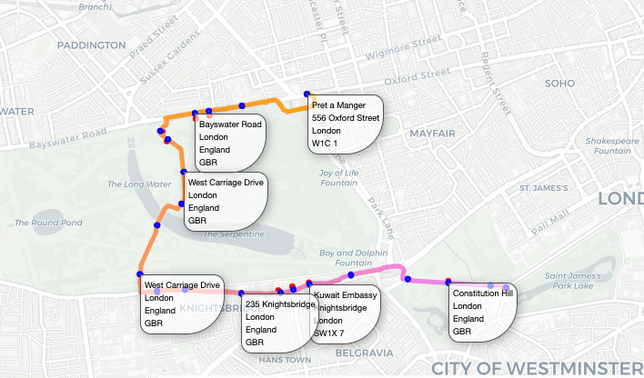

# London Map-Matching and Reverse-Geocoding

This repo contains a notebook that walks through the usage of the new vector enrichment features available in SageMaker Studio Geospatial, including:
- Map matching
- Reverse geocoding

We will follow a route through London, from Marble Arch to Buckingham Palace, in which a noisy GPS trace is correctly aligned to known roads (map-matching), and addresses derived from the coordinate points (reverse geocoding).



## Setup

- Create or join a [SageMaker Studio Domain](https://docs.aws.amazon.com/sagemaker/latest/dg/onboard-iam.html)
- Go to the IAM console and add the AmazonSageMakerGeospatialFullAccess policy to the execution role of your SageMaker studio domain
- Add the following trust policy under the 'Trust relationships' tab for the role:

```
{
    "Version": "2012-10-17",
    "Statement": [
        {
            "Effect": "Allow",
            "Principal": {
                "Service": [
                    "sagemaker.amazonaws.com",
                    "sagemaker-geospatial.amazonaws.com"
                ]
            },
            "Action": "sts:AssumeRole"
        }
    ]
}
```

- Launch the domain for your user

## Considerations

The notebook uses the default SageMaker bucket, and writes objects with prefix 'vej-input/'. Pre-existing objects with the same key as those uploaded by the notebook will be overwritten.
