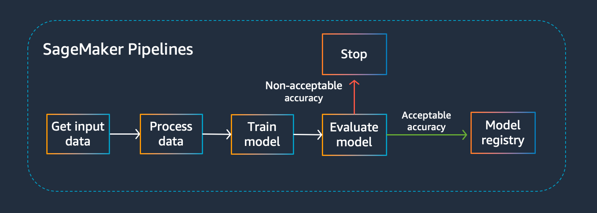

# Parameterize SageMaker Pipelines

Customers can use SageMaker Pipelines to build scalable machine learning pipelines that preprocess data and train machine learning models. With SageMaker Pipelines, customers have a toolkit for every part of the machine learning lifecycle that provides deep customizations and tuning options to fit every organization. Customers have the freedom to customize SageMaker Pipelines to specific use cases, but also to create generic machine learning pipelines that can be reused across different use cases.

From a birds-eye view a machine learning pipeline usually consists of 3 general steps: a preprocess step where the data is transformed, a training step where a machine learning model is trained, and an evaluation step which tests the performance of the trained model. If the model is performing according to the objective metric you’re optimizing for, then that becomes a candidate model for deployment to one or more environments. These candidate models should be registered into SageMaker Model Registry to catalog and store key metadata for that model version.

These steps have a lot of commonalities, even across different machine learning use cases. Customers that want to create training pipelines that can be re-used in an organization can use SageMaker Pipelines to create parameterized, generic training pipelines. Parameters allow customers to identify specific parameters that can be passed into the pipeline during pipeline execution without having to directly change the pipeline code itself. 

**This notebook** demonstrates how SageMaker Pipelines can be used to create a generic binary classification machine learning pipeline using XGBoost that's reusable across teams, machine learning use cases and even customers in a SaaS system. 
