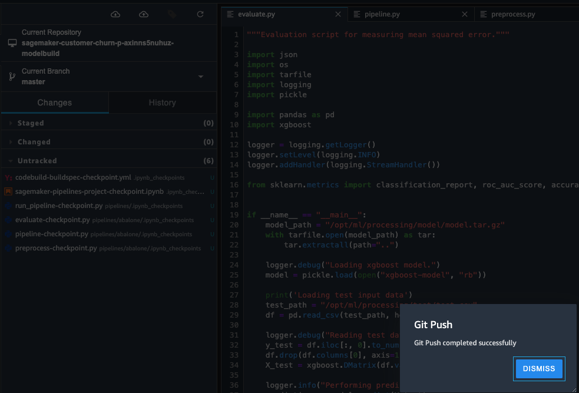

# Build, Automate, Manage, and Scale ML Workflows using Amazon SageMaker Pipelines

We recently announced Amazon SageMaker Pipelines (https://aws.amazon.com/sagemaker/pipelines/), the first purpose-built, easy-to-use Continuous Integration and Continuous Delivery (CI/CD) service for machine learning. SageMaker Pipelines has three main components which improves the operational resilience and reproducibility of your workflows: pipelines, model registry, and projects. 

The main components of Amazon SageMaker Pipelines are shown in the diagram below. SageMaker Projects includes MLOps templates that automatically provision the underlying resources needed to enable CI/CD capabilities for your Machine Learning Development Lifecycle (MLDC). Customers can use a number of built-in templates or create your own custom templates. SageMaker Pipelines can be used independently to create automated workflows;however, when used in combination with SageMaker Projects the additional CI/CD capabilities are provide automatically. As the diagram below illustrates, SageMaker’s built-in MLOps templates can automatically provision all of the underlying resources to build CI/CD pipelines that tap into AWS Developer Tools (https://aws.amazon.com/products/developer-tools/) and AWS Service Catalog (https://aws.amazon.com/servicecatalog/).


This blog post will focus on using one of the MLOps templates to bootstrap your ML project and establish a CI/CD pattern from seed code. We’ll show how to use the built-in Build/Train/Deploy Project template as a base for a customer churn classification example. This base template will enable CI/CD for building, training, and evaluating machine learning models, registering trained models to the Model Registry, and automating model deployment with manual approval and automated testing. 

## MLOps Template for Build, Train, and Deploy

We’ll start by taking a detailed look at what AWS services are launched when this build, train, deploy MLOps template is launched. Later, we’ll discuss how the skeleton can be modified for a custom use case. 

Within Amazon SageMaker Studio (https://aws.amazon.com/sagemaker/studio), you can select “Projects” from a drop-down menu on the “Components and registries” tab as shown below:


From the projects page you’ll have the option to launch a pre-configured SageMaker MLOps template. We'll select the build, train and deploy template:


NOTE: The starter code is used to kick off a model building pipeline by default and will train a ML model. This will incur a small cost.

Once the project is created from the MLOps template, the following architecture will be deployed:


Included in the above architecture are the following AWS Services. Note, all SageMaker resources such as training jobs, pipelines, models, and endpoints as well as AWS resources listed below are automatically tagged with the project name and a unique project ID tag:

* AWS Service Catalog (https://docs.aws.amazon.com/sagemaker/latest/dg/sagemaker-projects-studio-updates.html)
    * To get started with SageMaker Projects, they must be first enabled in the SageMaker Studio console (https://docs.aws.amazon.com/sagemaker/latest/dg/sagemaker-projects-studio-updates.html). The MLOps templates that are made available through SageMaker Projects are provided via a Service Catalog portfolio that automated gets imported when a user enables Projects on the Studio Domain.  
* AWS CodeCommit (https://aws.amazon.com/codecommit/)
    * Two repositories are added to CodeCommit. The first repository provides scaffolding code to create a multi-step model building pipeline including the following steps: data processing, model training, model evaluation, and conditional model registration based on accuracy. As you’ll see in the pipeline.py file, this pipeline trains a linear regression model using the XGBoost algorithm on the well-known Abalone (https://archive.ics.uci.edu/ml/datasets/abalone) dataset. This repository also includes a build specification file (https://docs.aws.amazon.com/codebuild/latest/userguide/build-spec-ref.html), used by AWS CodePipeline (https://aws.amazon.com/codepipeline/) and AWS CodeBuild (https://aws.amazon.com/codebuild/) to execute the pipeline automatically.
    * The second repository contains code and configuration files for model deployment, as well as test scripts required to pass the quality gate. This also utilizes AWS CodePipeline (https://aws.amazon.com/codepipeline/) and AWS CodeBuild (https://aws.amazon.com/codebuild/), which run a AWS CloudFormation (https://aws.amazon.com/cloudformation/) template to create model endpoints for staging and production. 
* AWS CodePipeline (https://aws.amazon.com/codepipeline/)
    * The ModelBuild pipeline will automatically trigger and run the Pipeline from end to end whenever a new commit is made to the ModelBuild CodeCommit repository.
    * The ModelDeploy pipeline will automatically trigger whenever a new model version is added to the Model Registry and the status is marked as “Approved”. Models that are registered with “Pending” or “Rejected” statuses will not be deployed.  
* Amazon S3 (https://aws.amazon.com/s3/)
    * An S3 bucket is created for output model artifacts generated from the Pipeline.
* Amazon SageMaker Pipelines (https://aws.amazon.com/sagemaker/pipelines)
    * This workflow contains the Directed Acyclic Graph (DAG) that trains and evaluates our model. Each step in the Pipeline keeps track of the lineage and intermediate steps can be cached for quickly re-running the pipeline. Outside of templates, Pipelines can also be created using the SDK. (https://sagemaker.readthedocs.io/en/stable/workflows/pipelines/sagemaker.workflow.pipelines.html)
* Amazon SageMaker Model Registry (https://docs.aws.amazon.com/sagemaker/latest/dg/model-registry.html)
    * This service will track the model versions and respective artifacts including the lineage/metadata for how they were created. Different model versions are grouped together under a Model Group and new models registered to the registry are automatically versioned. The Model Registry also provides an approval workflow for model versions and supports deployment of models in different accounts. As a note, the Model Registry can also be utilized through the boto3 package (https://docs.aws.amazon.com/sagemaker/latest/dg/model-registry-version.html).
* Amazon SageMaker Endpoints
    * After a model is approved in the registry, the artifact will be automatically deployed to a staging endpoint followed by a manual approval gate. If approved, it will be deployed to a production endpoint in the same AWS account.

## Modifying the Seed Code for Custom Use Case

After your project has been created the architecture shown above will be deployed and the visualization of the Pipeline will be available in the “Pipelines“ drop down menu within SageMaker Studio.

In order to modify the seed code from this launched template, we’ll first need to clone the AWS CodeCommit repositories to our local SageMaker Studio instance. From the list of projects, select the one that was just created. Under the “Repositories” tab you can select the hyperlinks to locally clone the AWS CodeCommit repos:


## ModelBuild Repo

The “ModelBuild” repository contains the code for preprocessing, training, and evaluating. The seed code trains and evaluates a model on theAbalone open source dataset (https://archive.ics.uci.edu/ml/datasets/abalone). We can modify these files in order to solve our own customer churn use-case.

```
|-- codebuild-buildspec.yml
|-- CONTRIBUTING.md
|-- pipelines
|   |-- abalone
|   |   |-- evaluate.py
|   |   |-- __init__.py
|   |   |-- pipeline.py
|   |   |-- preprocess.py
|   |-- get_pipeline_definition.py
|   |-- __init__.py
|   |-- run_pipeline.py
|   |-- _utils.py
|   |-- __version__.py
|-- README.md
|-- sagemaker-pipelines-project.ipynb
|-- setup.cfg
|-- setup.py
|-- tests
|   -- test_pipelines.py
|-- tox.ini
```

1. We’ll need a dataset accessible to the SageMaker Pipelines. The easiest way to do this is to open a new SageMaker notebook inside Studio and run the following cells:

```
!wget http://dataminingconsultant.com/DKD2e_data_sets.zip
!unzip -o DKD2e_data_sets.zip
!mv "Data sets" Datasets
```
```
import boto3
from sagemaker import get_execution_role

region = boto3.Session().region_name
default_bucket = boto3.Session().resource('s3').Bucket(default_bucket)
role = sagemaker.get_execution_role()
RawData = boto3.Session().resource('s3')\
.Bucket(default_bucket).Object(os.path.join(prefix, 'data/RawData.csv'))\
.upload_file('./Datasets/churn.txt')
print(os.path.join("s3://",default_bucket, prefix, 'data/RawData.csv'))
```

   - Note you’ll want to retain this dataset S3 URL.


2. Rename the abalone directory to customer_churn. This requires us to modify the path inside `codebuild-buildspec.yml` as shown in the sample repository

```
run-pipeline --module-name pipelines.customer-churn.pipeline \
```
3. Replace the `preprocess.py` code with the customer churn preprocessing script found in the sample repository. 

4. Replace the `pipeline.py` code with the customer churn pipeline script found in the sample repository.
   - a. Please be sure to replace the “InputDataUrl” default parameter with the S3 URL obtained in step 1.
    ```
        input_data = ParameterString(
        name="InputDataUrl",
        default_value=f"s3://YOUR_BUCKET/RawData.csv",
    )
    ```
   - b. Notice we’ve updated the conditional step to evaluate the classification model.
    ```
    # Conditional step for evaluating model quality and branching execution
    cond_lte = ConditionGreaterThanOrEqualTo(
        left=JsonGet(step=step_eval, property_file=evaluation_report, json_path="binary_classification_metrics.accuracy.value"), right=0.8
    )
    ```
   - c. One last thing to note is the default `ModelApprovalStatus` is set to `PendingManualApproval`. If our model has greater than 80% accuracy then it will be added to the model registry, but not deployed until manual approval is complete.

5. Replace the `evaluate.py` code with the customer churn evaluation script found in the sample repository. One piece of the code we’d like to point out is that since we’re evaluating a classification model, we need to update the metrics we’ll be evaluating and associating with trained models:

```
report_dict = {
  "binary_classification_metrics": {
      "accuracy": {
          "value": acc,
           "standard_deviation" : "NaN"
       },
       "auc" : {
          "value" : roc_auc,
          "standard_deviation": "NaN"
       },
   },
}

evaluation_output_path = '/opt/ml/processing/evaluation/evaluation.json'
with open(evaluation_output_path, 'w') as f:
    f.write(json.dumps(report_dict))
```
The json structure of these metrics are required to match the format of sagemaker.model_metrics (https://docs.aws.amazon.com/sagemaker/latest/dg/model-monitor-model-quality-metrics.html) for complete integration with the Model Registry.


## ModelDeploy Repo

The “ModelDeploy” repository contains the AWS CloudFormation buildspec for the deployment AWS CodePipeline. We won’t make any modifications to this code since it is sufficient for our customer churn example. It’s worth noting that model tests can be added to this repo to gate model deployment.

```
.
├── build.py
├── buildspec.yml
├── endpoint-config-template.yml
├── prod-config.json
├── README.md
├── staging-config.json
└── test
    ├── buildspec.yml
    └── test.py
```

## Trigger a New Execution

By committing these changes to the AWS CodeCommit repository (easily done in SageMaker Studio source control tab), a new Pipeline execution will be triggered.  We can be monitor the execution by selecting your Pipeline inside of the SageMaker Project.




Once completed, we can go to our Model group and inspect the metadata attached to the model. If everything looks good, we can manually approve the model:
   


This approval will trigger the ModelDeploy pipeline and expose and endpoint for real time inference.


## Conclusion

Amazon SageMaker Pipelines (https://aws.amazon.com/sagemaker/pipelines/) enables teams to leverage best practice CI/CD methods within their machine learning workflows. In this post we showed how a pre-configured MLOps template can be modified by a Data Scientist for their own modeling use case. Among the many benefits is that the changes to the source code can be tracked, associated metadata can be tied to trained models for deployment approval, and repeated Pipeline steps can be cached for re-use. Try SageMaker Pipelines in your own workflows today. 


