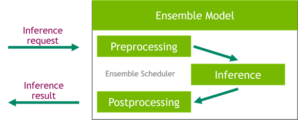

# NVIDIA Triton Inference Server on SageMaker - Hugging Face Sentence Transformers

## Introduction

[HuggingFace Sentence Transformers](https://huggingface.co/sentence-transformers) is a Machine Learning (ML) framework and set of pre-trained models to
extract embeddings from sentence, text, and image. The models in this group can also be used with the default methods exposed through the [Transformers](https://www.google.com/search?q=transofrmers+githbu&rlz=1C5GCEM_enES937ES938&oq=transofrmers+githbu&aqs=chrome..69i57.3022j0j7&sourceid=chrome&ie=UTF-8) library.

[NVIDIA Triton Inference Server](https://github.com/triton-inference-server/server/) is a high-performance ML model server, which enables the deployment of ML models in an easy, scalable, and cost-effective way. It also exposes many easy-to-use optimization features to make the most of the underlying hardware, in particular NVIDIA GPU's.

In this example, we walk through how you can:
* Create an Amazon SageMaker Studio image based on the official [NVIDIA PyTorch](https://catalog.ngc.nvidia.com/orgs/nvidia/containers/pytorch) image, which includes the necessary dependencies to optimize your model
* Optimize a pre-trained HuggingFace Sentence Transformers model with NVIDIA TensorRT to enable high-performance inference
* Create a Triton Model Ensemble, which will allow you to run in sequence a pre-processing step (input tokenization), model inference and post-processing, where sentence embeddings are computed from the raw token embeddings 

This example is meant to serve as a basis for use-cases in which you need to run your own code before and/or after your model, allowing you to optimize the bulk of the computation (the model) using tools such as TensorRT.

#### ! Important: The example provided can be tested also by using Amazon SageMaker Notebook Instances

### Prerequisites

1. Required NVIDIA NGC Account. Follow the instruction https://docs.nvidia.com/ngc/ngc-catalog-user-guide/index.html#registering-activating-ngc-account

##  Step 1: Clone this repository

##  Step 2: Build Studio image

In this example, we provide a [Dokerfile](./studio-image/image_tensorrt/Dockerfile) example to build a custom image for SageMaker Studio.

To build the image, push it and make it available in your Amazon SageMaker Studio environment, edit [sagemaker-studio-config](./studio-image/studio-domain-config.json) by replacing `$DOMAIN_ID` with your Studio domain ID.

We also provide automation scripts in order to [build and push](./studio-image/build_image.sh) your docker image to an ECR repository
and [create](./studio-image/create_studio_image.sh) or [update](./studio-image/update_studio_image.sh) an Amazon SageMaker Image. Please follow the instructions in the [README](./studio-image/README.md) for additional info on the usage of this script.

## Step 3: Compile model, create an Amazon SageMaker Real-Time Endpoint with NVIDIA Triton Inference Server

Clone this repository into your Amazon SageMaker Studio environment and execute the cells in the [notebook](./examples/triton_sentence_embeddings.ipynb)