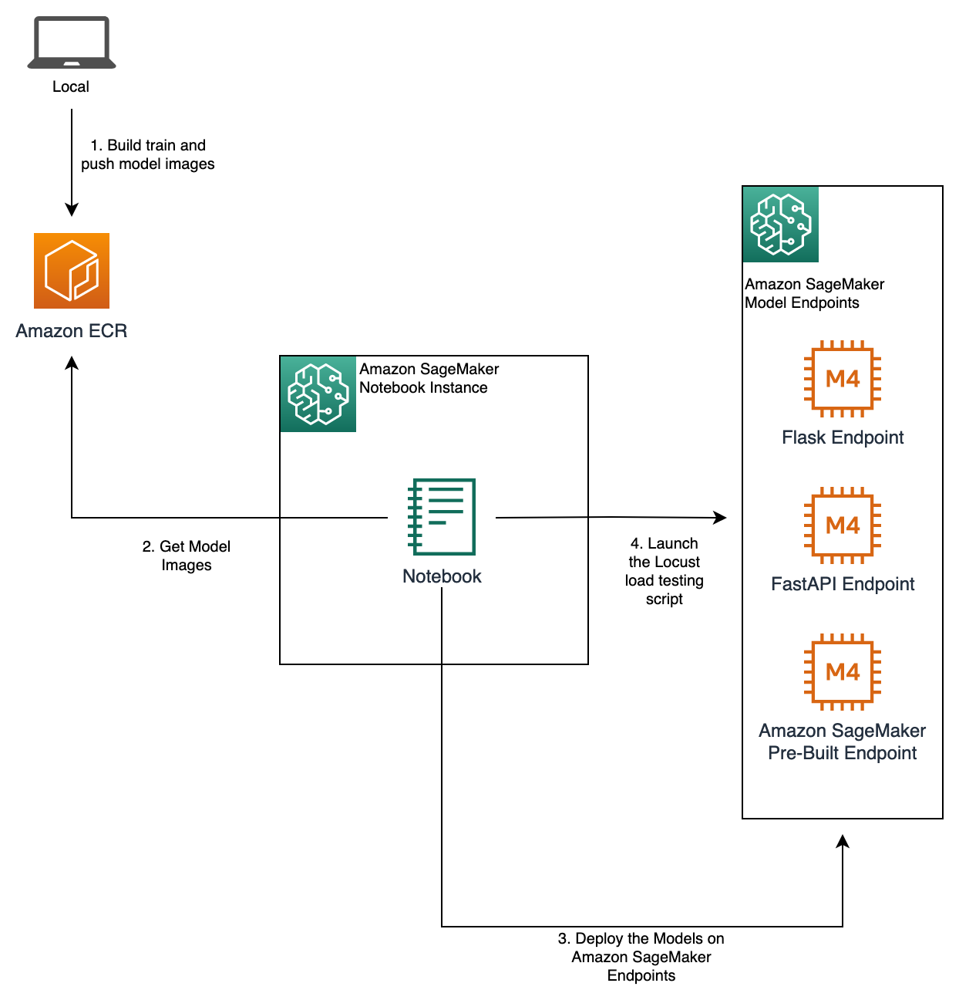

# SageMaker Endpoints Latency Testing

This example notebook shows how you can load test and measure latencies of endpoints that you deploy on SageMaker endpoints. In this particular example we deploy 3 variations of the scikit-learn decision tree model: served with Python Flask, FastAPI and the SageMaker pre-built container, however, you can use the scripts in the notebook to test and measure latencies of your own endpoints.



## Pre-requisites

At least the following IAM actions are required to execute this notebook:

```json
{
  "Version": "2012-10-17",
  "Statement": [
    {
      "Effect": "Allow",
      "Action": [
        "sagemaker:*"
      ],
      "Resource": "*"
    },
    {
      "Effect": "Allow",
      "Action": [
        "ecr:CreateRepository",
        "ecr:PutImage",
        "ecr:BatchCheckLayerAvailability",
        "ecr:GetDownloadUrlForLayer",
        "ecr:GetRepositoryPolicy",
        "ecr:DescribeRepositories",
        "ecr:ListImages",
        "ecr:BatchGetImage",
        "ecr:GetAuthorizationToken"
      ],
      "Resource": "*"
    }
  ]
}
```

> **NOTE:** It is recomended that you use a large instance type to launch load-testing of endpoints for better perfomance and quality testing. This notebook has been run on `ml.c5d.18xlarge` Notebook Instance

## The structure of the sample code

- **data:** Sample data used to train the decision tree model
- **fastapi-model:** FastAPI implementation of the model
- **flak-model:** Flask implementation of the model
- **load-testing:** Scripts to launch locust load testing
- **build_and_push.sh:** Helper script to build the Docker image and push it to the Amazon EC2 Container Registry (ECR) so that it can be deployed to SageMaker. The script is called from the notebook
