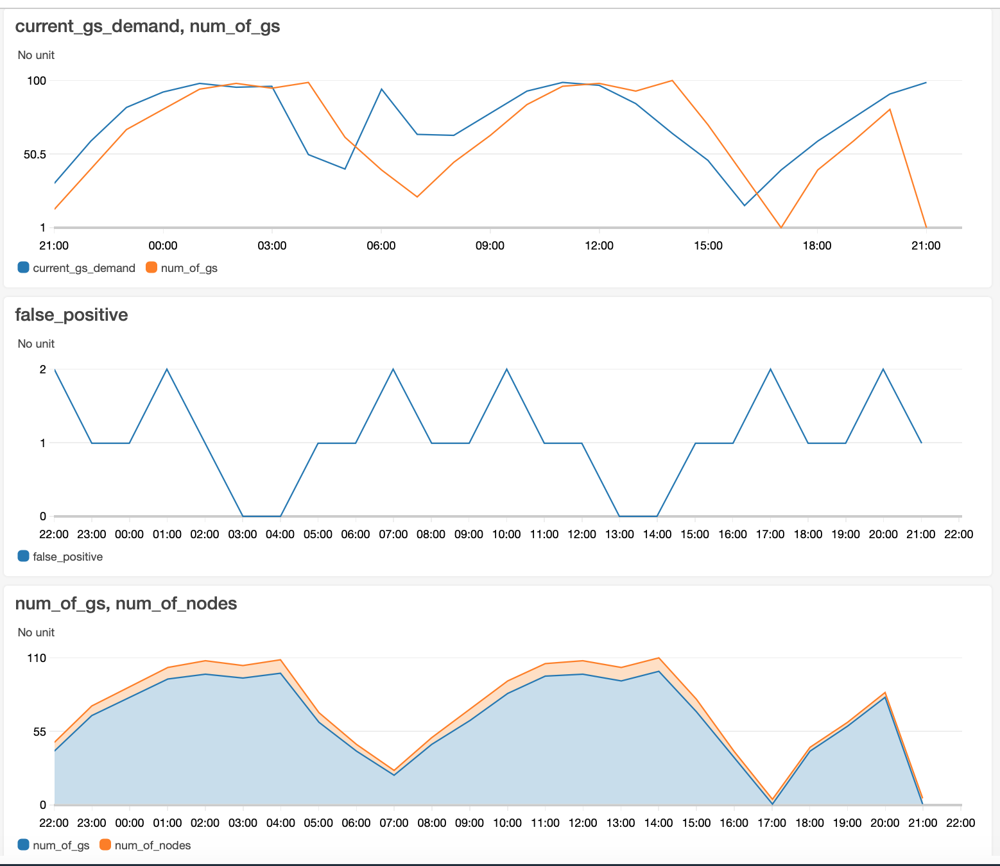

## Deploy game-server autopilot client
Now that we have the game server running, we can schedule the autopilot client to autoscale based on predictions. It uses a trained model that predicts the number of game-servers needed. In this workshop, we are going to focus on the client side only. The client is backed by a model that learns usage patterns and adopts the predictions based on emerging game-server allocation in a specific cluster. The Autopilot client sets the necessary number of game-servers. If there is a need for more EC2 instances, there will be game-server jobs that are pending. That will trigger the cluster_autoscaler that we deployed in previous step to add more EC2 instances, making space for more pods.

   To deploy autopilot execute:
   1. Build and deploy the image to ECR.
   ```
   cd autopilot-image
   ./build.sh
   cd ../..
   ```

   Then update the [autopilot-client-deploy.yaml](specs/autopilot-client-deploy.yaml) with the image name, and deploy it
   ```
   kubectl apply -f specs/autopilot-client-deploy.yaml
   ```

   After the pod is scheduled check its stdour/err by executing:

   ```
   kubectl logs `kubectl get po | grep autopilot | awk '{print $1}'`
   ```

   After few minutes, we can start seeing metrics populated in cloudwatch.
   Using CloudWatch console, discover the `multiplayersample` CloudWatch namespace under Custom Namespaces. There are five metrics that help us to assess the system health.
   * `num_of_gs` - Describes the predicated number of game-server that was set on the cluster.
   * `current_gs_demand` - Describes the current demand for game-servers by players.
   * `num_of_nodes` - Describes the number of EC2 instances allocated.
   * `false-positive` - Counter of cases where the predictions `num_of_gs` was smaller than `current_gs_demand` and could cause live session interruption.
   1. Create a line graph that includes `num_of_gs` and `current_gs_demand` to assess the prediction quality. Set the metric data aggregation to 5min **(Statistics=Average)**
   2. Create a line graph that includes `num_of_gs` and `num_of_nodes` to assess the correlation between game-server allocation and EC2 instances allocation. Set the metric data aggregation to 5min **(Statistics=Average)**
   3. Create a line graph that aggregates the number of **false positives** by the autopilot model. Set the metric aggregation to 5min **(Statistics=Sum)**
   Resulted 

