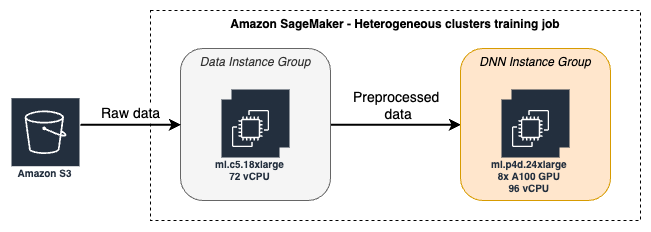

# SageMaker Heterogeneous Clusters Training
SageMaker Training Heterogeneous Clusters allows you to run one training job that includes instances of different types (for example a GPU instance like ml.p4d.24xlarge and a CPU instance like c5.18xlarge). One primary use case is offloading CPU intensive tasks like image pre-processing (data augmentation) from the GPU instance to a dedicate CPU instance, so you can fully utilize the expensive GPUs, and arrive at an improved time and cost to train.

You'll find TensorFlow (tf.data.service) and PyTorch (a customer gRPC based distributed data loading) examples on how to utilize Heterogeneous clusters in your training jobs. You can reuse these examples when enabling your own training workload to use heterogeneous clusters.

## Examples:

### TensorFlow examples
- [**TensorFlow's tf.data.service running locally**](tf.data.service.local/README.md):
This example runs the tf.data.service locally on your machine (not on SageMaker). It's helpful in order to get familiar with tf.data.service and to run small scale quick experimentation.

- [**TensorFlow's tf.data.service with Amazon SageMaker Training Heterogeneous Clusters**](tf.data.service.sagemaker/hetero-tensorflow-restnet50.ipynb):
This TensorFlow example runs a Homogenous trainign job and compares its results with a Heterogeneous Clusters SageMaker training job that runs with two instance groups:
  - `data_group` - this group has two ml.c5.18xlarge instances to which data augmentation is offloaded.
  - `dnn_group` - Running one ml.p4d.24xlarge instance (8GPUs) in a horovod/MPI distribution.

### PyTorch examples
- [**PyTorch with gRPC distributed dataloader running locally**](pt.grpc.local/README.md):
This Pytorch example runs a training job split into two processes locally on your machine (not on SageMaker). It's helpful in order to get familiar with the GRPC distributed data loader and to run small scale quick experimentation.

- [**PyTorch with gRPC distributed dataloader Heterogeneous Clusters training job example**](pt.grpc.sagemaker/hetero-pytorch-mnist.ipynb):
This PyTorch example runs a Hetero SageMaker training job that uses gRPC to offload data augmentation to a CPU based server.

### Hello world example
- [**Hetero Training Job - Hello world**](hello.world.sagemaker/README.md):
This basic example run a heterogeneous training job consisting of two instance groups. Each group includes a different instance_type. 
Each instance prints its instance group information and exits. 
Note: This example only shows how to orchastrate the training job with instance type, for actual code to help with a distributed data loader, see the TF or PT examples below.