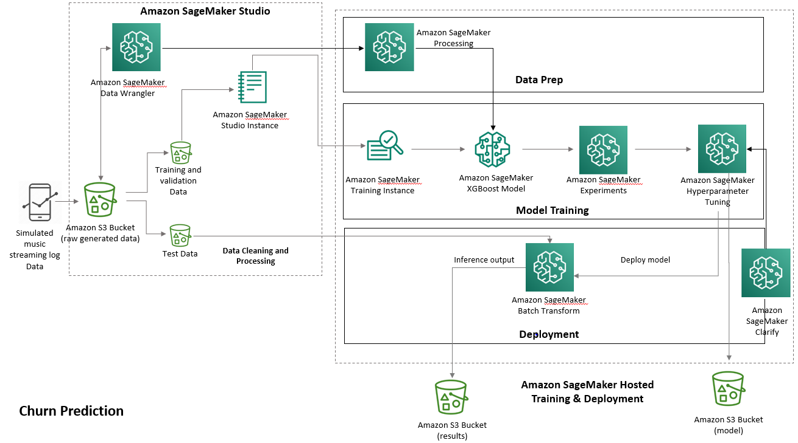

# Churn Prediction for Music Streaming
---
## Contents

1. [Background](#background)
1. [Approach](#approach)
1. [Data](#data)
1. [Requirements](#requirements)
1. [Architecture](#architecture)
1. [Cleaning Up](#cleaning-up)
1. [Useful Resources](#useful-resources)

---

## Background
The overall topics covered in the series of notebook are the following:  

* Basic data cleaning and preprocessing using SageMaker Data Wrangler
* SageMaker Processing for heavy-duty feature engineering steps
* Model building using XGBoost
* Hyperparamter tuning using SageMaker Automatic Tuning
* Deplying and getting predictions using Batch Transform
* SageMaker Clarify for model explainability

### What is customer churn and why is it important for businesses? 
Customer churn, or customer attrition, means a customer has the tendency to leave and stop paying for a service. It is one of the primary metrics companies use as a health indicator for the business and get a sense of their customer satisfaction. Some use cases for customer churn includes music and video streaming services, Software as a Service providers, and telecom companies.

Then how do we formulate a machine learning problem for churn prediction? You can start with the most straight-forward way and predict whether a user will cancel, or if you want to detect early signs of leaving, you can predict whether a user will downgrade a pricing plan or renew a subscription. You can either formulate it as a classification problem as above, or as a time series, to predict *when* will a user churn.

Some challenges with customer churn include imbalanced classes, where fewer churn data is available, which we will discuss for this use case example; another one is a user identification mapping problem which means if you are joining data from different platforms, you would want to make sure user A is identified as the same user across multiple platforms.

## Approach
We will aggregate from event-level to user-level, calculate user listening behavior metrics, and add time factor to the user behavior metrics (such as advertisement listened by the user in 30 days, 60 days, and 180 days).

For each user, we will determine if and when they cancel their subscription and we will use this for our target. We will train a XGBoost model on whether they cancel or not, giving inputs (i.e. features) of their aggregated user behavior.

## Data
We use simulated music streaming event-level usage data. This dataset contains 1100 users and their user behavior for one year. Each row in the data contains one event and has information about the timestamp of the event, user, page name, some demographic information, song attributes, and session information. 

## Requirements

You will need an AWS account to use this solution. Sign up for an [account](https://aws.amazon.com/) before you proceed. 

You will also need to have permission to use [Amazon SageMaker Studio](https://docs.aws.amazon.com/sagemaker/latest/dg/gs-studio.html) and to create all the resources detailed in the [architecture section](#architecture). All AWS permissions can be managed through [AWS IAM](https://aws.amazon.com/iam/). Admin users will have the required permissions, but please contact your account's AWS administrator if your user account doesn't have the required permissions.

To run this notebook under your own AWS account, you'll need to first create an S3 bucket and change the Amazon S3 locations within the code. For data, you have the option to use the same pregenerated data set used in this notebook found in the data folder, recreate the data using the initial generation code and specified changes or replace the data with your own data instead.

## Architecture
As part of the solution, the following services are used:

* [Amazon S3](https://aws.amazon.com/s3/): Used to store datasets.
* [Amazon SageMaker Data Wrangler](): Inital data cleaning and analysis. 
* [Amazon SageMaker Studio Notebooks](https://aws.amazon.com/sagemaker/): Used to preprocess and visualize the data, and to train model.
* [Amazon SageMaker Endpoint](https://aws.amazon.com/sagemaker/): Used to deploy the trained model.

The diagram below shows how each service is used in relation to other services in different stages of this use case.

    

## Cleaning Up

When you've finished with this solution, make sure that you delete all unwanted AWS resources. 

**Caution**: You need to manually delete any extra resources that you may have created in this notebook. Some examples include, extra Amazon S3 buckets (to the solution's default bucket) and extra Amazon SageMaker endpoints (using a custom name).

---
## Useful Resources

* Churn prediction demo video: https://youtu.be/jSrH_37jmvQ
* [Amazon SageMaker Developer Guide](https://docs.aws.amazon.com/sagemaker/latest/dg/whatis.html)
* [Amazon SageMaker Python SDK Documentation](https://sagemaker.readthedocs.io/en/stable/)
