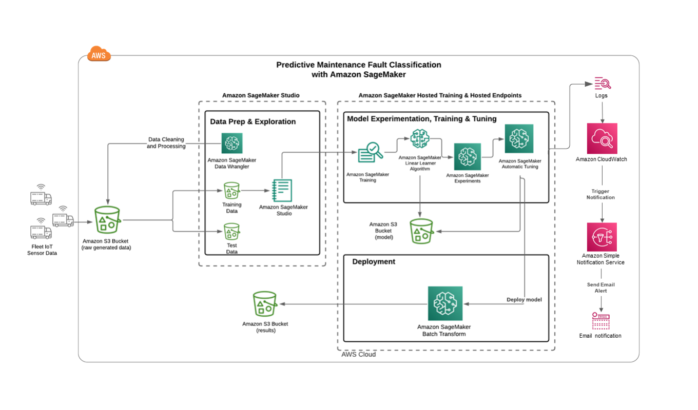

# Fleet Predictive Maintenance
---

## Contents

1. [Background](#Background)
1. [Approach](#Approach)
1. [Data](#Data)
1. [Requirements](#Requirements)
1. [Architecture](#Architecture)
1. [Cleaning Up](#CleaningUp)
1. [Useful Resources](#UsefulResources)

---

## Background
The purpose of this notebook is to demonstrate a Predictive Maintenance (PrM) solution for automible fleet maintenance via Amazon SageMaker Studio. This will give business users a quick path towards a PrM POC. In this notebook, we focus on preprocessing engine sensor data before feature engineering and building an initial model leveraging SageMaker's algorithms. The overall topics covered in this notebook are the following:  

* Setup for using SageMaker
* Basic data cleaning, analysis and preprocessing
* Converting datasets to format used by the Amazon SageMaker algorithms and uploading to S3 
* Training SageMaker's linear learner on the dataset
* Hyperparamter tuning using SageMaker Automatic Tuning
* Deplying and getting predictions using Batch Transform
 

### What is Predictive Maintenance and why is it important for businesses?

When machinery breaks down, it negatively affects a businesses' efficiency, productivity and growth. With the onset of the fourth industrial revolution (Industry 4.0) and the further adoption of IoT and Big Data in production and manufacturing settings, businesses have the opportunity to leverage AI and Machine Learning to not only create actionable insights, but to advance faster than competitors not applying Industry 4.0 methods. Predictive Maintenance (PrM) is a proactive AI strategy for minimize maintenance downtime by trying to predict machinery failures. The main goals for PrM are to reduce operational costs by optimizing the time and effort needed to repair machinery and to minimize unexpected downtime due to machinery failures. PrM allows for businesses to proctively address equipment issues, thus reducing unnecessary expenses, boosting scalability and productivity and increased transparancy into production.  

For more information on PrM, read [A Complete Guide To Predictive Maintenance](https://limblecmms.com/blog/predictive-maintenance/#). 

---

## Approach

PrM can be formulated in the following ways:
1. Fault Detection (Anomaly Detection) - Flagging Anomalous Behavior
1. Fault Classification - predicts whether there is a possibility of failure in a pre-decided time frame 
1. Remaining Useful Life (RUL) - Predict how much time is left before next failure 
1. Identifying the main cause(s) of failure

We will approach this predictive maintenance use case as a binary classification problem for Fault Classification. We have made this selection because if the lead time for fixing a vehicle is 12 hours, we may want a solution to flag whether an engine is likely to break within the next 24-48 hours. Thus, predicting for the Remaining Useful Life (RUL) may be unnecessary for the business's needs. It is also important to note here that incorporating proper business framing of a Predictive Maitenance classification problem may also result in higher evaluation metric scores as feature generation is specific to each system ([Reference 2](https://community.datarobot.com/t5/resources/predictive-maintenance-of-nasa-turbofans-using-datarobot/ta-p/2101), [Reference 3](https://arxiv.org/pdf/1809.10979.pdf)).

The method we'll use is a linear binary classifier, specifically we will be using Amazon SageMaker's Linear Learner Estimator. As input, the model is given labeled examples ( **`x`**, `y`). **`x`** is a high dimensional vector and `y` is a numeric label. Since we are doing binary classification, the algorithm expects the label to be either 0 or 1. Learn more information about [Linear-Learner](https://docs.aws.amazon.com/sagemaker/latest/dg/linear-learner.html) by reading SageMaker documentation.

With this approach in mind, the guiding question for our use case becomes, 
>Given the automobile engine operation data and histocial failure events data collected, can we predict whether or not a vehicle engine within our fleet will fail within the next few cycles? 

Note, we will discuss cycles below. 

### Challenges of Predictive Maintenance 

1. Domain Expertise   
The nature of predictive maintenace solutions requires a domain knowledge expert of the system or machinery in order better understand the relationship between the readings, what is considered a normal state of the machinery, plus additional insights for feature generation and engineering. In addition to this, a domain expert must be involved in deciding on the best time window for predictions and ultimately the business problem to be solved. With this in mind, we will make assumptions here for certain elements of this solution with the acknowldgement that these assumptions should be informed by a domain expert and a main business stakeholder. 

1. Data Issues   
Issues related to data can also pose a challenge in creating a reliable and accurate PrM solution. Some of the data issues most commonly faced are imbalanced classes, inaccurately labeled failure data, not enough data and not collecting the right data for the use case. In particular, not having enough failure data compared to non-failure data (class imbalance) is a difficult problem to solve for any classificaiton solution. In order to address this issue, we will attempt to resolve the imbalanced classes between failures and non-failures in the modeling section. 

---
## Data

As with any ML solution, for Predictive Maintenance, it is necessary to have relevant data, quality data and enough data to adequately train, test and validate a model. In terms of relevant data, the sensors must collect data that is related to the equipment or machinery they are predicting for. As for the quality and quantity of data, the data needs to be as accurate and robust as possible with sufficient enough failure data. For data decisions, it is important to combine the analysis done by Data Scientists with Domain Experts in order to understand the quality of the data, gather and understand appropriate data and sufficient amounts of data.    

Typical Data Sources for Predictive Maintance are:
* Failure history of a machine or component of the machine
* Machine sensors and operating data that track the operating condition of a machine
* Machine features and specifications such as make, model and year
* Maintenance records capture when, what, which machine and by whom a repair was made

For this use case, we will focus on using the first three types of data. We will use simulated telemetry sensor data for a fleet of automobiles. This data was adapted via the code from the AWS Labs repo called ['aws-fleet-predictive-maintenance'](https://github.com/awslabs/aws-fleet-predictive-maintenance). The generated sensor data collects engine voltage, current and resistance corresponding to a specific vehicle with each row of the data set representing a snapshot in time for sensor data readings. These snapshots are in two hour increments for each vehicle. In addition to log data, there is data on the vehicle features such as make, model, year, vehicle class and engine type. Finally, there is a target column called 'target' to indicate when a failure occurs (value of 1). Each row in the fleet details dataset contains a vehicle id, target, and timestamp with associated voltage, current and resistance readings for the vehicle's engine. Note that only ~19% of the data have positive labels, making this a challenging classification problem.  For context, "*Voltage* is the difference in charge between two points. *Current* is the rate at which charge is flowing. *Resistance* is a material's tendency to resist the flow of charge (current)" [Reference 4](https://learn.sparkfun.com/tutorials/voltage-current-resistance-and-ohms-law/all). 

The data generation code was adapted to include a larger fleet size, more sensor readings and to expand the time between readings. This was accomplished by setting the following paramers in the DatasetGenerator() constructor in 2_data_preparation.ipynb:
* num_vehicles=100,
* num_sensor_readings=100,
* period_ms=7200000 (Note: due to the way the initial code was written, the period must appear in milliseconds. 7200000ms = 120min = 2hrs)
In addition, in the config.yaml file, the window value was set to 5 like this, window_length: 5.

### Cycles and Failure Horizon (Window) 
A cycle is a specific legnth of time defined for a use case. Based on the sensor data available and the reading taken every two hours, we will define a cycle as two hours. A window of time is made up of a number of cycles. For our example, we will set the window value, w, to 1 cyles and as stated earlier, a cycle is two hours so that total time window = 1 x 2 hrs/cycle = 2  hours. Keep in mind that this window is an arbitrary selection and should be informed by analysis, the necessary lead time for repairs and domain expertise. 

---

## Requirements

You will need an AWS account to use this solution. Sign up for an [account](https://aws.amazon.com/) before you proceed. 

You will also need to have permission to use [Amazon SageMaker Studio](https://docs.aws.amazon.com/sagemaker/latest/dg/gs-studio.html) and to create all the resources detailed in the [architecture section](#architecture). All AWS permissions can be managed through [AWS IAM](https://aws.amazon.com/iam/). Admin users will have the required permissions, but please contact your account's AWS administrator if your user account doesn't have the required permissions.

To run this notebook under your own AWS account, you'll need to first create an S3 bucket and change the Amazon S3 locations within the code. For data, you have the option to use the same pregenerated data set used in this notebook found in the data folder, recreate the data using the initial generation code and specified changes or replace the data with your own data instead.

### Setup and Getting Started

Specifications:
* The SageMaker role arn used to give learning and hosting access to your data. The code snippet found in the notebook will use the same role used by your SageMaker notebook instance. Otherwise, specify the full ARN of a role.
* The S3 bucket that you want to use for training and storing model objects.

### Library Dependencies:
* sagemaker >= 2.0.0
* sagemaker-experiments >= 0.1.24
* boto3
* numpy 
* pandas
* sklearn 
* matplotlib 
* seaborn

---
## Architecture

As part of the solution, the following services are used:

* [Amazon S3](https://aws.amazon.com/s3/): Used to store datasets.
* [Amazon SageMaker Data Wrangler](): Initial data cleaning and analysis. 
* [Amazon SageMaker Studio Notebooks](https://aws.amazon.com/sagemaker/): Used to preprocess and visualize the data, and to train model.
* [Amazon SageMaker Hyperparameter Model Tuning](https://docs.aws.amazon.com/sagemaker/latest/dg/automatic-model-tuning.html): Used to choose the hyperparameter values to improve the model.
* [Amazon SageMaker Endpoint](https://aws.amazon.com/sagemaker/): Used to deploy the trained model.

---
## Cleaning Up

When you've finished with this solution, make sure that you delete all unwanted AWS resources. 

**Caution**: You need to manually delete any extra resources that you may have created in this notebook. Some examples include, extra Amazon S3 buckets (to the solution's default bucket) and extra Amazon SageMaker endpoints (using a custom name).

---
## Useful Resources

* [Amazon SageMaker Developer Guide](https://docs.aws.amazon.com/sagemaker/latest/dg/whatis.html)
* [Amazon SageMaker Python SDK Documentation](https://sagemaker.readthedocs.io/en/stable/)
