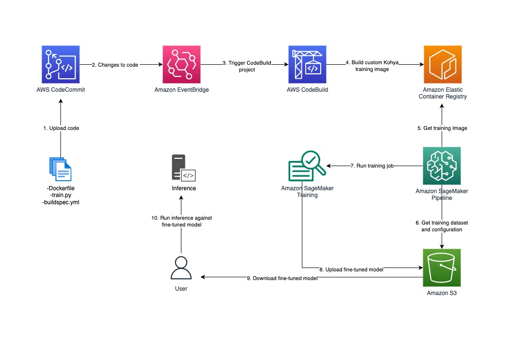

# Stable Diffusion XL Fine-Tuning with Kohya SS

This solution creates all the necessary components to get you started quickly with fine-tuning Stable Diffusion XL with a custom dataset, using a custom training container that leverages Kohya SS to do the fine-tuning. Stable Diffusion allows you to generate images from text prompts. The training is coordinated with a SageMaker pipeline and a SageMaker Training job. This solution automates many of the tedious tasks you must do to set up the necessary infrastructure to run your training. You will use the "kohya-ss-fine-tuning" Notebook to set up the solution. But first, get familiar with the solution components described in this README, which are labeled with their default resource names from the Cloudformation template.

*Prerequisites:*
1. SageMaker Domain configured (to be used with SageMaker Studio).
2. Add the [required permissions](https://aws-blogs-artifacts-public.s3.amazonaws.com/artifacts/ML-16550/sagemaker-policy.json) to the SageMaker Execution Role for your domain.
3. SageMaker Domain User Profile configured.
4. If you will run the Cloudformation template via the console, the proper IAM permissions must be assigned to your user.

*Follow these steps to get started:*

1. Navigate to Amazon SageMaker Studio in your AWS account. Run your JupyterLab space.
2. Click on "Terminal".
3. You will check out just the required directories of the SageMaker Examples git repository next (so you don't have to download the entire repo). Run the following commands from the terminal. If successful, you should see the output "Your branch is up to date with 'origin/main'".

        git clone --no-checkout https://github.com/aws/amazon-sagemaker-examples.git
        cd amazon-sagemaker-examples/
        git sparse-checkout set use-cases/text-to-image-fine-tuning
        git checkout

4. In Amazon SageMaker Studio, in the left-hand navigation pane, click the File Browser and navigate to the project directory (amazon-sagemaker-examples/use-cases/text-to-image-fine-tuning). Open the Jupyter Notebook named "kohya-ss-fine-tuning.ipynb".
5. The default runtime kernel is set to use Python 3 automatically. You now have a kernel that is ready to run commands. You may now continue with this Notebook to start setting up your solution.

---
  
## Solution Components:

* **S3 Bucket: sagemaker-kohya-ss-fine-tuning-\<accountid\>**
    * S3 bucket where custom dataset is uploaded (images, captions, kohya ss configuration)
    * These files will be uploaded from the Notebook
    * The SageMaker pipeline will orchestrate the training and output the model to this same S3 bucket

* **CodeCommit Repository: kohya-ss-fine-tuning-container-image**
    * Contains the source code to build the training container image (Dockerfile)
    * Contains the training code (train.py)
    * Contains the build spec used by CodeBuild to create the docker image (buildspec.yml)
    * Changes to these files will trigger a new container image to be built

* **ECR Repository: kohya-ss-fine-tuning**
    * ECR repository for hosting the training container image
    * Container image will be built and pushed to this repository
    * Container image contains the [Kohya SS](https://github.com/bmaltais/kohya_ss.git) program (used to train the custom SDXL model)

* **CodeBuild Project: kohya-ss-fine-tuning-build-container**
    * Builds the training container image and pushes it to ECR
    * Environment variables in template.yml can be modified to change the Kohya SS version
    * The GitHub repository (https://github.com/bmaltais/kohya_ss.git) has been tested as of version v22.6.2
    * If you use newer versions, you will want to check the Dockerfile and the docker-compose.yaml file in the repository, and the training entrypoint for SDXL (sdxl_train_network.py) in the custom "train" file located in this repository to see if any modifications need to be made

* **EventBridge Rule: kohya-ss-fine-tuning-trigger-new-image-build-rule**
    * Updating the CodeCommit repository code triggers the CodeBuild project that builds the new training container image
    * This rule does NOT kick off a training job

* **SageMaker Pipeline: kohya-ss-fine-tuning-pipeline**
    * Orchestrates training the custom model
    * Takes the custom training image from ECR, and the dataset/config located in S3, and initiates a SageMaker training job
    * Once completed, it outputs the model to the same S3 bucket, which you may use to run inference
    * This pipeline must be executed manually, given specific input parameters which you may override

* **IAM Roles**
    * SageMaker Pipeline execution (custom-sagemaker-pipeline-execution-role)
    * SageMaker Service role (custom-sagemaker-service-role)
    * CodeBuild Service role (custom-codebuild-service-role)
    * EventBridge role (custom-build-new-training-container-image-rule-role)